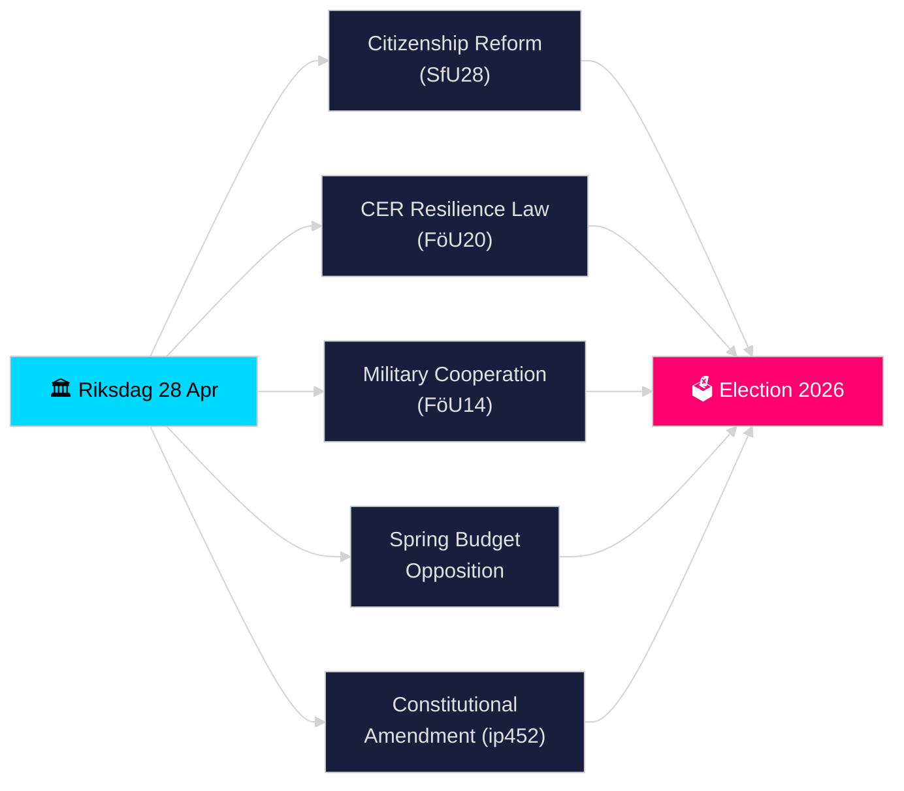

# Riksdagen Realtidspuls — 28 april 2026

**Författare**: James Pether Sörling
**Pass**: 2 (kritiskt granskad och förbättrad 2026-04-28)
**Datum**: 2026-04-28
**Klassificering**: OFFENTLIG — GDPR Art. 9(2)(e)(g) offentliggjorda politiska uppgifter
**Konfidensgrad**: HÖG [B2]
**Analysnivå**: standard

---

## 🎯 BLUF

Sveriges riksdag inledde sin historiskt täta pre-valspurt den 28 april 2026: Tidö-koalitionen drev fram skarpare medborgarskapsregler (HD01SfU28), en ny lag om kritisk infrastrukturresiliens baserad på EU CER-direktivet (HD01FöU20), ett förbättrat ramverk för militärt operativt samarbete (HD01FöU14) och Vårbudgetpaketet 2026 — medan oppositionen (S, V, C, MP) lämnade samordnade motioner mot den ekonomiska vårpropositionen. En interpellation om grundlagsändring (HD10452) av Elsa Widding signalerade ytterligare sprickor kring demokratiska processnormer inför valet i september 2026. Sammanflödet av säkerhets-, finans- och identitetspolitisk lagstiftning på en enda dag markerar riksmötets 2025/26 toppläge av lagstiftningsintensitet.

## 🧭 3 beslut detta PM stöder

1. **Bedöm koalitionsstabilitet**: Avgör om Tidö-koalitionen (M, SD, KD, L) kan driva igenom sitt fullständiga paket under vårriksmötet utan defektioner, givet oppositionstryck mot Vårbudgeten och grundlagsreformen.
2. **Följ säkerhetslagstiftningens konvergens**: Bedöm huruvida det samtida antagandet av militärt samarbete (FöU14), CER-resiliens (FöU20) och moms-/skattebrott (SkU21, SkU22) utgör en sammanhängande säkerhetsstatlig expansion eller styckevis EU-mandatuppfyllelse.
3. **Övervaka valpositionering 2026**: Kvantifiera hur skärpta medborgarskapsregler (SfU28) och brottslagstiftning (dubbla straff för gängbrott, prop. 2025/26:218) fungerar som valbudskap för SDs och Ms väljare.

## ⚡ 60-sekunders läsning

- **Medborgarskap (HD01SfU28)**: SfU debatterar skarpare krav — språk, inkomst, bosättning. SD-drivet; M stödjer. S/V/C motsätter sig nyckelbestämmelser. Schemalagt för utskottsomröstning 2026-05-xx.
- **Kritisk infrastruktur (HD01FöU20)**: Ny lag om CER-direktivtransposition som ger Försvarsmakten-närstående myndigheter förstärkta resiliens-mandat. Planerad riksdagsomröstning 2026-06-15.
- **Militärt samarbete (HD01FöU14)**: Betänkande som möjliggör fördjupat operativt samarbete inom NATO-ramen. Omröstning planerad 2026-06-15.
- **Vårbudgetmotioner**: S (HD024100), SD, V, C, MP lämnade kontramotioner till prop. 2025/26:99 och prop. 2025/26:100, den ekonomiska vårpropositionen — signalerar fiskal sårbarhet för en minoritetsregering.
- **Grundlagsändring (HD10452)**: Widding (oberoende) utmanar justitieminister Strömmer om det planerade 2/3-majoritetskravet för grundlagsändringar och hävdar att det ger minoriteter makt att blockera demokratiska majoriteter.
- **Momsbedrägeri / Skattebrott (SkU21, SkU22)**: Två skattekommittéers betänkanden om representativt skatteansvar och motåtgärder mot momsbedrägeri — EU-drivna.
- **Transportplan (HD03259)**: Nationell transportinfrastrukturplan 2026–2037 ifrågasatt av MP.

## 🔭 Viktigaste framåtsignalen

**Före 2026-05-19**: Justitieminister Strömmer måste svara på interpellationen om grundlagsändring (HD10452). Svaret signalerar regeringens beredskap att debattera demokratisk legitimitetsargumentation inför valet.

<!-- source-sha: 85156e01acda6f6589295f5a1f9197b815c84bc8 -->
