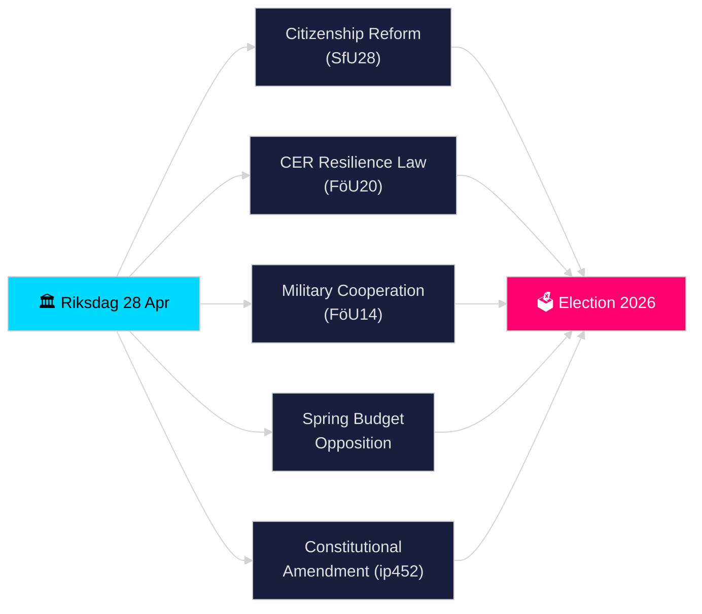

# 瑞典议会实时脉搏 — 2026年4月28日

**作者**: 詹姆斯·彼得·索林
**审阅**: 2（2026-04-28批判性审阅并改进）
**日期**: 2026-04-28
**分类**: 公开 — GDPR第9条(2)(e)(g) 已公开的政治数据
**置信级别**: 高 [B2]
**分析深度**: 标准

---

## 🎯 核心摘要

瑞典议会于2026年4月28日开启了历史上最密集的选前冲刺期：蒂多联合政府在强化公民身份要求（HD01SfU28）、转化欧盟CER指令的关键基础设施韧性新法（HD01FöU20）、改进的军事作战合作框架（HD01FöU14）和2026年春季预算方案上取得进展——而反对党（S、V、C、MP）对经济春季提案提交了协调一致的修正案。埃尔萨·维丁的宪法质询（HD10452）在2026年9月大选前进一步揭示民主程序规范上的裂痕。安全、财政与身份政策立法在一天内汇聚，标志着2025/26议会届次立法压力的顶峰。

## 🧭 本简报支持的3项决策

1. **评估联合政府稳定性**: 鉴于反对党对春季预算和宪法改革施加的压力，判断蒂多联合政府（M、SD、KD、L）能否在春季会期内无叛离地通过全套方案。
2. **追踪安全立法汇聚**: 评估军事合作（FöU14）、CER韧性（FöU20）与增值税/税务犯罪立法（SkU21、SkU22）同时获批，是否构成连贯的安全国家扩张，还是零散的欧盟义务履行。
3. **监测2026年选举定位**: 量化强化公民资格（SfU28）和犯罪立法（针对团伙犯罪的双重刑罚，提案2025/26:218）作为针对SD和M选民的选举诱饵所起的作用。

## ⚡ 60秒摘要

- **公民资格（HD01SfU28）**: SfU辩论更严格的要求——语言、收入、居住地。由SD推动；M支持。S/V/C反对关键条款。预计2026-05-xx委员会投票。
- **关键基础设施（HD01FöU20）**: 转化CER指令的新法，赋予与Försvarsmakten相邻机构强化的韧性权限。瑞典议会投票预计2026-06-15。
- **军事合作（HD01FöU14）**: 使北约框架内更深入作战合作成为可能的베탄칸데。投票预计2026-06-15。
- **春季预算修正案**: S（HD024100）、SD、V、C、MP对提案2025/26:99和提案2025/26:100（经济春季提案）提交修正案——显示少数派政府的财政脆弱性。
- **宪法修正（HD10452）**: 维丁（无党派）就宪法变更2/3多数要求挑战司法部长斯特罗姆，声称该要求赋予少数派阻止民主多数的权力。
- **增值税欺诈/税务犯罪（SkU21、SkU22）**: 税务委员会两项关于代表性税务责任和打击增值税欺诈的베탄칸데——由欧盟推动。
- **交通计划（HD03259）**: 2026–2037年国家交通基础设施计划受到MP质疑。

## 🔭 最重要的未来信号

**2026-05-19前**: 司法部长斯特罗姆必须回应宪法质询（HD10452）。回应将表明政府在选举前愿意在多大程度上辩论民主合法性论点。

<!-- source-sha: 85156e01acda6f6589295f5a1f9197b815c84bc8 -->
