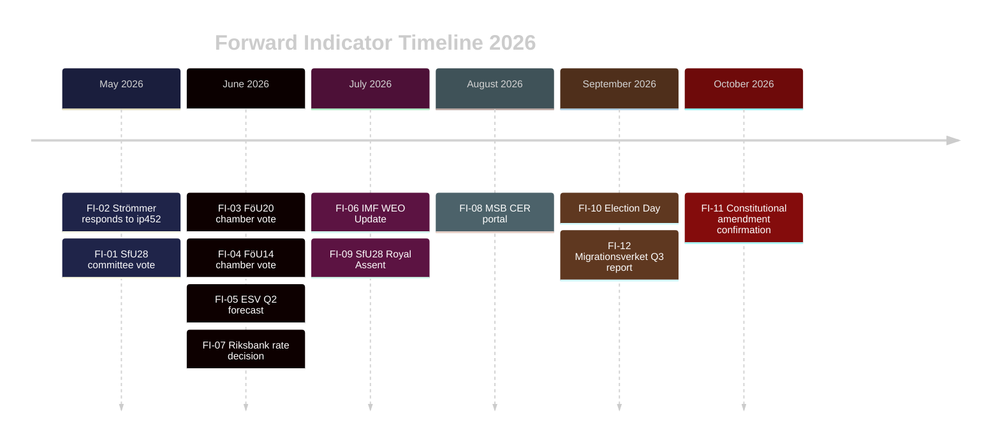

# Forward Indicators — Riksdag Realtime Pulse 28 April 2026

**Author**: James Pether Sörling
**Date**: 2026-04-28

## ≥10 Dated Forward Indicators

| # | Indicator | Expected Date | Source / Monitor |
|---|---|---|---|
| FI-01 | SfU28 committee final vote on citizenship amendments | 2026-05-28 (est.) | https://www.riksdagen.se/sv/dokument-lagar/utskottens-arbete/socialforsakringsutskottet/ |
| FI-02 | Justice Minister Strömmer response to ip452 (constitutional amendment interpellation) | 2026-05-19 (formal deadline) | https://data.riksdagen.se/dokument/HD10452 |
| FI-03 | FöU20 (CER Directive) chamber vote | 2026-06-15 (scheduled) | https://data.riksdagen.se/dokument/HD01FöU20 |
| FI-04 | FöU14 (Military cooperation) chamber vote | 2026-06-15 (scheduled) | https://data.riksdagen.se/dokument/HD01FöU14 |
| FI-05 | ESV (Ekonomistyrningsverket) Q2 2026 forecast update | 2026-06-01 (est.) | https://www.esv.se/statsliggaren/statens-budget-och-utfall/ |
| FI-06 | IMF WEO July 2026 Update — Sweden GDP revision | 2026-07-22 (IMF cycle) | https://www.imf.org/en/Publications/WEO |
| FI-07 | Riksbank June 2026 rate decision + MPR | 2026-06-25 (scheduled) | https://www.riksbank.se/sv/penningpolitik/ |
| FI-08 | MSB (CER) incident reporting portal go-live | 2026-08-01 (est.) | https://www.msb.se/cer |
| FI-09 | SfU28 Royal Assent (Kungörelse) if passed | 2026-07-01 (est.) | Swedish Statute Book (SFS) |
| FI-10 | September 2026 Riksdag election — seat count confirmation | 2026-09-13 (Election Day) | https://www.val.se |
| FI-11 | Post-election parliament confirmation of vilande grundlagsbeslut (prop. 2024/25:165) | 2026-10-15 (est., first session) | https://data.riksdagen.se |
| FI-12 | Migrationsverket capacity report Q3 2026 (SfU28 implementation readiness) | 2026-09-30 (est.) | https://www.migrationsverket.se |

## Early Warning Signals

**Red flags** (indicate escalating risk):
- SfU28 vote delayed past June 2026 → coalition dysfunction signal
- Strömmer response to ip452 avoids defending 2/3 threshold → internal M ambivalence on constitutional amendment
- IMF WEO July revision drops Sweden below 0.8% → fiscal credibility crisis
- SD publicly denounces SfU28 "utspädning" → coalition fracture risk

**Green flags** (indicate stabilisation):
- SfU28 passes committee May 28 with minimal amendments
- Cross-party joint statement on FöU14 and FöU20
- Riksbank holds rates in June (signalling stable economic outlook)
- ESV Q2 forecast confirms budget trajectory within 0.1% of government projection

