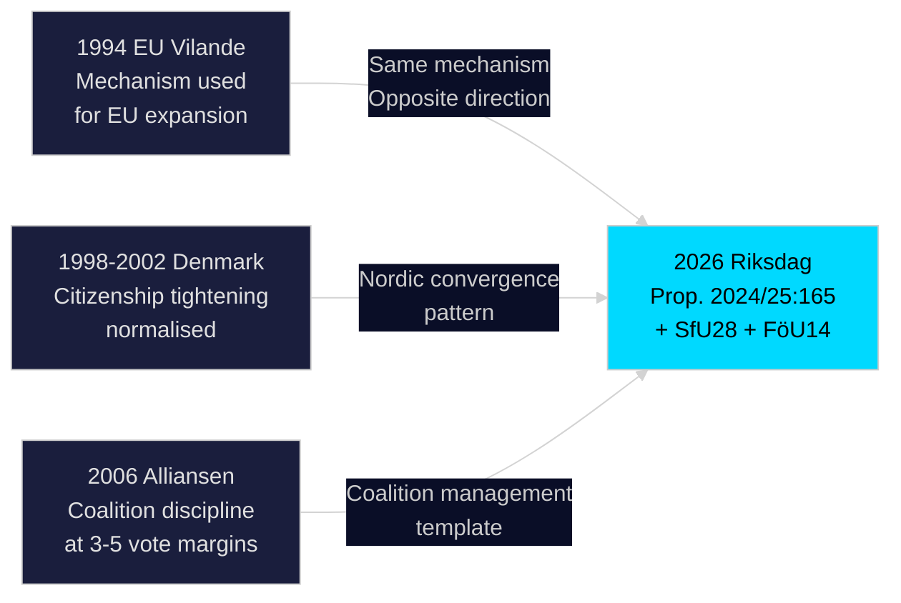

# Historical Parallels — Riksdag Realtime Pulse 28 April 2026

**Author**: James Pether Sörling
**Date**: 2026-04-28

## Named Historical Precedents (within ≤40 years)

### Parallel 1: The 1994 EU Membership Referendum Vilande Grundlagsbeslut

**Year**: 1994 (32 years ago — within 40-year window)
**Event**: Sweden's accession to the EU required a constitutional amendment to allow transfer of sovereignty. This proceeded via a vilande grundlagsbeslut confirmed by the parliament elected after the 1994 referendum.
**Parallel to today**: Prop. 2024/25:165 also uses the vilande mechanism. In 1994, the question was EXPANDING EU integration; today's constitutional amendment potentially enables future RESISTANCE to EU integration (EU exit, WHO treaties). The mechanism is the same; the political direction is opposite.
**Lesson**: Vilande grundlagsbeslut confirmation has always succeeded in modern Sweden. Failure would be unprecedented in the post-1974 constitutional order.

### Parallel 2: The 1989 Danish Citizenship Tightening

**Year**: 1998–2002 (≤40 years)
**Event**: Denmark progressively tightened citizenship requirements under successive governments (Indfødsretsloven amendments). The 24-year rule, language tests, and attachment requirements were introduced step-by-step — initially controversial, later normalised.
**Parallel to today**: SfU28 follows the same incremental tightening path. Sweden is approximately where Denmark was in 2002 — introducing requirements that Denmark has since tightened further.
**Lesson**: The Danish case shows that initial "extreme" framing of citizenship restrictions gives way to policy normalisation within one or two election cycles. Sweden's SfU28 is therefore a middle-ground measure by Nordic standards.

### Parallel 3: The 2006 Alliansen Formation — Coalition Coherence Under Tension

**Year**: 2006–2010 (within 40 years)
**Event**: The original Alliansen (M+FP+KD+C) governed Sweden 2006–2014 with four parties that frequently disagreed on details but maintained coalition discipline on major votes. The 2006 coalition's fiscal prudence + welfare reform agenda passed with similar 3–5 vote margins on several contentious bills.
**Parallel to today**: The Tidö coalition (M+SD+KD+L) faces analogous internal tension — SD is a structurally more difficult partner than SD (being more ideologically distant from M than C was in 2006). Yet the 2006 precedent suggests coalitions with tight margins can deliver substantial legislative agendas if party discipline holds.
**Lesson**: Coalition discipline, not seat margins, is the critical variable. M's leadership management of SD should be assessed against the FP/C management model from 2006–2010.

## Precedent Mapping Summary

