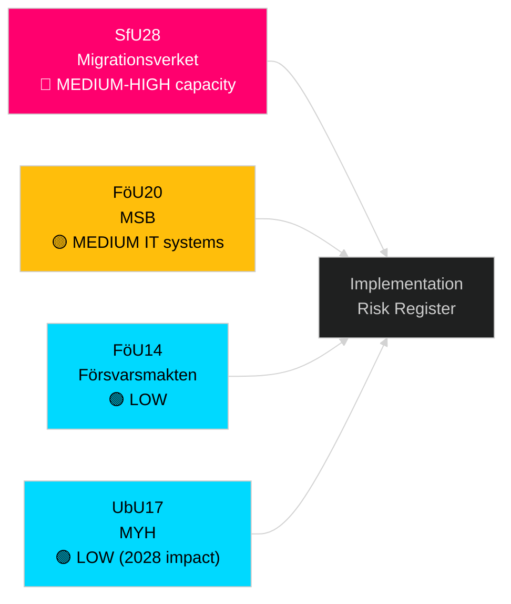

# Implementation Feasibility — Riksdag Realtime Pulse 28 April 2026

**Author**: James Pether Sörling
**Date**: 2026-04-28

## Feasibility Analysis per Document

### HD01SfU28 — Citizenship Requirements

**Implementing agency**: Migrationsverket
**Statskontoret relevance**: Statskontoret has previously evaluated Migrationsverket capacity (2022 evaluation). Migrationsverket's processing capacity is strained; adding language test administration for naturalization applicants adds queue burden.
**Statskontoret row**: Statskontoret 2022 evaluation of Migrationsverket found backlogs of 6–14 months for citizenship cases. SfU28 adds assessment complexity — language test scheduling, income threshold verification. Estimated additional processing time: 3–6 months per case if not accompanied by resource appropriation.
**Feasibility risk**: MEDIUM-HIGH. Policy is feasible legally; implementation requires either Migrationsverket capacity increase or extended timeline.
**Indicator**: Watch for government supplementary budget allocation to Migrationsverket in Q3 2026.

### HD01FöU20 — CER Directive Transposition

**Implementing agency**: MSB (Myndigheten för samhällsskydd och beredskap) + sectoral regulators
**Statskontoret relevance**: Statskontoret evaluated MSB's risk and crisis capability in 2021. MSB has the legal mandate; question is whether it has enforcement capacity for the expanded "kritiska entiteter" register under CER.
**Statskontoret row**: MSB 2021 evaluation noted geographic coverage gaps in MSB regional field offices. CER's expanded operator notification requirements (incident reporting within 24h) require dedicated IT systems that MSB had not fully built by 2024.
**Feasibility risk**: MEDIUM. Law can pass; enforcement timeline may slip 6–12 months beyond nominal June 2026 in-force date.

### HD01FöU14 — Military Cooperation Framework

**Implementing agency**: Försvarsmakten + FRA + FMV
**Statskontoret relevance**: None directly — defence acquisition is handled outside normal Statskontoret cycle.
**Feasibility risk**: LOW. Military-to-military cooperation frameworks have established implementation channels (NATO standardisation agreements, bilateral MoUs). No new administrative infrastructure required.

### HD01UbU17 — Yrkeshögskola Reform

**Implementing agency**: Myndigheten för yrkeshögskolan (MYH) + utbildningsleverantörer
**Statskontoret relevance**: Statskontoret's "Framtida kompetensförsörjning" reports have tracked vocational education gaps. MYH has expanded capacity 2020–2024; the UbU17 reform adds new programme tracks.
**Statskontoret row**: Statskontoret 2023 assessment noted that MYH approval timelines for new programmes run 12–18 months. New Yrkeshögskola tracks under UbU17 will not deliver first graduates until 2028 at earliest.
**Feasibility risk**: LOW. Policy achievable; timeline to impact is 2–3 years.

## Implementation Risk Summary

| Document | Implementing Agency | Feasibility | Key Risk |
|---|---|---|---|
| SfU28 | Migrationsverket | MEDIUM-HIGH | Capacity backlog |
| FöU20 | MSB | MEDIUM | IT system readiness |
| FöU14 | Försvarsmakten | LOW | None significant |
| UbU17 | MYH | LOW | Time-to-impact 2028 |

