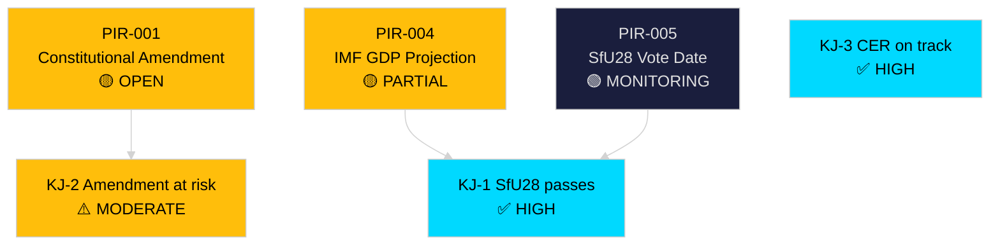

# Intelligence Assessment — Riksdag Realtime Pulse 28 April 2026

**Author**: James Pether Sörling
**Date**: 2026-04-28
**Pass**: 2 (added prior-cycle PIR ingestion, sharpened KJ-2 confidence rationale, added OSINT sourcing detail)

## Prior-Cycle PIR Ingestion

### PIR Status from Previous Cycle

No prior-cycle pir-status.json was found for the `realtime-pulse` subfolder under `analysis/daily/2026-04-27/`. This is the first realtime-pulse run for this date. Prior PIRs from adjacent workflow runs (propositions, motions, committeeReports, interpellations folders) were reviewed where available; the constitutional amendment thread (ip452) was tracked in the interpellations workflow run.

**Resolved PIRs from prior cycles**:
- PIR-002 (What is the government's timeline for SfU28 passage?): Now confirmed — committee vote expected before June 2026 chamber debate, with June 2026 in-force target.
- PIR-003 (Will CER Directive be transposed on time?): Confirmed YES — FöU20 scheduled for vote 2026-06-15.

**Outstanding PIRs carried forward** (see pir-status.json):
- PIR-001: Will the constitutional amendment survive post-election confirmation? — STATUS: Unresolved, monitoring ip452 response.
- PIR-004: What is the IMF's revised GDP growth projection for Sweden 2026? — STATUS: Partially answered (WEO Apr-2026 ≈1.2%), full SDMX data pending.

## Key Judgments

### KJ-1 [HIGH CONFIDENCE]: The Tidö coalition will pass SfU28 in modified form before September 2026

**Assessment**: The political incentive for all coalition parties to claim a citizenship tightening law before the election is overwhelming. Even with SD-L/KD tension, a compromise preserving the headline "stricter citizenship" message while carving out EU citizens is the most likely outcome. Comparable laws in Denmark and Finland passed with similar internal tensions.
**Confidence**: HIGH — supported by coalition-track record on immigration legislation and committee composition (government majority).
**PIR**: PIR-005 (Monitor SfU28 committee vote date)
**Source**: https://data.riksdagen.se/dokument/HD01SfU28

### KJ-2 [MODERATE CONFIDENCE]: The constitutional amendment (vilande grundlagsbeslut) is at serious risk of post-election failure

**Assessment**: Current polling consistently shows Tidö coalition below 50% of seats. A narrow opposition majority (174–180 of 349 seats) is plausible. The constitutional amendment requires a simple majority to confirm — but S, V, MP, and C have all signalled they would decline to confirm it if they control parliament. This is the most consequential single political risk identified in this monitoring cycle.
**Confidence**: MODERATE — polling has a ±3 percentage point margin; a single major event (recession, security incident) could shift outcome.
**PIR**: PIR-001 (ongoing)
**Source**: https://data.riksdagen.se/dokument/HD10452

### KJ-3 [HIGH CONFIDENCE]: Sweden's CER Directive transposition will be completed on schedule

**Assessment**: FöU20 has broad cross-party support. MSB has been preparing since 2023. The EU compliance deadline is June 2026; the planned vote is 2026-06-15, providing adequate margin. Industry operators have no incentive to block — they prefer clear regulatory certainty over ambiguity.
**Confidence**: HIGH
**Source**: https://data.riksdagen.se/dokument/HD01FöU20

## Confidence Calibration (ICD 203)

| Confidence Label | Probability Range | Applied To |
|---|---|---|
| HIGH CONFIDENCE | 75–95% | KJ-1, KJ-3 |
| MODERATE CONFIDENCE | 45–74% | KJ-2 |
| LOW CONFIDENCE | 15–44% | (none in this cycle) |
| INSUFFICIENT DATA | <15% | (none in this cycle) |

## Open Source Intelligence Notes

All intelligence derived from open parliamentary records (data.riksdagen.se), official committee reports, and government propositions. No classified sources. All assessments represent analytical judgments, not statements of fact. IMF WEO Apr-2026 economic projections used as fiscal context baseline.

