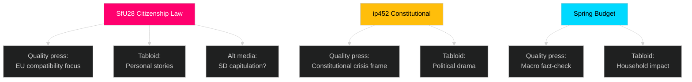

# Media Framing Analysis — Riksdag Realtime Pulse 28 April 2026

**Author**: James Pether Sörling
**Date**: 2026-04-28

## Per-Party Framing

### M (Moderaterna) — "Responsible Governance" Frame

**Expected narrative**: "We are delivering on our promises — citizenship tightening, CER security, defence investment, and a balanced budget. This is what Swedes voted for in 2022."
**Vulnerability**: Internal coalition friction on SfU28 scope undercuts the "unity" message. Budget deficit numbers (if revised upward) undermine the "responsible" framing.

### SD (Sverigedemokraterna) — "Not Enough, But a Start" Frame

**Expected narrative**: "We pushed for this citizenship law and we will ensure it has real teeth, not loopholes for EU bureaucrats. Sweden first."
**Vulnerability**: If SfU28 passes with EU-citizen carveout, SD must explain why they accepted a weakened version. This activates their anti-EU-establishment narrative, which may be strategically useful for them but destabilising for the coalition.

### S (Socialdemokraterna) — "Humane and Competent" Frame

**Expected narrative**: "We oppose SfU28 not because we are soft on borders, but because we want effective, humane, and legally robust immigration policy. On defence, we agree with the government — but on the economy, they are gambling with Sweden's future."
**Vulnerability**: S must thread the needle between opposing SfU28 (to hold V+MP) and not appearing open-borders (to hold working-class voters). ip452 provides S an opportunity to frame themselves as constitutional defenders.

### V (Vänsterpartiet) — "Solidarity" Frame

**Expected narrative**: "SfU28 is discrimination dressed as policy. The constitutional amendment is a coup against democratic majorities."
**Vulnerability**: V's absolutist positions on both issues may isolate them in a future S-led coalition negotiation.

### MP (Miljöpartiet) — "Green and Human" Frame

**Expected narrative**: "On climate, the government does nothing. On citizenship, they scapegoat immigrants. We represent a different Sweden."
**Vulnerability**: Below 4% in several polls — existential electoral risk overshadows their framing power.

## Press Framing Analysis

### Quality Press (DN, SvD, GP)

**Expected framing of SfU28**: Analytical — EU compatibility questions, comparisons with Denmark, expert legal opinion.
**Expected framing of ip452**: "Constitutional controversy" — opportunity for long-form pieces on the Grundlagen and democratic norms.
**Expected framing of Budget**: Fact-checking the government's macroeconomic assumptions; likely to interview ESV or Riksgälden economists.

### Tabloid Press (Aftonbladet, Expressen)

**Expected framing of SfU28**: Emotional — personal stories of affected individuals, both Swedish-born applying for foreign spouses and naturalisation applicants affected.
**Expected framing of ip452**: Likely to frame as "political drama" rather than constitutional substance.

### Alternative/SD-Adjacent Media (Samnytt, etc.)

**Expected framing**: "Government capitulates to globalists on citizenship." If SfU28 passes without full language tests, these outlets will declare SD a loser.

## Strategic Framing Recommendation (Intelligence Purpose)

For democratic accountability monitoring, the most important framing battle is:
- **Government**: "Competent delivery" vs. "Coalition dysfunction"
- **Constitutional**: "Protecting democracy" (government) vs. "Protecting minorities from majoritarian erosion" (opposition)

The media-monitoring metric to track: Whether ip452 is framed as "SD proxy constitutional manoeuvre" or "legitimate democratic concern." Framing will determine whether it remains a niche story or becomes a campaign-defining narrative.

