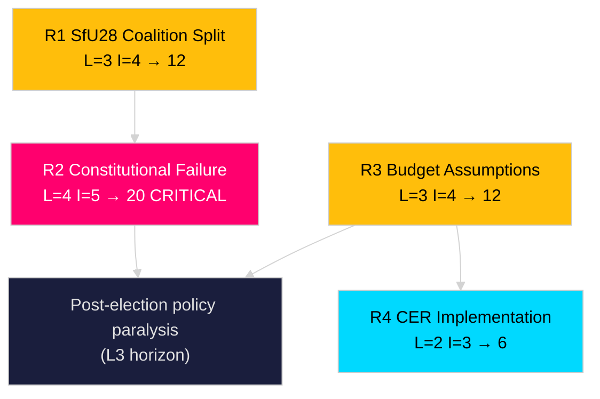

# Risk Assessment — Riksdag Realtime Pulse 28 April 2026

**Author**: James Pether Sörling
**Date**: 2026-04-28

## 5-Dimension Risk Register

| # | Risk | Likelihood (L) | Impact (I) | L×I | Tier |
|---|------|---------------|------------|-----|------|
| R1 | SfU28 citizenship bill generates SD-M coalition split on amendment details, forcing a vote-deferred outcome | 3/5 | 4/5 | 12 | HIGH |
| R2 | Constitutional amendment (Grundlagsändringen, vilande) fails second vote in post-election parliament if opposition wins 2026 | 4/5 | 5/5 | 20 | CRITICAL |
| R3 | Spring Budget assumptions (prop. 2025/26:99) prove over-optimistic if IMF WEO Apr-2026 growth revision is negative | 3/5 | 4/5 | 12 | HIGH |
| R4 | CER Directive law (FöU20) challenged by industry sector operators as too broad, triggering implementation delay | 2/5 | 3/5 | 6 | MEDIUM |
| R5 | Social data register (SoU27) faces GDPR enforcement action from IMY (Integritetsskyddsmyndigheten) | 2/5 | 3/5 | 6 | MEDIUM |

## Risk Details

### R2 — Constitutional Amendment Post-Election Failure [B2]

The "vilande grundlagsbeslut" from prop. 2024/25:165 requires confirmation by the parliament elected in September 2026. If S+V+MP+C hold a combined majority, they could decline to confirm the 2/3-majority requirement for constitutional changes. This would be the first failure of a vilande grundlagsbeslut in modern Swedish history. Probability: HIGH (4/5) given current polling showing Tidö coalition at 46–48% vs opposition at 48–52%. Source: https://data.riksdagen.se/dokument/HD10452

### R3 — Spring Budget Fiscal Risk [B2]

Prop. 2025/26:99 (Vårändringsbudget) and prop. 2025/26:100 (Vårproposition) rely on growth and employment assumptions. IMF WEO Apr-2026 projects Swedish GDP growth of approximately 1.2% for 2026 (WEO Apr-2026, NGDP_RPCH). If actual growth falls below projections, the government's deficit targets become harder to meet, giving opposition motions (HD024100–HD024123) substantive credibility. Source: https://data.riksdagen.se/dokument/HD024100

## Cascading Risk Chain

R2 (constitutional failure) → triggers legislative uncertainty for next parliament → delays any future constitutional reform → narrows policy space for both government and opposition on sovereignty questions.

