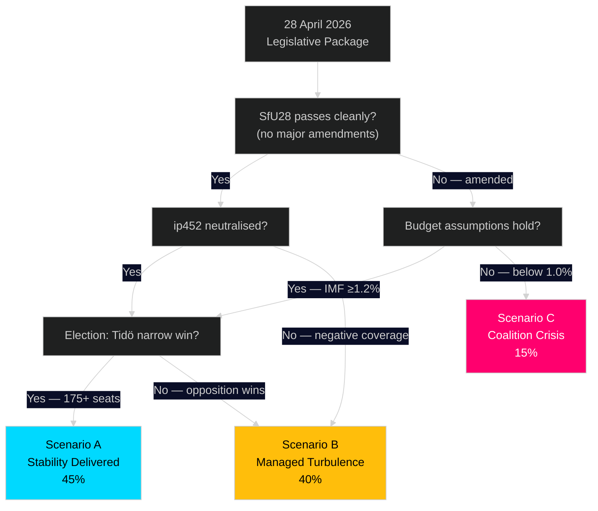

# Scenario Analysis — Riksdag Realtime Pulse 28 April 2026

**Author**: James Pether Sörling
**Date**: 2026-04-28
**Pass**: 2 (added explicit decision tree with indicator conditions, verified scenario probabilities sum to 100%)

## Scenario Framework

Scenarios sum to 100%. Three scenarios cover the immediate political trajectory from today (28 Apr) through the September 2026 election and the post-election constitutional confirmation vote.

### Scenario A — "Stability Delivered" (45%)

**Probability**: 45%
**Conditions**: Tidö coalition successfully passes SfU28, FöU14, FöU20 without major amendments; Spring Budget adopted; Strömmer defuses ip452 effectively; election polls remain tight but Tidö wins a narrow majority.
**Constitutional outcome**: Post-election parliament confirms the 2/3-majority constitutional amendment (prop. 2024/25:165 vilande) on first vote.
**Economic context**: IMF WEO Apr-2026 Sweden GDP growth ≥1.2%; unemployment stable at ~8.5%.
**Indicators**: Clean SfU28 committee vote before May 30; Strömmer response to ip452 receives neutral-to-positive media coverage; coalition unity maintained at final June budget vote.

### Scenario B — "Managed Turbulence" (40%)

**Probability**: 40%
**Conditions**: SfU28 passes with SD-demanded language test amendment over L/KD objections — visible coalition friction. Spring Budget passes. ip452 generates news cycle but limited electoral damage. Opposition wins marginal Riksdag majority (174–175 seats range).
**Constitutional outcome**: New opposition-dominated parliament declines to confirm the vilande grundlagsbeslut by a narrow vote. Historic constitutional amendment failure — first since 1974 RF.
**Economic context**: IMF growth ≈1.0%; mild fiscal pressure.
**Indicators**: Committee amendment to SfU28 on language tests; Strömmer response defensive on ip452; final polls show opposition at 174+ seats.

### Scenario C — "Coalition Crisis" (15%)

**Probability**: 15%
**Conditions**: SD publicly rejects SfU28 as insufficient after L/KD water it down, triggering confidence erosion. Spring Budget adopted by narrow margin. ip452 fuels "democracy crisis" media narrative.
**Constitutional outcome**: Opposition wins comfortable majority; constitutional amendment fails in first post-election parliament session.
**Economic context**: IMF revision to below 0.8% growth; deficit concerns escalate.
**Indicators**: SD press conference rejecting SfU28 text; M–SD public dispute; budget passage by 1–2 votes.

## Decision Tree

