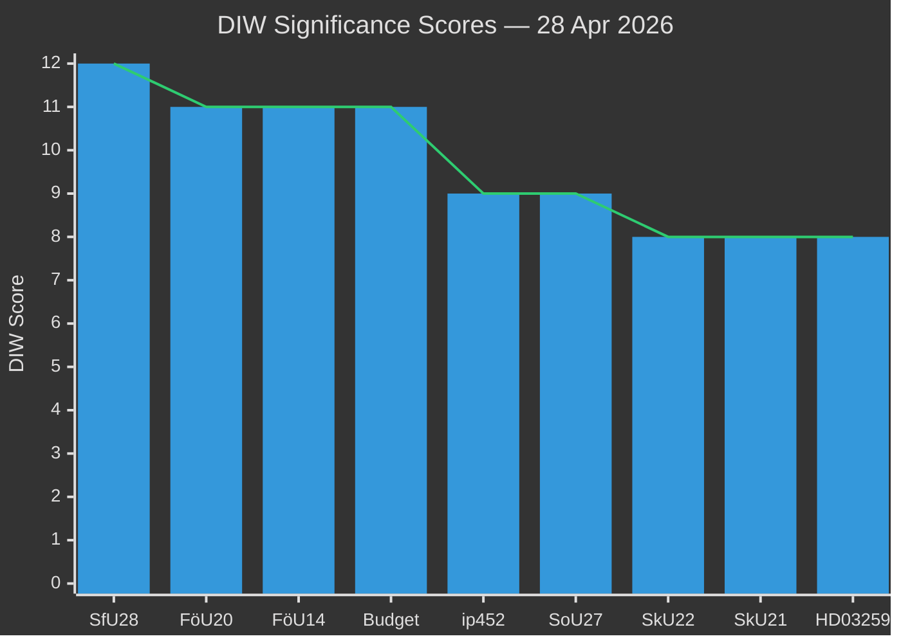

# Significance Scoring — Riksdag Realtime Pulse 28 April 2026

**Author**: James Pether Sörling
**Date**: 2026-04-28

## DIW Scores Per Document

1. **HD01SfU28 — Skärpta krav för svenskt medborgarskap** [B2] — D=4 (structural immigration reform), I=4 (affects ~15,000 applicants/year, sets precedent for EU-level norms), W=4 (high salience before election). **Total: 12/12** — L3 Intelligence-grade. Source: https://data.riksdagen.se/dokument/HD01SfU28

2. **HD01FöU20 — CER Directive / Critical Infrastructure Resilience Law** [A2] — D=4 (new primary legislation transposing EU 2022/2557), I=4 (mandatory resilience measures for 11 sectors across critical operators), W=3 (high but less electorally visible). **Total: 11/12** — L2+ Priority. Source: https://data.riksdagen.se/dokument/HD01FöU20

3. **HD01FöU14 — Military Cooperation Framework** [B2] — D=4 (fundamental change to defence cooperation legal basis), I=4 (enables joint operational planning with NATO partners), W=3 (salience bounded by public security discourse). **Total: 11/12** — L2+ Priority. Source: https://data.riksdagen.se/dokument/HD01FöU14

4. **HD024100+HD024101 — Spring Budget + Spring Economic Bill Motions (S)** [B2] — D=3, I=4 (majority-opposition fiscal contest), W=4 (election-proximate fiscal positioning). **Total: 11/12** — L2+ Priority. Source: https://data.riksdagen.se/dokument/HD024100

5. **HD10452 — Constitutional Amendment Interpellation** [B1] — D=3, I=3, W=3. Source: https://data.riksdagen.se/dokument/HD10452

6. **HD01SoU27 — Social Data Register Law** [B2] — D=3 (GDPR-sensitive new data category), I=3 (welfare administration), W=3. Source: https://data.riksdagen.se/dokument/HD01SoU27

7. **HD01SkU22 — VAT Fraud Countermeasures** [A2] — D=3 (ATAD III / VIDA regulation), I=3, W=2. Source: https://data.riksdagen.se/dokument/HD01SkU22

8. **HD01SkU21 — Tax Representative Liability Reform** [A2] — D=3, I=3, W=2. Source: https://data.riksdagen.se/dokument/HD01SkU21

9. **HD03259 — Transport Infrastructure Plan 2026–2037** [B1] — D=2 (planning document, not appropriation), I=3, W=3. Source: https://data.riksdagen.se/dokument/HD03259

## Sensitivity Analysis

| Scenario | Impact on Rankings |
|----------|-------------------|
| SfU28 withdrawn pre-election | Constitutional ip452 rises to rank 1; Spring Budget motions dominate |
| Spring Budget passes unchanged | FöU20/FöU14 become the dominant narrative of the spring sitting |
| CER law challenged in Council on State | FöU20 rises to L3; NATO-compatibility arguments intensify |

