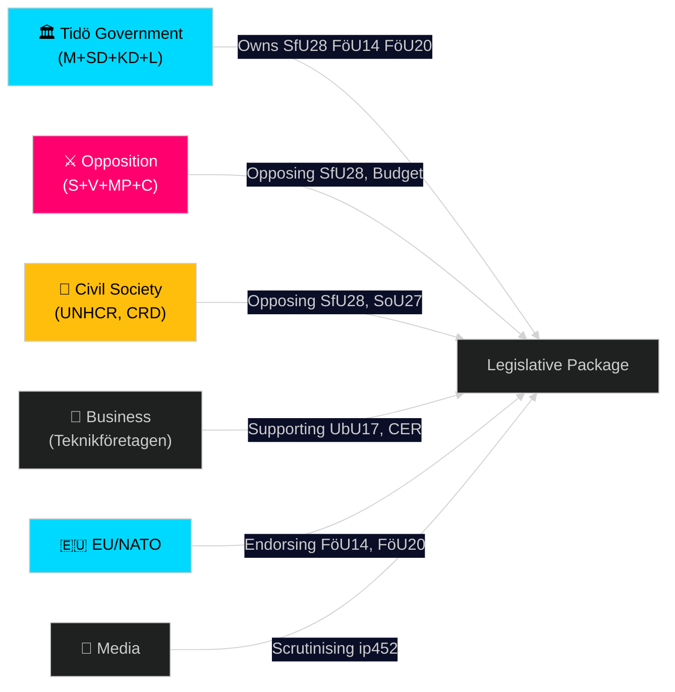

# Stakeholder Perspectives — Riksdag Realtime Pulse 28 April 2026

**Author**: James Pether Sörling
**Date**: 2026-04-28

## 6-Lens Stakeholder Matrix

### Lens 1: Government / Tidö Coalition

**Key actors**: PM Ulf Kristersson (M), Justice Minister Gunnar Strömmer (M), SD party leader Jimmie Åkesson
**Stance on core legislation**: Supportive. SfU28, FöU14, FöU20 all government-originated or coalition-supported. Spring Budget (prop. 2025/26:99/100) is government-owned.
**Strategic objective**: Deliver visible security+prosperity package before September 2026 election.
**Risk**: Internal SD-M tension on SfU28 scope. Constitutional challenge via ip452 could become election liability if Strömmer fumbles the response.

### Lens 2: Opposition (S + V + MP + C)

**Key actors**: S leader Magdalena Andersson, C leader Muharrem Demirok, V and MP leadership
**Stance**: Opposed to SfU28 (all four); oppose constitutional amendment; fiscal alternative motions (HD024100–HD024123) signal alternative budget priorities.
**Strategic objective**: Frame Spring Budget as insufficient; position for a "rescue Sweden" coalition post-2026 election.
**Risk**: Fragmented opposition. C is ambivalent on security measures; S has historically supported defence spending increases.

### Lens 3: Civil Society / NGOs

**Key actors**: Röda Korset, UNHCR-Sweden, Civil Rights Defenders
**Stance**: Strongly oppose SfU28 citizenship tightening; concerned about SoU27 social data register privacy implications.
**Potential action**: Public statements, media briefings, Riksdag remiss submissions. Source: https://data.riksdagen.se/dokument/HD01SfU28

### Lens 4: Business / Industry

**Key actors**: Teknikföretagen, Almega, Stockholms handelskammare
**Stance**: Mixed. Support CER Directive (FöU20) for infrastructure security. Cautious on SfU28 if it complicates skilled-worker immigration. Support Yrkeshögskola reform (UbU17) for skills pipeline.
**Potential action**: Remiss submissions; industry association commentary. Source: https://data.riksdagen.se/dokument/HD01UbU17

### Lens 5: EU / International Partners

**Key actors**: European Commission, NATO, Nordic defence ministries
**Stance**: Strongly supportive of FöU14 (military cooperation) and FöU20 (CER transposition). No formal EU position on SfU28 (national competence).
**Potential action**: Positive statements on CER; quiet monitoring of citizenship changes for Blue Card/EU Free Movement compatibility.

### Lens 6: Media / Public Opinion

**Key actors**: SVT, DN, Aftonbladet, SvD; tabloid and alternative media
**Stance**: Polarised. Quality media will focus on constitutional amendment controversy (ip452) and fiscal policy debate. Tabloid media likely to amplify citizenship restrictions.
**Risk**: "Surveillance state" framing of SoU27 could gain traction in social media ahead of election.

## Stakeholder Alignment Map

