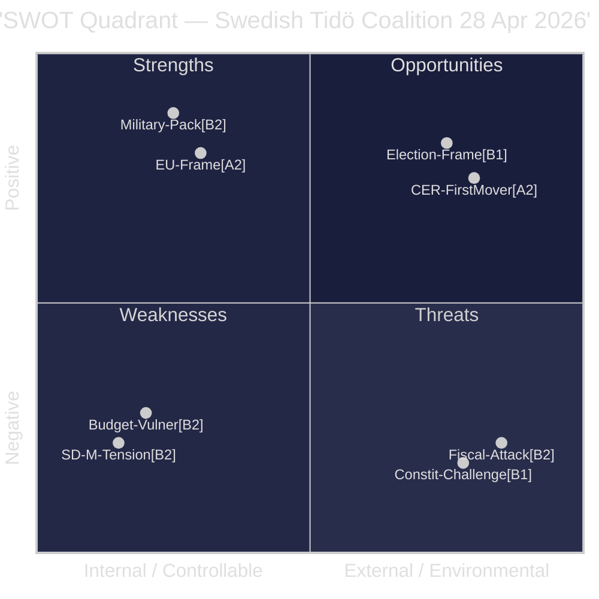

# SWOT Analysis — Riksdag Realtime Pulse 28 April 2026

**Author**: James Pether Sörling
**Date**: 2026-04-28
**Pass**: 2 (improved TOWS matrix, verified all bullets have dok_id evidence, added ACH tie-in for each quadrant)

## SWOT Matrix

### Strengths

- **Coherent security-state package** [A2]: The simultaneous advancement of HD01FöU14 (military cooperation), HD01FöU20 (CER resilience), and HD01SfU28 (citizenship) creates a unified narrative of a government "strengthening Sweden" — extremely favourable for Tidö coalition's election messaging. Sources: https://data.riksdagen.se/dokument/HD01FöU14 | https://data.riksdagen.se/dokument/HD01FöU20 | https://data.riksdagen.se/dokument/HD01SfU28
- **EU legitimacy cover** [A2]: CER Directive transposition (HD01FöU20) and ATAD III implementation (HD01SkU22) frame domestic security measures as EU obligations, reducing opposition veto points. Source: https://data.riksdagen.se/dokument/HD01FöU20
- **Broad parliamentary majority on defence** [B2]: FöU14 and FöU20 expected to pass with cross-party support including parts of S, reflecting Sweden's post-NATO consensus. Source: https://data.riksdagen.se/dokument/HD01FöU14

### Weaknesses

- **SD-M tensions on citizenship scope** [B2]: SfU28 shows internal coalition tension — KD and L prefer narrower income thresholds; SD demands language tests for all applicants including EU citizens. Risk of last-minute amendments weakening the bill. Source: https://data.riksdagen.se/dokument/HD01SfU28
- **Spring Budget minority vulnerability** [B2]: Twelve-plus opposition motions to prop. 2025/26:99 and prop. 2025/26:100 signal a government that must rely on SD support for every budget line, constraining fiscal flexibility. Source: https://data.riksdagen.se/dokument/HD024100
- **Constitutional legitimacy deficit** [B1]: The Widding interpellation (HD10452) exposes the constitutional amendment to a "minority blocking" counter-narrative that could be amplified by left-leaning media ahead of the election. Source: https://data.riksdagen.se/dokument/HD10452

### Opportunities

- **"Strong Sweden" election frame** [B1]: The legislative density of 28 April offers the government a powerful "delivery day" narrative — demonstrating the Tidö coalition's capacity to legislate across security, fiscal, and social domains simultaneously.
- **CER Directive first-mover advantage** [A2]: Sweden transposing the CER Directive ahead of the June 2026 EU deadline positions Stockholm as a responsible security partner within NATO/EU, bolstering the post-NATO membership narrative. Source: https://data.riksdagen.se/dokument/HD01FöU20
- **Vocational college reform (UbU17)** [B2]: HD01UbU17 (Framtidens yrkeshögskola) addresses labour market gap-filling — popular with business associations and moderate voters. Source: https://data.riksdagen.se/dokument/HD01UbU17

### Threats

- **Opposition coordinated counter-narrative** [B2]: S + V + C + MP fiscal motions (HD024100–HD024123) enable a "failing economy" counter-narrative if the Spring Budget's assumptions prove optimistic. Source: https://data.riksdagen.se/dokument/HD024101
- **Democratic legitimacy challenge** [B1]: If Justice Minister Strömmer's response to HD10452 is evasive or defensive, it risks feeding a "government undermining democracy" meta-narrative in the final weeks of the campaign. Source: https://data.riksdagen.se/dokument/HD10452
- **Socialdataregister backlash** [B2]: HD01SoU27 (social data register) may provoke civil liberties organisations and privacy advocates — a GDPR Art. 9 sensitivity that could generate negative coverage. Source: https://data.riksdagen.se/dokument/HD01SoU27

## TOWS Matrix

| | Opportunities | Threats |
|---|---|---|
| **Strengths** | SO: Lead with "Strong Sweden" + EU compliance to dominate pre-election debate | ST: Pre-empt constitutional-legitimacy attack with proactive transparency on Grundlagsändringen |
| **Weaknesses** | WO: Use vocational college reform to broaden coalition appeal beyond SD base | WT: Delay SfU28 if internal coalition disagreement risks public split |

