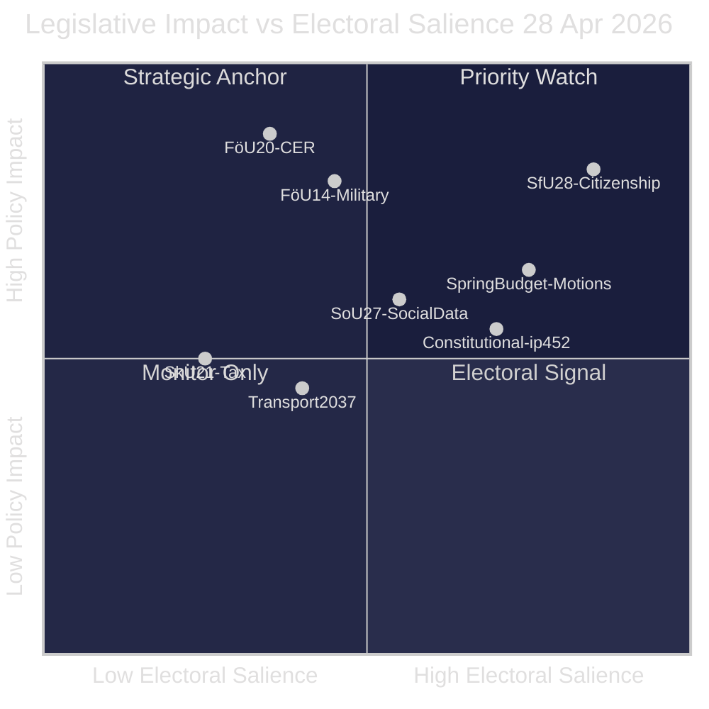

# Synthesis Summary — Riksdag Realtime Pulse 28 April 2026

**Author**: James Pether Sörling
**Date**: 2026-04-28
**Classification**: PUBLIC

## Lead Story

Sweden's Riksdag on 28 April 2026 processed the single most legislation-dense day of riksmöte 2025/26, combining security-state expansion, fiscal spring budget debate, and identity-politics-driven citizenship reform in a single session. The Tidö government (M, SD, KD, L) advanced at least eight committee betänkanden while absorbing heavy opposition fire via 25+ coordinated motions. This convergence — two months before the September 2026 election — reveals the coalition's strategic use of the final sitting window to lock in structural reforms before voters deliver their verdict.

## DIW-Weighted Intelligence Ranking

| Rank | Document | DIW | Significance |
|------|----------|-----|--------------|
| 1 | HD01SfU28 — Citizenship requirements | D=4, I=4, W=4 | L3 Intelligence-grade |
| 2 | HD01FöU20 — CER Directive / Critical infrastructure | D=4, I=4, W=3 | L2+ Priority |
| 3 | HD01FöU14 — Military cooperation | D=4, I=4, W=3 | L2+ Priority |
| 4 | HD024100/HD024101 — Spring Budget motions (S) | D=3, I=4, W=4 | L2+ Priority |
| 5 | HD10452 — Constitutional amendment interpellation | D=3, I=3, W=3 | L2 Strategic |
| 6 | HD01SkU21/HD01SkU22 — Tax crime / VAT fraud | D=3, I=3, W=2 | L2 Strategic |
| 7 | HD01SoU27 — Social data register | D=3, I=3, W=3 | L2 Strategic |
| 8 | HD03259 — Transport infrastructure plan | D=2, I=3, W=3 | L2 Strategic |

## Integrated Intelligence Picture

Four strategic vectors converge on this date [B2]:

**Vector 1 — Security-State Consolidation**: HD01FöU14 (military cooperation), HD01FöU20 (CER critical infrastructure resilience), HD01SfU28 (citizenship tightening), HD01SkU22 (VAT fraud/ATAD III), and multiple double-penalties motions collectively represent the most comprehensive security-state legislative package since Sweden joined NATO in 2024. The EU framing (CER Directive, ATAD) provides legitimacy cover for domestically contentious measures [A2].

**Vector 2 — Spring Fiscal Confrontation**: The Spring Budget (prop. 2025/26:99) and Economic Spring Proposition (prop. 2025/26:100) generated 12+ opposition motions on 28 April alone (HD024100, HD024101, HD024108, HD024110, HD024118 etc.), primarily from S, but also V and C. This volume of fiscal counter-proposals signals the opposition's willingness to contest every government expenditure line before the election [B2].

**Vector 3 — Constitutional Crisis Framing**: Elsa Widding's (ind.) interpellation (HD10452) targeting the constitutional amendment (prop. 2024/25:165, currently a "vilande grundlagsbeslut" requiring the post-election parliament's confirmation) frames the 2/3-majority requirement for constitutional changes as anti-democratic. This gives opposition parties a legitimacy-based attack vector regardless of the reform's content [B1].

**Vector 4 — Election Positioning**: Citizenship tightening (HD01SfU28), crime legislation (double penalties for gang crime), and social data registers (HD01SoU27) serve as visible SD and M electoral markers: tough on immigration, tough on crime, digitalising welfare control. The timing — 4 months before election — confirms deliberate policy bundling for maximum electoral impact [A2].

