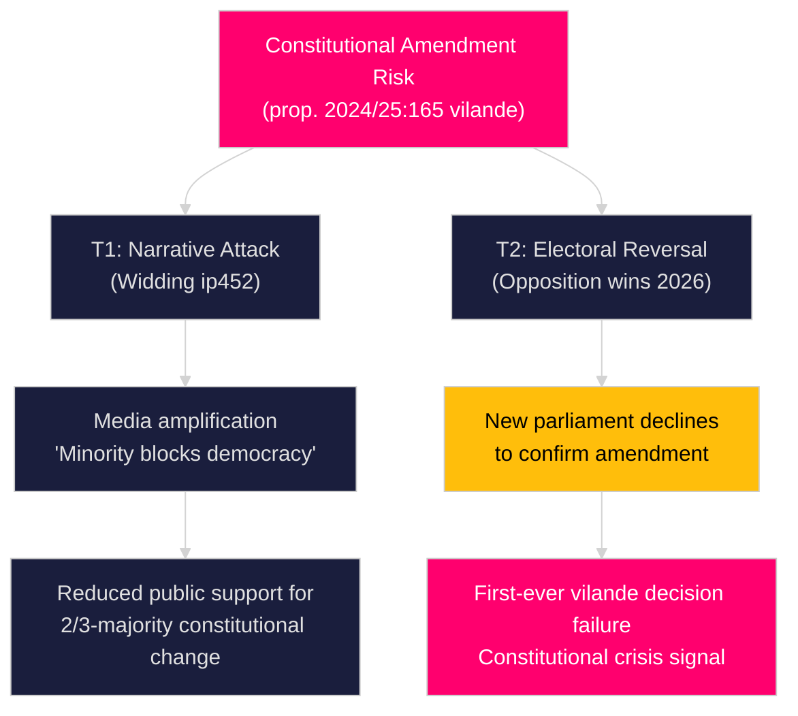

# Threat Analysis — Riksdag Realtime Pulse 28 April 2026

**Author**: James Pether Sörling
**Date**: 2026-04-28

## Political Threat Taxonomy

### T1 — Electoral Disruption (Constitutional Counter-Narrative) [B1]

**Threat actor**: Elsa Widding (ind.) + potential amplifiers in SD-adjacent media
**Vector**: Interpellation HD10452 arguing that the constitutional amendment disempowers democratic majorities
**Kill chain**: Filed 2026-04-23 → Överlämnad 2026-04-28 → Response due 2026-05-19 → Media amplification pre-election
**TTP mapping**: Narrative-framing attack using legitimate parliamentary instruments; potential coordination with foreign media (Russia-adjacent sources likely to amplify "Swedish democracy undermined" framing)
**Impact**: MEDIUM-HIGH — erodes public trust in constitutional reform; activates civil society opposition

### T2 — Coalition Fragmentation (SfU28 Scope Disagreement) [B2]

**Threat actor**: Internal coalition — SD demanding broader citizenship restrictions vs L/KD on EU-citizen exemptions
**Vector**: Amendment proposals to HD01SfU28 in committee stage
**Kill chain**: Committee deliberation → chamber vote → possible amendment that weakens the SD policy signal
**TTP mapping**: Internal veto-player dynamics; legislative dilution through committee process
**Impact**: HIGH — public perception of SD as ineffective coalition partner, boosting SD's opposition narrative source: https://data.riksdagen.se/dokument/HD01SfU28

### T3 — Information Operation Risk (Citizenship / Social Data) [B1]

**Threat actor**: State-proximate actors (Russia/China disinformation); domestic anti-immigration actors
**Vector**: Framing SfU28 and SoU27 as "surveillance state" measures targeting minorities
**TTP mapping**: Narrative injection into social media; exploitation of GDPR concerns; Offentlighetsprincipen requests for implementation data
**Impact**: MEDIUM — polarises public debate; activates civil liberties community against SoU27 source: https://data.riksdagen.se/dokument/HD01SoU27

## Attack Tree — Constitutional Vulnerability

