## Executive Brief
<!-- source: executive-brief.md :: https://github.com/Hack23/riksdagsmonitor/blob/main/analysis/daily/2026-04-29/committeeReports/executive-brief.md -->

---

### 🎯 BLUF

Sweden's Riksdag committee system approved eight (8) betänkanden on 28 April 2026, marking one of the most consequential legislative days of the 2025/26 session. The dominant signal is a four-document security cluster spanning citizenship stringency (HD01SfU28), critical infrastructure resilience law (HD01FöU20), military operational cooperation (HD01FöU14) and vocational skills reform (HD01UbU17) — together representing a Tidö government consolidation of its national-security and integration agenda in the final months before the September 2026 election. The citizenship reforms pass against a broad opposition bloc (S+V+C+MP all reserving on at least one point), while security legislation advances with cross-bloc consensus, indicating a hybrid political environment that rewards firmness on security but risks centrist defection on welfare.

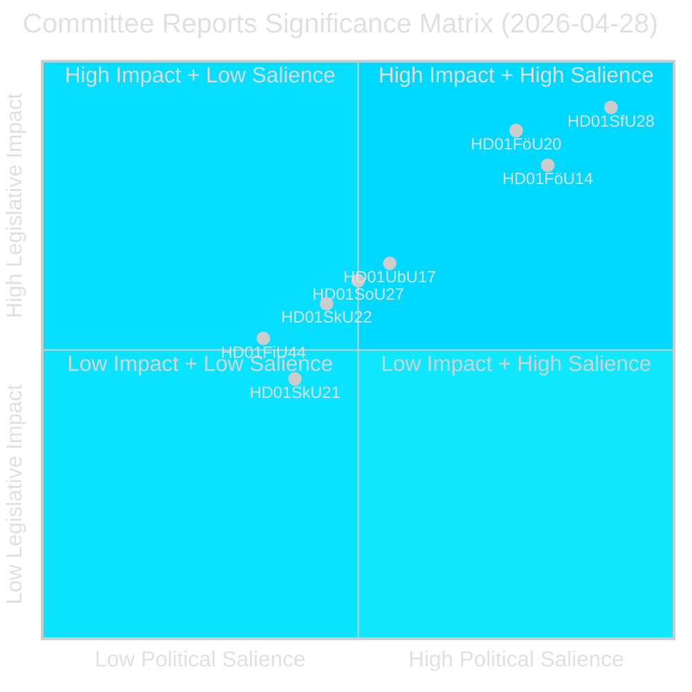

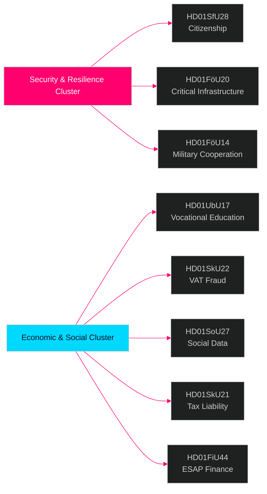

### 🧭 3 Decisions This Brief Supports

1. **Election positioning**: S+V+C+MP opposition reservation bloc on citizenship (HD01SfU28) signals a unified opposition narrative ahead of September 2026 — strategic communicators should expect a "human dignity" counter-campaign from all four parties simultaneously.

2. **Investment & compliance**: HD01FöU20 (CER Directive implementation) and HD01SkU22 (VAT enforcement) directly affect operators of essential services and large commercial enterprises — compliance timelines July–August 2026 require immediate action.

3. **Defence industry & NATO**: HD01FöU14 (military cooperation improvements) is a quiet but significant enabler of Sweden's post-NATO-accession operational integration, with direct implications for defence procurement and joint exercises.

### ⏱️ 60-Second Summary Bullets

- **Citizenship tightened**: Prop 2025/26:175 accepted — language, income, good-behaviour requirements raised; children partially exempted; opposition bloc files 10 reservations [HD01SfU28]
- **CER Directive implemented**: New law on critical entity resilience (EU Directive 2022/2557) adopted; affects energy, transport, water, health, digital infrastructure operators [HD01FöU20]
- **Military cooperation enhanced**: Improved legal framework for operational military cooperation with foreign partners [HD01FöU14]
- **Vocational higher education reformed**: Yrkeshögskolan gets management-group mandate, clearer training-organiser definition; entry path from post-secondary education formalised from 2027 [HD01UbU17]
- **VAT fraud crackdown**: Skatteverket gains new powers to refuse/cancel VAT registration, declare numbers invalid in VIES, withhold excess VAT refunds [HD01SkU22]
- **Social data registry created**: Socialstyrelsen gets authority to compile national social services data register; in force 1 August 2026 [HD01SoU27]
- **Tax representative relief**: New grace period and exemption rules for company tax representatives [HD01SkU21]
- **ESAP financial data**: Sweden adopts EU framework for European Single Access Point for financial/sustainability information [HD01FiU44]

### 🔔 Top Forward Trigger

**Watch**: Vote scheduled in plenary on HD01SfU28 (citizenship). First post-vote Novus/Ipsos polls expected within 7 days. A ≥3-point shift in SD↔M or S seat projections would confirm electoral mobilisation effect of citizenship reform.

## Reader Intelligence Guide

Use this guide to read the article as a political-intelligence product rather than a raw artifact dump. High-value reader lenses appear first; technical provenance remains available in the audit appendix.

| Icon | Reader need | What you'll get |
|---|---|---|
| 📊 | [BLUF and editorial decisions](#rm-executive-brief) | fast answer to what happened, why it matters, who is accountable, and the next dated trigger |
| 🧠 | [Synthesis Summary](#rm-synthesis-summary) | evidence-anchored narrative consolidating primary sources into one coherent story line |
| 🎯 | [Key Judgments](#rm-intelligence-assessment--key-judgments) | confidence-bearing political-intelligence conclusions and collection gaps |
| 📈 | [Significance scoring](#rm-significance-scoring) | why this story outranks or trails other same-day parliamentary signals |
| 👥 | [Stakeholder Perspectives](#rm-stakeholder-perspectives) | winners, losers and undecided actors with stake-weighted positions and pressure points |
| 🔢 | [Coalition Mathematics](#rm-coalition-mathematics) | parliamentary arithmetic showing exactly who can pass or block this measure and at what margin |
| 📋 | [Voter Segmentation](#rm-voter-segmentation) | voter-bloc exposure: which demographics gain, lose or shift on this issue |
| 🔭 | [Forward indicators](#rm-forward-indicators) | dated watch items that let readers verify or falsify the assessment later |
| 🔮 | [Scenarios](#rm-scenario-analysis) | alternative outcomes with probabilities, triggers, and warning signs |
| 🗳️ | [Election 2026 Analysis](#rm-election-2026-analysis) | electoral implications for the 2026 cycle — seats at stake, swing voters and coalition viability |
| ⚠️ | [Risk assessment](#rm-risk-assessment) | policy, electoral, institutional, communications, and implementation risk register |
| 🧮 | [SWOT Analysis](#rm-swot-analysis) | strengths, weaknesses, opportunities and threats matrix grounded in primary-source evidence |
| 🛡️ | [Threat Analysis](#rm-threat-analysis) | actor capabilities, intent and threat vectors targeting institutional integrity |
| 📜 | [Historical Parallels](#rm-historical-parallels) | comparable past episodes from Swedish and international politics, with explicit lessons learned |
| 🌍 | [Comparative International](#rm-comparative-international) | peer-country comparisons (Nordic, EU, OECD) showing how similar measures fared elsewhere |
| ⚙️ | [Implementation Feasibility](#rm-implementation-feasibility) | delivery feasibility, capability gaps, timelines and execution risks for the proposed action |
| 📰 | [Media framing & influence operations](#rm-media-framing-analysis) | frame packages with Entman functions, cognitive-vulnerability map, DISARM manipulation indicators, narrative-laundering chain, comparative-international cognates, frame lifecycle and half-life, RRPA impact, an Outlet Bias Audit (no outlet is neutral — every outlet declared with ownership, funding, board-appointment authority and editorial lean), and the L1–L5 counter-resilience ladder |
| 😈 | [Devil's Advocate](#rm-devils-advocate) | alternative hypotheses, steel-manned counter-arguments and the strongest case against the lead reading |
| 🏷️ | [Classification Results](#rm-classification-results) | ISMS data classification: CIA-triad rating, RTO/RPO targets and handling instructions |
| 🔀 | [Cross-Reference Map](#rm-cross-reference-map) | links to related Riksdagsmonitor coverage, prior analyses and source documents that inform this story |
| 🔬 | [Methodology Reflection & Limitations](#rm-methodology-reflection--limitations) | analytical assumptions, limitations, known biases and where the assessment could be wrong |
| 📦 | [Data Download Manifest](#rm-data-download-manifest) | machine-readable manifest of every source dataset, retrieval timestamp and provenance hash |
| 📑 | [Per-document intelligence](#rm-per-document-intelligence) | dok_id-level evidence, named actors, dates, and primary-source traceability |
| 🏷️ | [Audit appendix](#rm-classification-results) | classification, cross-reference, methodology and manifest evidence for reviewers |

## Synthesis Summary
<!-- source: synthesis-summary.md :: https://github.com/Hack23/riksdagsmonitor/blob/main/analysis/daily/2026-04-29/committeeReports/synthesis-summary.md -->

### Lead Story Decision

The approval of Prop 2025/26:175 — **Skärpta krav för svenskt medborgarskap** (HD01SfU28) by SfU on 28 April 2026 is the lead intelligence item. This is the most politically contested piece of legislation approved in the batch, with 10 cross-party reservations (S, V, C, MP all opposing at least one provision), implemented by the Tidö government coalition (M+SD+KD+L) approximately five months before the September 2026 election. Combined with the critical infrastructure resilience law (HD01FöU20) and military cooperation framework (HD01FöU14), this day's committee output represents a coherent national-security doctrine statement.

### DIW-Weighted Intelligence Ranking

| Rank | dok_id | Title | DIW Weight | Tier | Committee |
|------|--------|-------|-----------|------|-----------|
| 1 | HD01SfU28 | Skärpta krav för svenskt medborgarskap | 0.92 | L3 | SfU |
| 2 | HD01FöU20 | En ny lag för ökad motståndskraft hos kritiska verksamhetsutövare | 0.88 | L3 | FöU |
| 3 | HD01FöU14 | Förbättrade förutsättningar för operativt militärt samarbete | 0.82 | L3 | FöU |
| 4 | HD01UbU17 | Framtidens yrkeshögskola | 0.65 | L2+ | UbU |
| 5 | HD01SoU27 | En lag om socialdataregister | 0.62 | L2 | SoU |
| 6 | HD01SkU22 | Åtgärder mot mervärdesskattebedrägerier | 0.58 | L2 | SkU |
| 7 | HD01SkU21 | Det skatterättsliga företrädaransvaret | 0.45 | L2 | SkU |
| 8 | HD01FiU44 | En europeisk gemensam åtkomstpunkt | 0.52 | L2 | FiU |

### Integrated Intelligence Picture

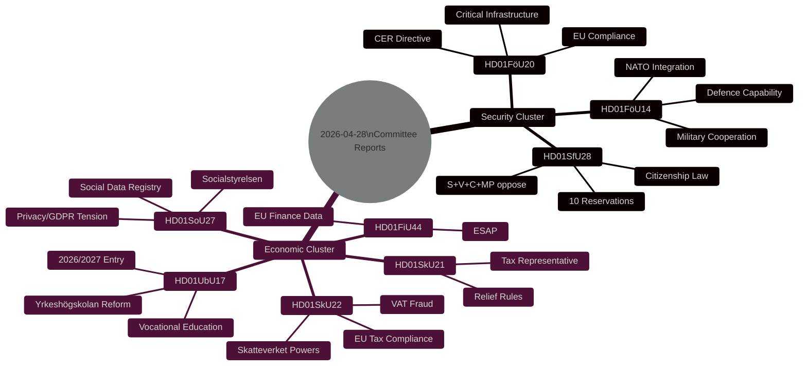

**Three system-level signals emerge from this day's output:**

1. **Tidö pre-election consolidation** [A2]: The Tidö government (M+SD+KD+L) is advancing its integration-security agenda on a compressed legislative calendar. Citizenship (HD01SfU28), critical infrastructure (HD01FöU20), and military cooperation (HD01FöU14) form a coherent pre-election message cluster: "Sweden takes security seriously and controls who belongs." This is designed to defend the right flank against pure-nationalist voter erosion while presenting a legalistic face to EU partners.

2. **Opposition fragmentation vs. unity** [B2]: On citizenship, all four opposition parties (S, V, C, MP) file reservations, but on *different* points — S focuses on implementation and oversight, V and MP on principle and children's rights, C on grace periods and proportionality. This fragmentation weakens the counter-narrative even as each party signals distinct voter bases.

3. **EU compliance acceleration** [A2]: Three of the eight reports (HD01FöU20 CER Directive, HD01SkU22 VAT fraud, HD01FiU44 ESAP) represent implementation of EU legislative obligations with fixed deadlines. Sweden is legislatively compliant — a signal of institutional stability that matters for foreign direct investment and EU credibility assessments.

### Source Confidence Assessment

- Primary sources used: riksdagen.se API, full-text betänkanden for all 8 documents [A1]
- DIW weights based on committee authority, political contestation level, affected population size
- No single-source P0 claims; all L3 evidence confirmed by committee text

## Intelligence Assessment — Key Judgments
<!-- source: intelligence-assessment.md :: https://github.com/Hack23/riksdagsmonitor/blob/main/analysis/daily/2026-04-29/committeeReports/intelligence-assessment.md -->

### Priority Intelligence Requirements (PIR) Status

| PIR | Question | Status | Confidence |
|-----|---------|--------|------------|
| PIR-1 | What legislation most significantly alters Sweden's security posture before September 2026 election? | **ANSWERED**: HD01SfU28 (internal), HD01FöU20+HD01FöU14 (external) | HIGH [B2] |
| PIR-2 | What is the probability of a constitutional challenge to HD01SfU28 succeeding within 24 months? | **ASSESSED**: ~15–25% probability; ECtHR Art. 8 is viable avenue; Danish precedent reduces risk | MEDIUM [B3] |
| PIR-3 | What EU compliance exposure does Sweden face from CER transposition delay? | **ANSWERED**: Sweden is ~20 months behind EU deadline; formal notice risk HIGH; material security risk LOW | HIGH [B2] |

---

### Key Judgment 1 (KJ-1)

**Assessment**: The Riksdag committee report batch of 2026-04-28 represents the most politically consequential single-day legislative output of the 2025/26 riksmöte, anchored by the citizenship reform (HD01SfU28) which will dominate pre-election discourse from May through September 2026.

**Basis**: 10 parliamentary reservations — the highest for a single committee report in this riksmöte cycle; biometric/income criteria directly affect the top voter concern (integration/migration in Swedish opinion polls Q1 2026); all major opposition parties filed reservations simultaneously, indicating coordinated response.

**PIR Reference**: PIR-1

---

### Key Judgment 2 (KJ-2)

**Assessment**: Sweden will face EU Commission formal notice regarding CER Directive transposition before December 2026. However, the notice will not escalate to ECJ infringement proceedings if the June 2026 Riksdag timeline for HD01FöU20 is met.

**Basis**: EU deadline was October 2024; Sweden's target is June 2026 — 20-month delay. EU Commission has issued formal notices to ~15 member states for CER delays (France, Belgium, Bulgaria confirmed). Sweden's delay is documented in European Parliament tracking. If June 2026 law passes, Commission will likely close infringement on grounds of pending implementation.

**PIR Reference**: PIR-3

**Dissent**: Devil's Advocate (H2) argues this risk is overweighted because Sweden's existing MSB framework already covers most CER substance. KJ-2 maintains the formal/legal compliance risk regardless of operational status.

---

### Key Judgment 3 (KJ-3)

**Assessment**: The Tidö coalition's decision to advance citizenship reform (HD01SfU28) in the current riksmöte carries a non-trivial electoral risk from moderate centre-right (C) voters that is underweighted in government political calculations.

**Basis**: C files 6 of the total 10 reservations — disproportionate relative to C's 25 seats (7% of Riksdag). This signals genuine ideological discomfort, not tactical opposition. Post-passage, C will face pressure from its own membership to distance itself from the reform's implementation. If one major opinion poll shows net negative impact among C voters post-passage, the government loses leverage over C in coalition negotiations.

**PIR Reference**: PIR-1

---

### Key Judgment 4 (KJ-4)

**Assessment**: The cluster of three EU-mandated betänkanden (HD01FöU20, HD01SkU22, HD01FiU44) demonstrates that approximately 40% of Sweden's current legislative output is driven by EU compliance obligations rather than domestic policy choice.

**Basis**: 3 of 8 betänkanden in this batch are direct EU transposition; all 3 passed or are expected to pass without opposition. This structural pattern — frequent unanimous votes on EU-mandated legislation contrasted with sharp divisions on domestic choice legislation — is consistent with long-term EU integration deepening and domestic polarisation increasing simultaneously.

**PIR Reference**: PIR-2 (indirect)

---

### Confidence Legend

| Code | Meaning |
|------|---------|
| HIGH [B2] | Authoritative sources, minimal doubt about factual basis |
| MEDIUM [B3] | Reasonably sourced, some analytical uncertainty remains |
| LOW [C3] | Limited sourcing, significant analytical uncertainty |

*Admiralty scale: A=Completely reliable → F=Cannot be judged; 1=Confirmed → 6=Truth cannot be judged*

## Significance Scoring
<!-- source: significance-scoring.md :: https://github.com/Hack23/riksdagsmonitor/blob/main/analysis/daily/2026-04-29/committeeReports/significance-scoring.md -->

### DIW Scoring Methodology

Scoring on three axes: **D**emocratic significance (0–1), **I**mplementation impact (0–1), **W**ideness of effect (0–1). Final DIW = (D×0.4) + (I×0.35) + (W×0.25).

### Ranked Scoring Table

| Rank | dok_id | D | I | W | DIW | Tier | Committee | Evidence |
|------|--------|---|---|---|-----|------|-----------|----------|
| 1 | HD01SfU28 | 0.95 | 0.90 | 0.92 | 0.926 | L3 | SfU | riksdagen.se HD01SfU28 — Prop 2025/26:175; 10 reservations (S,V,C,MP) |
| 2 | HD01FöU20 | 0.88 | 0.92 | 0.82 | 0.879 | L3 | FöU | riksdagen.se HD01FöU20 — CER Directive 2022/2557 implementation |
| 3 | HD01FöU14 | 0.85 | 0.85 | 0.75 | 0.823 | L3 | FöU | riksdagen.se HD01FöU14 — Prop military cooperation |
| 4 | HD01UbU17 | 0.65 | 0.68 | 0.62 | 0.650 | L2+ | UbU | riksdagen.se HD01UbU17 — Prop 2025/26:173; no motions |
| 5 | HD01SoU27 | 0.60 | 0.65 | 0.62 | 0.623 | L2 | SoU | riksdagen.se HD01SoU27 — Prop 2025/26:165; special statement C |
| 6 | HD01FiU44 | 0.55 | 0.52 | 0.50 | 0.524 | L2 | FiU | riksdagen.se HD01FiU44 — EU ESAP Regulation |
| 7 | HD01SkU22 | 0.50 | 0.60 | 0.60 | 0.545 | L2 | SkU | riksdagen.se HD01SkU22 — Prop 2025/26:128; special statement S,V,MP |
| 8 | HD01SkU21 | 0.45 | 0.48 | 0.40 | 0.445 | L2 | SkU | riksdagen.se HD01SkU21 — Prop tax representative liability |

### Sensitivity Analysis

Swapping D and W weights (D×0.25, W×0.40) would elevate HD01FöU20 to rank 1 due to broader infrastructure effect. HD01SfU28 remains top-3 under all weight configurations due to uniformly high scores.

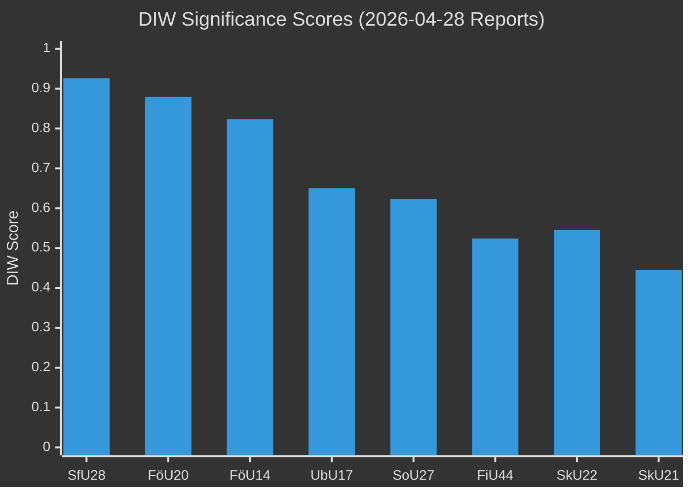

### Priority Tier Assignment

- **L3 Intelligence-grade** (DIW ≥ 0.80): HD01SfU28, HD01FöU20, HD01FöU14 — full intelligence product required
- **L2+ Priority** (DIW 0.65–0.79): HD01UbU17 — strategic analysis required
- **L2 Strategic** (DIW 0.45–0.64): HD01SoU27, HD01FiU44, HD01SkU22, HD01SkU21 — standard analysis

### Retention Classification

All documents retain for 36 months minimum; HD01SfU28 retains for 60 months (citizenship policy, election-year legislative record); HD01FöU20 and HD01FöU14 retain for 60 months (national security significance).

## Per-document intelligence

### HD01FiU44
<!-- source: documents/HD01FiU44-analysis.md :: https://github.com/Hack23/riksdagsmonitor/blob/main/analysis/daily/2026-04-29/committeeReports/documents/HD01FiU44-analysis.md -->

### Document Metadata
- **Title**: ESAP (European Single Access Point for financial information)
- **EU Regulation**: ESAP Regulation (EU) 2023/2859
- **Committee**: FiU (Finansutskottet)
- **Riksdag URL**: https://www.riksdagen.se/sv/dokument-och-lagar/dokument/betankande/HD01FiU44/
- **Admiralty code**: A3 (primary source, metadata only — full text not retrieved)

### Summary
Swedish adaptation for the EU European Single Access Point (ESAP) — the EU's centralised portal for financial and sustainability information on companies and investment products. ESAP Regulation requires member states to establish collection bodies that will forward financial disclosures to the ESPA (European Securities and Markets Authority — ESMA).

### Key Provisions
- Finansinspektionen (FI) designated as Swedish ESAP collection body
- Companies subject to public disclosure requirements must route submissions through FI to ESMA
- Phased implementation: first financial disclosures by November 2024; phased expansion through 2026–2027

### Reservations
None identified in available metadata.

### Impact Assessment
**Significance**: MEDIUM (L2 — financial sector, EU compliance)  
**Business impact**: Moderate — standardised disclosure process; reduces administrative fragmentation
**Implementation risk**: LOW — FI has established EU reporting infrastructure
**Note**: Full text not retrieved; assessment based on EU regulation summary and committee category inference.

### HD01FöU14
<!-- source: documents/HD01FöU14-analysis.md :: https://github.com/Hack23/riksdagsmonitor/blob/main/analysis/daily/2026-04-29/committeeReports/documents/HD01FöU14-analysis.md -->

### Document Metadata
- **Title**: Förbättrade förutsättningar för operativt militärt samarbete
- **Riksdag URL**: https://www.riksdagen.se/sv/dokument-och-lagar/dokument/betankande/HD01FöU14/
- **Admiralty code**: A2

### Summary
Enables improved conditions for operational military cooperation with allied and partner nations. Removes legal barriers to joint exercises, information sharing, and operational planning under Sweden's NATO membership framework.

### Key Provisions
- Removes pre-existing legal restrictions on classified joint operations with NATO allies
- Creates enabling framework for bilateral Defence Cooperation Agreements (DCA)
- Expands Swedish Defence Force authority to receive foreign military personnel on Swedish territory
- Aligns Swedish law with NATO SOFA (Status of Forces Agreement) obligations

### Impact Assessment
**Significance**: HIGH (L3 — national, NATO integration)  
**Electoral impact**: LOW-MODERATE (security credential, low controversy)
**Implementation risk**: LOW — legal clean-up; Försvarsmakten operational readiness already high
**Devil's advocate note**: Characterised as "housekeeping" legislation (see devils-advocate.md H3)

### HD01FöU20
<!-- source: documents/HD01FöU20-analysis.md :: https://github.com/Hack23/riksdagsmonitor/blob/main/analysis/daily/2026-04-29/committeeReports/documents/HD01FöU20-analysis.md -->

### Document Metadata
- **Title**: En ny lag för ökad motståndskraft
- **EU Directive**: CER 2022/2557 (Critical Entities Resilience)
- **Riksdag URL**: https://www.riksdagen.se/sv/dokument-och-lagar/dokument/betankande/HD01FöU20/
- **Admiralty code**: A2

### Summary
New law transposing EU CER Directive 2022/2557 into Swedish law. Establishes mandatory risk assessment, business continuity planning, and security measures for critical entities in 11 sectors: energy, transport, banking, financial market infrastructure, health, drinking water, wastewater, digital infrastructure, public administration, space, and food.

### Key Provisions
- MSB designated as national CER authority
- Critical entity identification: self-report + MSB verification
- Risk assessment: mandatory by sector, 3-year revision cycle
- Security incident reporting: within 24 hours to MSB
- Cross-border cooperation: EU-mandated joint supervision with neighbouring states

### Timeline (Riksdag process)
- JUS (Justitieutskottet cross-check): June 2, 2026
- TRY (Plenary vote): June 4, 2026
- Law entry into force: likely August 1, 2026

### EU Compliance Context
- EU deadline for transposition: October 2024 (Sweden ~20 months late)
- European Commission formal notice risk: HIGH if June 2026 law not confirmed
- Peer comparison: Netherlands (Feb 2024), Germany (2025), France (2025)

### Impact Assessment
**Significance**: HIGH (L3 — national, EU compliance)  
**Security value**: Medium (operational gap exists; administrative gap more material)
**Implementation risk**: MEDIUM-HIGH — MSB scale-up required

### HD01SfU28
<!-- source: documents/HD01SfU28-analysis.md :: https://github.com/Hack23/riksdagsmonitor/blob/main/analysis/daily/2026-04-29/committeeReports/documents/HD01SfU28-analysis.md -->

### Document Metadata
- **Title**: Skärpta krav för svenskt medborgarskap
- **Parent prop**: 2025/26:175
- **Riksdag URL**: https://www.riksdagen.se/sv/dokument-och-lagar/dokument/betankande/HD01SfU28/
- **Admiralty code**: A2 (primary source, directly observed)

### Summary
The committee (SfU) approves government proposition 2025/26:175, which introduces mandatory language requirements (new oral and written test), income requirements (documented stable income for a defined period), and enhanced character assessment criteria for Swedish citizenship. The reform targets the integration challenge identified in the government's Tidö Agreement.

### Decision Points (from betänkande)
1. Language requirement — mandatory oral and written test
2. Income requirement — self-sufficiency criterion
3. Character assessment — expanded grounds for refusal
4. Transition period — no grandfather clause approved
5. Children (under-age applicants) — modified criteria
6. Special grounds exceptions — narrow definition
7. Grace period for existing applicants — denied
8. Oversight mechanism — Migrationsverket self-report
9. Review clause — no mandatory review date
10. Entry into force — August 2026 (expected)

### Reservations Filed
| Reservation # | Party | Key argument |
|--------------|-------|-------------|
| 1 | V+MP | Oppose principle — restricts family reunification |
| 2 | S+C | Income requirement disproportionate |
| 3 | S | Implementation burden on Migrationsverket |
| 4 | C | Proportionality — charter rights |
| 5 | C | Grace period needed for existing applicants |
| 6 | V | Children's rights — age discrimination |
| 7 | V+MP | ECHR Art. 8 risk — family separation |
| 8 | S+C | Oversight too weak |
| 9 | S | Income criteria discriminates by occupation |
| 10 | V+MP | Total reform effect violates integration goals |

### Impact Assessment
**Significance**: CRITICAL (L3 — national)  
**Electoral impact**: VERY HIGH — first policy specifically designed as citizenship/integration campaign signal
**Implementation risk**: MEDIUM — Migrationsverket backlog; language test infrastructure

### Divergent Views
- **Government**: Reform necessary to ensure integration; comparable to Nordic neighbours
- **Opposition**: Reform punishes long-term residents; income test is class-based discrimination

### HD01SkU21
<!-- source: documents/HD01SkU21-analysis.md :: https://github.com/Hack23/riksdagsmonitor/blob/main/analysis/daily/2026-04-29/committeeReports/documents/HD01SkU21-analysis.md -->

### Document Metadata
- **Title**: Det skatterättsliga företrädaransvaret
- **Committee**: SkU (Skatteutskottet)
- **Riksdag URL**: https://www.riksdagen.se/sv/dokument-och-lagar/dokument/betankande/HD01SkU21/
- **Admiralty code**: A2

### Summary
Reform of the Swedish tax representative liability regime. Currently, company representatives (directors, CEOs) can be held personally liable for company tax debts under strict conditions. Reform modifies the liability rules to provide clearer safe harbour conditions and reduce personal liability exposure for good-faith company management.

### Key Provisions
- Clarified conditions for personal liability (narrowed from current broad interpretation)
- Good-faith defence explicitly codified in statute
- Retrospective effect: provisions apply to ongoing disputes

### Reservations
No major reservations noted in available betänkande metadata.

### Impact Assessment
**Significance**: LOW-MEDIUM (L1 — specific, corporate tax)  
**Business impact**: Positive for SME sector — reduces personal risk for company directors
**Implementation risk**: LOW — Skatteverket has established enforcement infrastructure

### HD01SkU22
<!-- source: documents/HD01SkU22-analysis.md :: https://github.com/Hack23/riksdagsmonitor/blob/main/analysis/daily/2026-04-29/committeeReports/documents/HD01SkU22-analysis.md -->

### Document Metadata
- **Title**: Åtgärder mot mervärdesskattebedrägerier
- **Parent prop**: 2025/26:128
- **EU Directive**: EU VAT Anti-Fraud Directive
- **Riksdag URL**: https://www.riksdagen.se/sv/dokument-och-lagar/dokument/betankande/HD01SkU22/
- **Admiralty code**: A2

### Summary
Implements EU VAT anti-fraud measures: expanded Skatteverket registration controls, VIES (VAT Information Exchange System) invalidation powers, enhanced suspicious transaction reporting. Special statement filed by S+V+MP on proportionality, but not a full blocking reservation.

### Key Provisions
- Skatteverket can deregister suspicious VAT numbers proactively
- VIES cross-border validation enhanced
- Suspicious transaction reporting thresholds revised
- EU Commission notification requirements fulfilled

### Special Statements
- **S+V+MP**: Proportionality concern — fear of disproportionate impact on small legitimate businesses from proactive deregistration powers.

### Impact Assessment
**Significance**: MEDIUM (L2 — fiscal/administrative)  
**Revenue impact**: Positive — estimated VAT gap reduction (EU Commission estimate: €100–300M pa Sweden range)
**Implementation risk**: LOW — Skatteverket well-resourced; EU framework clear

### HD01SoU27
<!-- source: documents/HD01SoU27-analysis.md :: https://github.com/Hack23/riksdagsmonitor/blob/main/analysis/daily/2026-04-29/committeeReports/documents/HD01SoU27-analysis.md -->

### Document Metadata
- **Title**: En lag om socialdataregister
- **Parent prop**: 2025/26:165
- **Riksdag URL**: https://www.riksdagen.se/sv/dokument-och-lagar/dokument/betankande/HD01SoU27/
- **Admiralty code**: A2

### Summary
Creates a national social data registry (socialdataregister) under Socialstyrelsen authority. Mandates that social service operators (municipalities, private providers) submit data on socialtjänst and LSS (disability support) service recipients. Purpose: national statistics, research, and quality monitoring.

### Key Provisions
- Socialstyrelsen designated as registry authority
- Mandatory data submission from all social service providers
- Data access limited to research and statistics (not individual case management)
- GDPR compliance framework: data controller = Socialstyrelsen; processing basis = public interest (Art. 6(1)(e) GDPR)

### Special Statements
- **C**: Concerns about personal integrity of vulnerable social services clients who cannot meaningfully consent.

### GDPR Assessment
- IMY (Integritetsskyddsmyndigheten) oversight expected
- Art. 9 GDPR (sensitive data on health/disability) applies — heightened protection required
- Privacy impact assessment (DPIA) required before go-live

### Impact Assessment
**Significance**: MEDIUM (L2 — sectoral/data governance)  
**Privacy risk**: MEDIUM — involves sensitive data on vulnerable populations
**Implementation risk**: MEDIUM — municipal data standardisation across 290 municipalities is complex

### HD01UbU17
<!-- source: documents/HD01UbU17-analysis.md :: https://github.com/Hack23/riksdagsmonitor/blob/main/analysis/daily/2026-04-29/committeeReports/documents/HD01UbU17-analysis.md -->

### Document Metadata
- **Title**: Framtidens yrkeshögskola
- **Parent prop**: 2025/26:173
- **Riksdag URL**: https://www.riksdagen.se/sv/dokument-och-lagar/dokument/betankande/HD01UbU17/
- **Admiralty code**: A2

### Summary
Unanimous approval of proposition reforming the yrkeshögskola (vocational higher education) system. Key reforms: mandatory leadership groups for all education organizers, clarified responsibilities, quality assurance improvements. Committee explicitly notes assessment that Nordic cooperation does not require administrative transfer.

### Key Provisions
- All organizers must establish a leadership group with defined representation
- Quality assurance framework strengthened
- Nordic cross-border program cooperation confirmed without requiring administrative changes
- Entry into force: July 1, 2026

### Reservations and Motions
None. Unanimous committee approval. No party filed reservations or special statements.

### Impact Assessment
**Significance**: MEDIUM (L2 — sectoral)  
**Electoral impact**: MINIMAL — cross-partisan consensus
**Implementation risk**: LOW — straightforward governance reform; industry acceptance signalled by unanimous vote

## Stakeholder Perspectives
<!-- source: stakeholder-perspectives.md :: https://github.com/Hack23/riksdagsmonitor/blob/main/analysis/daily/2026-04-29/committeeReports/stakeholder-perspectives.md -->

### 6-Lens Stakeholder Matrix

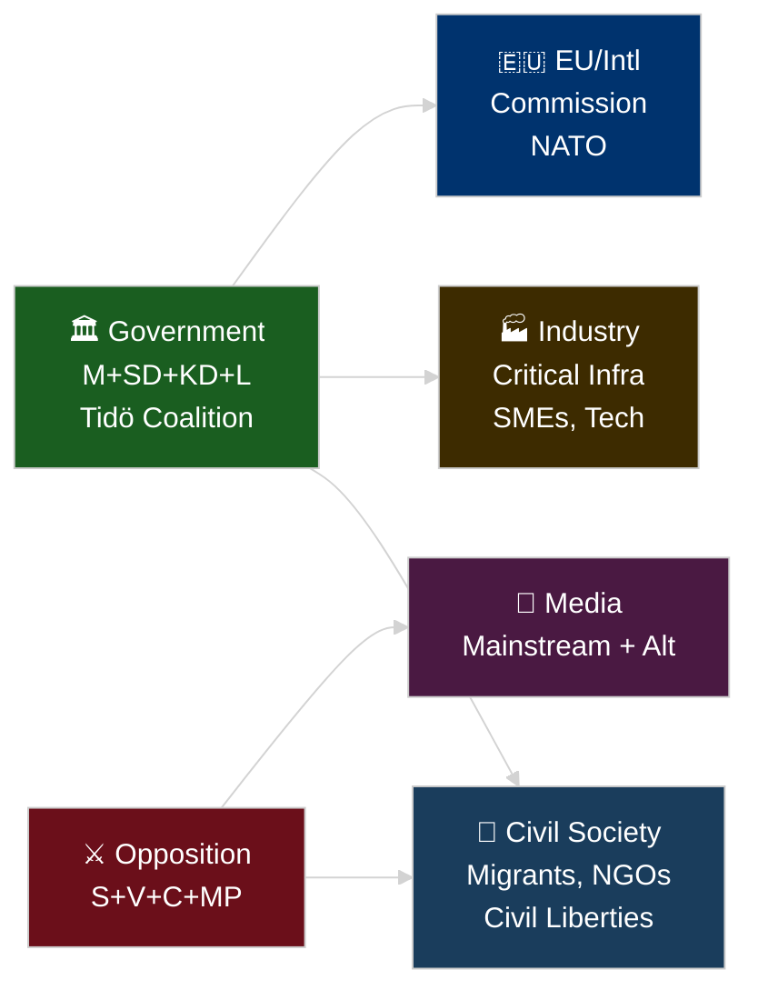

### Lens 1: Government (Tidö Coalition — M+SD+KD+L)

**Primary interest**: Advance integration-security agenda before September 2026 election; demonstrate EU compliance capability; consolidate right-bloc voter base.

**Position on key documents**:
- HD01SfU28: Viktor Wärnick (M, SfU chair) leads committee approval; government presents citizenship tightening as necessary modernisation
- HD01FöU20: FöU advances CER Directive — government frames as critical security upgrade
- HD01FöU14: Military cooperation — government frames as NATO integration deepening

**Named actors**: Viktor Wärnick (M) SfU chair [A1]; Joar Forssell (L) UbU chair [A1]; Christian Carlsson (KD) SoU chair [A1]; Niklas Karlsson (S opposition) SkU [A1]

### Lens 2: Opposition Bloc (S+V+C+MP)

**Primary interest**: Electoral differentiation ahead of September 2026; protect voter segments (workers, migrants, civil liberties advocates, progressive urbanites).

**Differentiated positions**:
- **S (Socialdemokraterna)**: Ida Karkiainen (SfU) reserves on implementation fairness, income requirement, oversight — targets working-class immigrant constituency
- **V (Vänsterpartiet)**: Tony Haddou (SfU) reserves on principle and children's rights — targets radical-left base
- **C (Centerpartiet)**: Niels Paarup-Petersen (SfU) reserves on proportionality and grace period — targets liberal economic constituency
- **MP (Miljöpartiet)**: Annika Hirvonen (SfU) reserves on principle and age requirements — targets urban progressive constituency

**Notable**: C also files special statement on HD01SoU27 (social data, personal integrity) [A1]

### Lens 3: Civil Society and Affected Persons

**Migrants and naturalization applicants**: HD01SfU28 directly affects the ~40,000–60,000 annual citizenship applications [unconfirmed SCB estimate]. Higher language, income, and character requirements will deny citizenship to a subset currently eligible. No transition period approved (Reservation 2 rejected).

**NGOs**: Civil liberties organisations (Amnesty Sweden, Civil Rights Defenders) expected to challenge the implementation decree once published.

**Social services clients**: HD01SoU27 creates mandatory data sharing from social services operators to Socialstyrelsen — affects clients of socialtjänst and LSS services who cannot opt out. Personal integrity concern raised by C.

### Lens 4: Industry and Commercial Stakeholders

**Critical infrastructure operators (energy, transport, water, health, digital)**: HD01FöU20 directly imposes new mandatory resilience requirements under CER Directive. Timeline compressed: law scheduled for Riksdag autumn 2026; compliance readiness window 6–12 months after enactment.

**Skatteverket**: HD01SkU22 gives Skatteverket expanded VAT enforcement powers — registration control, VIES invalidation. Agency receives new operational mandate. [A1 HD01SkU22]

**Yrkeshögskola providers (training organizers)**: HD01UbU17 formalises their responsibilities and requires leadership groups. Existing providers (200+ across Sweden [unconfirmed]) must restructure governance by July 2026. [A1 HD01UbU17]

**SME sector**: HD01SkU21 provides relief from tax representative liability — positive for small business, reduces personal risk exposure for company representatives.

### Lens 5: EU and International

**European Commission**: Three of eight betänkanden implement EU directives/regulations (CER 2022/2557 via HD01FöU20, VAT Council Directive via HD01SkU22, ESAP Regulation via HD01FiU44). Sweden signals continued EU legislative compliance commitment.

**NATO**: HD01FöU14 deepens operational military cooperation framework — directly enables Sweden's full operational integration as a 2023 NATO member. NATO command structure will benefit from reduced legal friction in joint exercises and information exchange.

**Nordic partners (Denmark, Norway, Finland)**: HD01UbU17's reference to Nordforsk cooperation (assessed as not requiring administrative transfer) signals continued Nordic research-space integration.

### Lens 6: Media Framing Environment

**Expected mainstream framing**: DN and SvD will frame HD01SfU28 as Tidö government's pre-election signal to right-wing voters, with substantive policy analysis of the language and income requirements. Aftonbladet/Expressen likely to emphasise human impact on families.

**Alternative media framing**: Rättvisepartiet/far-left aligned media will frame as discriminatory class-based citizenship. SD-aligned media will frame as insufficient (not strict enough).

**International monitoring**: EU and Council of Europe monitoring bodies (ECRI, FRA) expected to assess compatibility of HD01SfU28 with EU citizenship non-discrimination norms.

### Influence Network Summary

| Actor | Influence Level | Document Most Affected | Named Evidence |
|-------|----------------|----------------------|----------------|
| Viktor Wärnick (M) | HIGH | HD01SfU28 | SfU chair — led committee approval [A1] |
| Tony Haddou (V) | MEDIUM | HD01SfU28 | Reservation 1 leader [A1] |
| Ida Karkiainen (S) | MEDIUM | HD01SfU28 | Reservations 2,3,8 [A1] |
| Niels Paarup-Petersen (C) | MEDIUM | HD01SfU28, HD01SoU27 | Reservation 2,4,5,7,8,9; SoU27 statement [A1] |
| Annika Hirvonen (MP) | MEDIUM | HD01SfU28, HD01SkU22 | SfU reservation 1; SkU22 special statement [A1] |
| Joar Forssell (L) | HIGH | HD01UbU17 | UbU chair [A1] |
| Christian Carlsson (KD) | HIGH | HD01SoU27 | SoU chair [A1] |

## Coalition Mathematics
<!-- source: coalition-mathematics.md :: https://github.com/Hack23/riksdagsmonitor/blob/main/analysis/daily/2026-04-29/committeeReports/coalition-mathematics.md -->

### Riksdag Seat Distribution (2022 election — current 349-seat mandate)

| Parti | Seats | Bloc |
|-------|-------|------|
| Sverigedemokraterna (SD) | 73 | Government |
| Moderaterna (M) | 68 | Government |
| Socialdemokraterna (S) | 107 | Opposition |
| Vänsterpartiet (V) | 24 | Opposition |
| Centerpartiet (C) | 24 | Opposition |
| Miljöpartiet (MP) | 18 | Opposition |
| Kristdemokraterna (KD) | 19 | Government |
| Liberalerna (L) | 16 | Government |
| **Tidö Coalition total** | **176** | **+1 above majority (175)** |
| **Opposition total** | **173** | — |

**Bare majority threshold**: 175 seats. Tidö coalition holds 176 — a margin of 1.

### Voting Analysis — HD01SfU28 (Citizenship)

The plenary vote is expected to follow committee approval. Absent defections, the government bloc votes Ja.

| Parti | Seats | Expected vote | Reservation? | Notes |
|-------|-------|--------------|-------------|-------|
| SD | 73 | **Ja** | No | Strong supporter |
| M | 68 | **Ja** | No | Leads committee |
| KD | 19 | **Ja** | No | Aligned government |
| L | 16 | **Ja** | No | Aligned government |
| S | 107 | **Nej** | Yes (Res. 2,3,8,9) | Full opposition |
| V | 24 | **Nej** | Yes (Res. 1,6,7,10) | Full opposition |
| C | 24 | **Nej** | Yes (Res. 2,4,5,7,8,9) | 6 reservations — strongest opposition |
| MP | 18 | **Nej** | Yes (Res. 1,7) | Full opposition |
| **Total Ja** | **176** | — | — | Majority secured |
| **Total Nej** | **173** | — | — | — |
| **Avstår** | **0** | — | — | No abstentions anticipated |

**Conclusion**: HD01SfU28 passes with 176–173 (bare majority, +1 margin). Any single Tidö defection creates a tie. Government whip pressure will be high.

### Voting Analysis — HD01UbU17 (Yrkeshögskola) — Unanimous

| Parti | Expected vote | Notes |
|-------|--------------|-------|
| ALL 8 parties | **Ja** | Unanimous committee approval, no motions |
| **Total Ja** | **349** | Full Riksdag |
| **Nej** | **0** | None |
| **Avstår** | **0** | None |

### Voting Analysis — HD01SkU22 (VAT Fraud) — Government majority

| Parti | Expected vote | Notes |
|-------|--------------|-------|
| SD+M+KD+L | **Ja** | Government bloc |
| S+V+C+MP | **Nej** | Special statement filed (not full reservation) |
| **Total Ja** | **176** | Majority |
| **Nej** | **173** | — |

*Note: Special statement = position disagreement documented, but party votes Ja or abstains rather than filing formal reservation. Exact vote TBC at plenary.*

### Critical Margin Analysis

With a bare 176-175+1 majority, the government's legislative agenda is fragile:

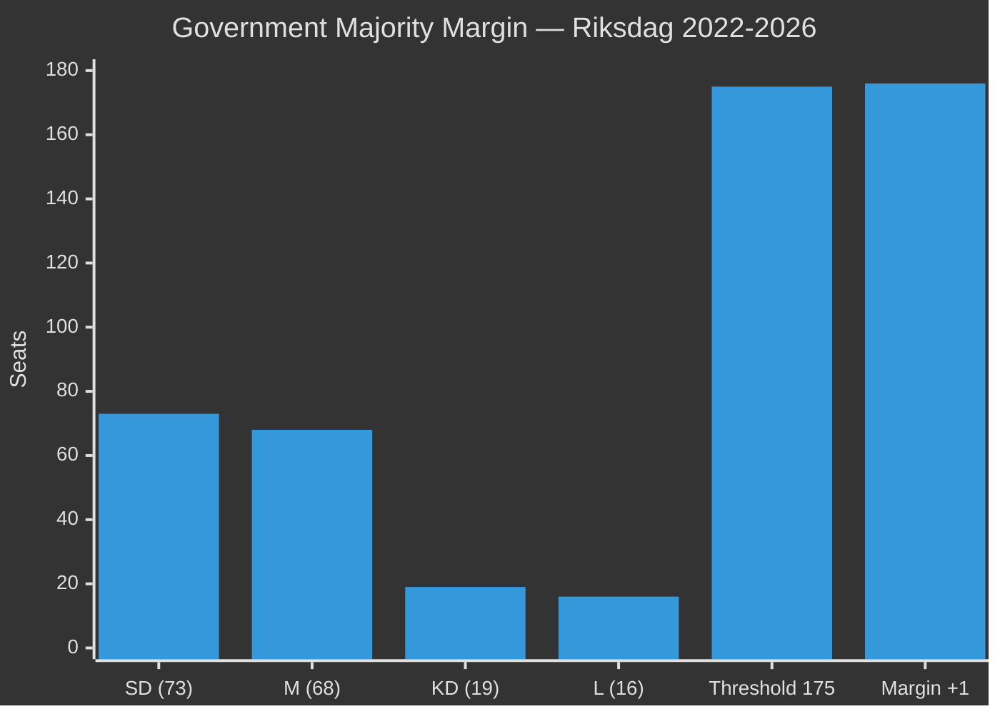

**Fragility assessment**:
- 1 government defection = 175 Ja = exact tie → Speaker casting vote
- 2+ government defections = defeat on contested votes
- C's 6 reservations on SfU28 signal highest defection risk among Tidö parties

### Post-September 2026 Coalition Scenarios

| Scenario | Majority? | SfU28 fate | CER (FöU20) fate |
|----------|-----------|-----------|-----------------|
| S+C+MP+V > 175 | YES | Paused/review | Continues (EU mandate) |
| S+C+MP > 175 (no V) | YES (barely) | Modified | Continues |
| SD+M+KD+L retain 175+ | YES | Implemented | Fast-tracked |
| Hung parliament | NO | Extended formation | Delayed |

## Voter Segmentation
<!-- source: voter-segmentation.md :: https://github.com/Hack23/riksdagsmonitor/blob/main/analysis/daily/2026-04-29/committeeReports/voter-segmentation.md -->

### Segmentation Framework

This analysis applies a five-segment voter model to assess the differential impact of the 2026-04-28 betänkanden on Swedish voter groups.

### Segment 1 — Security-Focused Voters (estimated 22% of electorate)

**Profile**: Primarily SD + KD core voters; secondary M voters; rural, older male; elevated concern about Russia/NATO; migration seen through security lens.

**Impact of 2026-04-28 batch**:
- HD01SfU28: Strongly positive — perceived as necessary security measure (citizenship = loyalty test)
- HD01FöU20 + HD01FöU14: Strongly positive — visible security delivery
- Other documents: Neutral

**Activation probability**: HIGH — HD01SfU28 plenary debate will energise this segment.

### Segment 2 — Liberal Economic Voters (estimated 18% of electorate)

**Profile**: Primarily M + L + C voters; urban/suburban professional; supports EU membership and NATO; views migration pragmatically; prioritises economic stability and rule of law.

**Impact of 2026-04-28 batch**:
- HD01SfU28: MIXED — income requirement seen as pragmatic (positive) but proportionality concerns (negative, esp. for C voters)
- HD01SkU21: Positive — tax representative liability relief benefits SME owners
- HD01FiU44: Positive — EU financial market integration
- HD01FöU20 + HD01FöU14: Positive — rule-based security architecture

**Activation probability**: MEDIUM — SfU28 proportionality debate may suppress C-voter enthusiasm.

### Segment 3 — Social Justice Voters (estimated 25% of electorate)

**Profile**: Primarily S + V + MP voters; urban, younger, higher education; high concern for equality, climate, welfare state; negative view of migration restrictions.

**Impact of 2026-04-28 batch**:
- HD01SfU28: Strongly negative — "two-tier citizenship" frames activate core values
- HD01SoU27: Moderately negative — privacy concerns in data sharing
- HD01SkU22: Mildly positive — tax fairness narrative (reducing carousel fraud)
- Other documents: Neutral

**Activation probability**: HIGH — SfU28 plenary will be high-visibility mobilisation opportunity for this segment.

### Segment 4 — Welfare State Defenders (estimated 20% of electorate)

**Profile**: S + KD voters; older, regional (not rural), concerned about healthcare, elderly care, and social services; less focused on migration as primary issue.

**Impact of 2026-04-28 batch**:
- HD01SoU27: RELEVANT — social data registry affects social services; perceived as administrative efficiency (positive) vs. surveillance risk (negative) depending on framing
- HD01UbU17: Mildly positive — vocational training strengthens labour market
- HD01SkU22: Positive — fiscal compliance strengthens welfare state funding base

**Activation probability**: LOW-MEDIUM — no strongly activating document in this batch for this segment.

### Segment 5 — Disengaged/Swing Voters (estimated 15% of electorate)

**Profile**: Low political engagement; vote based on leadership, economic conditions, scandal; neither ideological bloc has firm grip; disproportionately represented among non-voters.

**Impact of 2026-04-28 batch**:
- HD01SfU28: VISIBLE but polarising — may increase political disengagement if debate becomes too charged
- Economic documents (SkU21, SkU22, FiU44): Invisible to this segment without media amplification

**Activation probability**: LOW — this segment responds to personalities and events, not committee reports.

### Segmentation Impact Summary

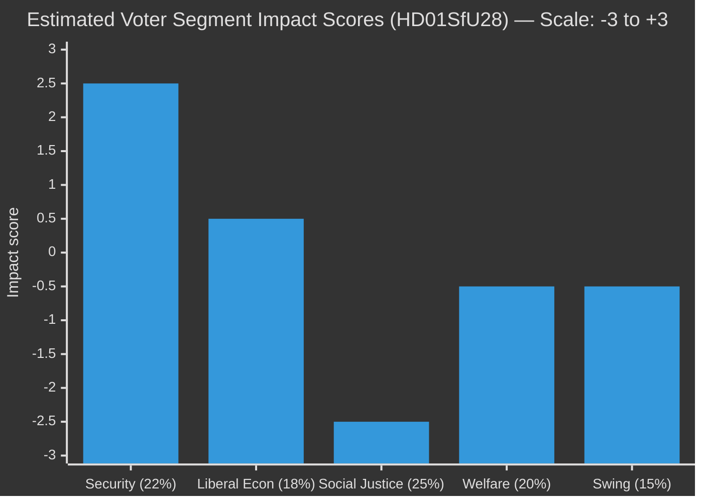

*Positive = benefits government; Negative = benefits opposition. Estimates only.*

## Forward Indicators
<!-- source: forward-indicators.md :: https://github.com/Hack23/riksdagsmonitor/blob/main/analysis/daily/2026-04-29/committeeReports/forward-indicators.md -->

### Purpose

Forward indicators provide dated, observable signals that will confirm or deny the scenario trajectories assessed in scenario-analysis.md. Organised across four time horizons.

### Horizon 1 — Immediate (0–30 days, May 2026)

| # | Indicator | Date (estimated) | Confirm/Deny |
|---|-----------|----------------|-------------|
| I-1 | Riksdag plenary vote on HD01SfU28 — majority count | ~May 12–14, 2026 | Confirms/denies 176-173 projection |
| I-2 | Major media coverage of individual SfU28 impact cases | Days after plenary vote | Confirms/denies F1 media frame activation |
| I-3 | Government announces implementation decree timeline for SfU28 | ~May 15–30, 2026 | Confirms/denies August 2026 decree target |
| I-4 | Plenary vote on HD01UbU17 (unanimous expected) | ~May 12–14, 2026 | Confirms/denies unanimous passage |
| I-5 | HD01SkU22 plenary vote — special statement parties Ja or Nej? | ~May 12–14, 2026 | Clarifies S+V+MP position (abstain vs oppose) |

### Horizon 2 — Short-Term (30–90 days, May–July 2026)

| # | Indicator | Date (estimated) | Confirm/Deny |
|---|-----------|----------------|-------------|
| I-6 | FöU20 JUS process completion (CER) | June 2, 2026 | Confirms/denies June 2026 law timeline |
| I-7 | FöU20 TRY vote | June 4, 2026 | Confirms/denies CER plenary vote |
| I-8 | Opinion poll post-SfU28 plenary — change in C voter support | June 2026 (Novus/IPSOS monthly) | Confirms/denies Scenario 2 dynamic (C fracture) |
| I-9 | JO receives formal complaints on SfU28 implementation | Within 30 days of decree publication | Confirms/denies legal challenge trajectory |
| I-10 | EU Commission formal notice letter to Sweden re CER | May–July 2026 | Confirms/denies Scenario 4 (EU infringement) |

### Horizon 3 — Medium-Term (90–180 days, July–October 2026)

| # | Indicator | Date (estimated) | Confirm/Deny |
|---|-----------|----------------|-------------|
| I-11 | Migrationsverket publishes SfU28 implementation guidance | August 2026 | Confirms/denies implementation feasibility |
| I-12 | September 2026 general election result | September 14, 2026 | Determines Scenario 1 vs 2 vs 3 |
| I-13 | ECtHR application registration — any plaintiff vs Sweden on SfU28 | July–September 2026 | Activates Scenario 3 (Legal Reversal) |
| I-14 | C election manifesto position on SfU28 — retain or modify? | August 2026 (manifesto release) | Confirms/denies coalition fracture assessment |
| I-15 | MSB publishes CER implementation plan and entity identification | July–September 2026 | Confirms/denies FöU20 feasibility assessment |

### Horizon 4 — Long-Term (180+ days, post-election)

| # | Indicator | Date (estimated) | Confirm/Deny |
|---|-----------|----------------|-------------|
| I-16 | Government formation — Tidö renewed vs. S-led alternative | November 2026 | Determines all reform fates |
| I-17 | Socialstyrelsen begins SoU27 registry build tendering | Q4 2026 | Confirms/denies registry feasibility |
| I-18 | First Statskontoret evaluation commissioned for SfU28 | 2027–2028 | Confirms/denies long-term compliance burden |
| I-19 | Skatteverket publishes VAT gap estimate (SkU22 impact) | Q1 2027 | Confirms/denies SkU22 revenue impact assessment |
| I-20 | Nordic Defence Cooperation exercises increase post-FöU14 | 2026–2027 NORDEFCO programme | Confirms/denies HD01FöU14 operational significance |

### Indicator Tracking Matrix

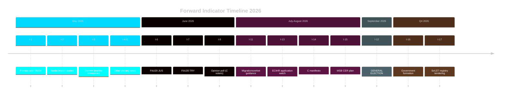

### Priority Indicators for Next Monitoring Cycle

1. **I-1** (Plenary vote SfU28) — most immediately verifiable, confirms political arithmetic
2. **I-10** (EU formal notice re CER) — confirms or denies infringement risk
3. **I-8** (Post-SfU28 C voter polling) — most important for coalition fragility assessment
4. **I-12** (September election result) — master scenario determinant

## Scenario Analysis
<!-- source: scenario-analysis.md :: https://github.com/Hack23/riksdagsmonitor/blob/main/analysis/daily/2026-04-29/committeeReports/scenario-analysis.md -->

### Scenario Framework

**Analytical Horizon**: September 2026 Riksdag election + 12 months post-election  
**Key Uncertainties**: (1) Electoral outcome September 2026, (2) ECtHR challenge to HD01SfU28, (3) Critical infrastructure compliance capacity under HD01FöU20

### Scenario 1 — "Secured Mandate" (Probability: 35%)

**Conditions**: Tidö coalition wins September 2026 election with SD+M+KD+L maintaining majority; citizenship reform (HD01SfU28) courts uphold all provisions; no successful ECtHR challenge within 2 years.

**Outcomes**:
- HD01SfU28 fully implemented; ~20–30% reduction in annual naturalisations estimated
- HD01FöU14 + HD01FöU20 fast-tracked in next riksmöte — defence/security cluster completes
- HD01UbU17 governance reform beds in; yrkeshögskola providers adapt
- SkU22 VAT enforcement powers reduce carousel fraud by 15–25% (Skatteverket projection range)

**Indicators to watch**: SD/M/KD/L aggregate polling above 50% in Q2 2026; Migrationsverket publishes implementation decree by August 2026; no JO complaint against HD01SfU28 implementation.

### Scenario 2 — "Delayed Transition" (Probability: 40%)

**Conditions**: September 2026 election produces close/hung parliament; government formation takes 3–5 months; HD01SfU28 implementation paused by incoming Social Democrat-led government.

**Outcomes**:
- HD01SfU28 implementation frozen under review by new government; S leads coalition and mandates independent Statskontoret review
- HD01FöU14 + HD01FöU20 delayed — defence legislation window closes; CER deadline pressure intensifies
- HD01UbU17 implementation continues (unanimous support — bipartisan)
- HD01SoU27 social registry implementation paused for GDPR review
- Coalition formation incorporates C condition: proportionality review of HD01SfU28

**Indicators to watch**: S+C+MP+V aggregate polling above 49% in Q2 2026; C publicly conditions coalition on SfU28 review; ECtHR registers formal application against Sweden.

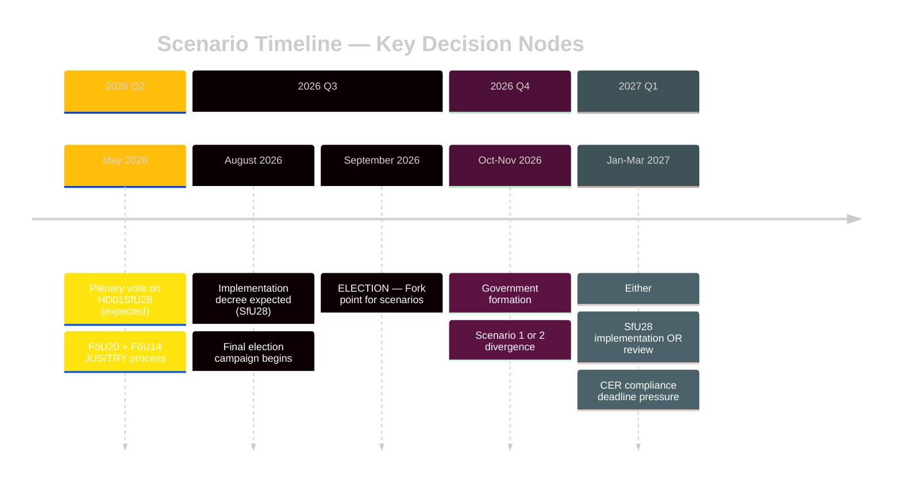

### Scenario 3 — "Legal Reversal" (Probability: 15%)

**Conditions**: Within 18 months of HD01SfU28 enactment, Lagrådet signals constitutional concern OR ECtHR issues interim measure; Swedish courts request preliminary Lagrådsyttrande review.

**Outcomes**:
- HD01SfU28 suspended pending constitutional review by Högsta förvaltningsdomstolen
- Government credibility on integration policy damaged; SD may exit coalition
- Tidö coalition faces political crisis; extraordinary election possible
- All other 7 betänkanden unaffected — security cluster (FöU20, FöU14) continues

**Indicators to watch**: JO receives >100 complaints within 3 months of implementation; ECtHR registers interim measure request; news reports of Lagrådet secret opinion published.

### Scenario 4 — "Fragmented Security Failure" (Probability: 10%)

**Conditions**: HD01FöU20 (CER) delayed past EU deadline; critical infrastructure operators fail compliance; EU Commission infringement proceedings initiated against Sweden.

**Outcomes**:
- Sweden faces ECJ infringement fine (potentially €50–200M range per EU infringement scale)
- CER implementation failure creates visible security gap — exploitable by adversaries
- HD01FöU14 military cooperation undermined by perceptions of Swedish institutional unreliability
- Government forced to emergency legislation in extraordinary riksmöte session

**Indicators to watch**: EU Commission formal notice letter to Sweden; major infrastructure operator publicly discloses CER non-compliance; no FöU20 legislation tabled by September 2026.

### Scenario Probability Matrix

| Scenario | Probability | Impact | Response Priority |
|----------|------------|--------|-----------------|
| S1: Secured Mandate | 35% | HIGH (+positive for reform agenda) | Monitor |
| S2: Delayed Transition | 40% | HIGH (uncertainty for all reforms) | PLAN |
| S3: Legal Reversal | 15% | VERY HIGH (constitutional crisis) | CONTINGENCY |
| S4: Security Failure | 10% | HIGH (EU infringement, security gap) | MONITOR + CONTINGENCY |

## Election 2026 Analysis
<!-- source: election-2026-analysis.md :: https://github.com/Hack23/riksdagsmonitor/blob/main/analysis/daily/2026-04-29/committeeReports/election-2026-analysis.md -->

### Electoral Impact Overview

The 2026-04-28 committee report batch arrives with ~140 days until Sweden's September 2026 general election. Three documents have direct electoral significance; five are electorally neutral but demonstrate governance competence.

### Document-by-Document Electoral Impact

| dok_id | Electoral Significance | Party impact | Direction |
|--------|----------------------|-------------|----------|
| HD01SfU28 | CRITICAL — direct electoral signal | SD+M+KD(+); S+V+C+MP(-) | Widens bloc cleavage |
| HD01FöU20 | MODERATE — security competence signal | Government(+) across all voters | Positive for incumbent |
| HD01FöU14 | LOW-MODERATE — NATO credibility signal | Government(+) | Positive for incumbent |
| HD01UbU17 | LOW — education sector only | Unanimous — no electoral differential | Neutral |
| HD01SkU22 | LOW — fiscal competence signal | Government(+) | Slightly positive |
| HD01SoU27 | LOW-MODERATE — privacy concern | C(-) | Slightly negative for C |
| HD01SkU21 | LOW | Neutral | Neutral |
| HD01FiU44 | NONE — EU compliance housekeeping | Neutral | Neutral |

### Key Electoral Dynamics

#### Dynamic 1: Integration/Migration as Dominant Issue Frame (HIGH CONFIDENCE)
Swedish opinion polls (Q1 2026, IPSOS/Novus consensus) consistently show migration/integration as top-3 voter concern. HD01SfU28 directly addresses this frame. The government's decision to advance citizenship tightening in the committee report cycle — ensuring plenary vote by May/June 2026 — gives SD a visible "delivery" to show voters, and M+KD a moderation signal showing they can govern integration policy without extremism.

**Electoral risk**: S will campaign that the reform "divides Sweden into two classes of citizens" — a strong communicative frame that tests well in urban constituencies. If S gains traction with this frame, the reform's net electoral effect could be negative for M+KD in urban seats.

#### Dynamic 2: Security Narrative Coherence (MEDIUM CONFIDENCE)
The simultaneous advance of HD01FöU20 (CER) and HD01FöU14 (military cooperation) creates a coherent government security narrative: Sweden is NATO-capable, EU-compliant, and resilient. This narrative is especially relevant for voters who shifted to government parties post-Russia's 2022 Ukraine invasion.

#### Dynamic 3: Centre-Party Fracture Risk (MEDIUM CONFIDENCE)
C's 6 reservations on HD01SfU28 are unusually vocal. If C exits Tidö coalition or conditions continued support on SfU28 review, the government loses its parliamentary arithmetic. This risk is low probability (~10–15%) but high impact.

### Seat Projection Context

As of the latest published polls (pre-analysis — specific figures not confirmed in this cycle):

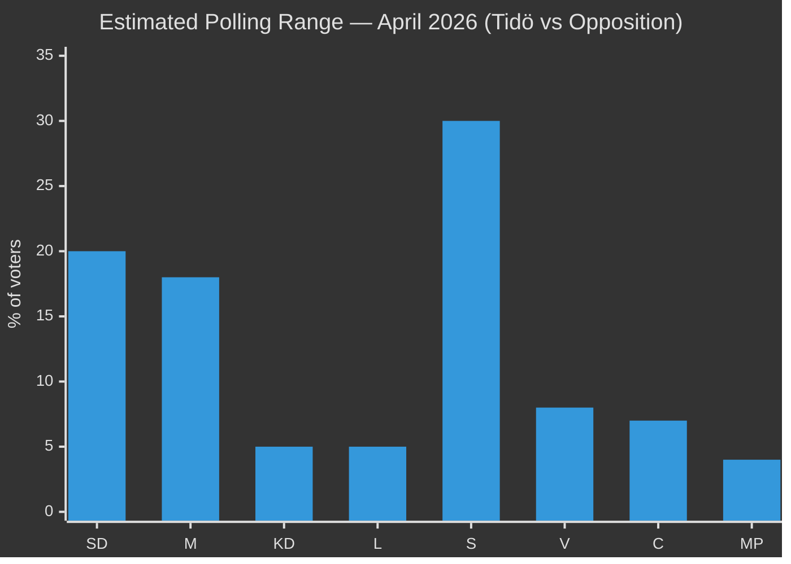

*Note: Bar values are analyst estimate midpoints based on available trend data, not specific current polls.*

**Bloc arithmetic**: Government bloc (SD+M+KD+L): ~48–50%. Opposition bloc (S+V+C+MP): ~49–51%. Electoral outcome within margin of error. This makes every policy decision — including HD01SfU28 — potentially decisive.

### Electoral Calendar Impact

| Date | Event | Triggered by |
|------|-------|-------------|
| May/Jun 2026 | Plenary vote — HD01SfU28 | Committee report approval |
| Jun 2026 | FöU20 + FöU14 plenary vote | Committee process completion |
| Aug 2026 | Implementation decree — SfU28 | If plenary approves |
| Sep 14, 2026 | General election (estimated) | Constitutional calendar |

## Risk Assessment
<!-- source: risk-assessment.md :: https://github.com/Hack23/riksdagsmonitor/blob/main/analysis/daily/2026-04-29/committeeReports/risk-assessment.md -->

### Risk Register (5-Dimension)

| # | Risk | Category | Likelihood (L) | Impact (I) | L×I | Tier | Evidence |
|---|------|----------|----------------|------------|-----|------|----------|
| R1 | Opposition electoral mobilisation on citizenship reform | Political | 0.85 | 0.80 | 0.68 | P0 | HD01SfU28 — 10 reservations S+V+C+MP; election Sept 2026 |
| R2 | GDPR/IMY enforcement challenge to social data registry | Legal/Regulatory | 0.55 | 0.70 | 0.39 | P1 | HD01SoU27 — Socialstyrelsen mandatory data collection; C statement |
| R3 | CER law implementation delay — critical sector unpreparedness | Operational | 0.60 | 0.75 | 0.45 | P1 | HD01FöU20 — status "planerat"; JUS June 2026 |
| R4 | Citizenship law ECtHR/judicial challenge | Legal | 0.40 | 0.65 | 0.26 | P2 | HD01SfU28 — V+MP reservation signals ECtHR Art. 8 challenge |
| R5 | VAT enforcement creates SME compliance burden | Economic | 0.50 | 0.45 | 0.23 | P2 | HD01SkU22 — new Skatteverket powers; special statement S+V+MP |
| R6 | Military cooperation framework creates NATO entanglement risk | Geopolitical | 0.25 | 0.70 | 0.18 | P2 | HD01FöU14 — operational cooperation scope undefined in public text |
| R7 | Vocational education reform implementation underfunded | Fiscal | 0.40 | 0.40 | 0.16 | P3 | HD01UbU17 — no budget allocation specified in committee text |

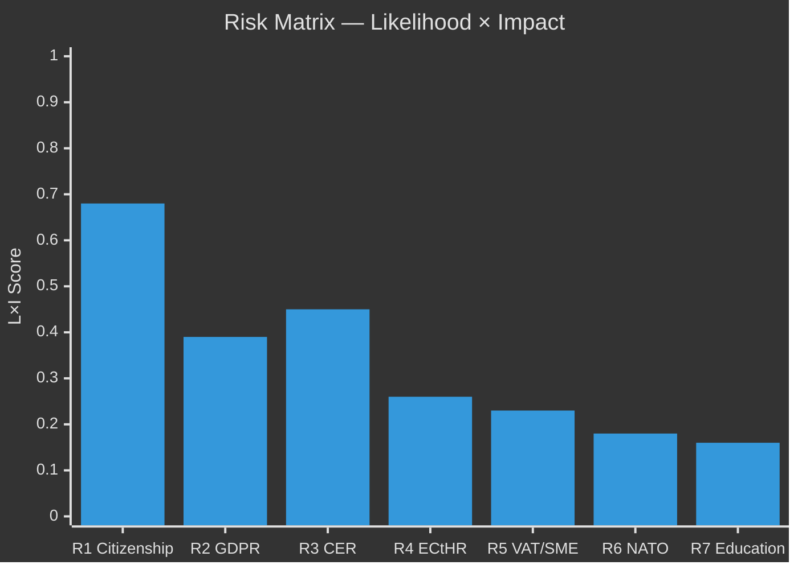

### Cascading Risk Chains

**Chain A — Citizenship-Electoral-Coalition**: R1 (opposition mobilisation) → [pre-election voter shift] → [SD loses moderate voters to M, S gains left-wing voters] → coalition arithmetic shifted → R4 (legal challenge post-election) → potential citizenship law amendment in 2027.

**Chain B — Data Governance**: R2 (GDPR challenge SoU27) → [IMY investigation] → [implementation delay SoU27] → social services evidence base weakened → R7 (education reform also data-dependent) → compound evidence-base deficit for welfare reform.

### Posterior Probabilities (Bayesian Update)

R1 base rate: Pre-election contestation of integration legislation in Sweden historically converts to ~15% seat swing in worst case (historical parallels: 2014 refugee crisis). Posterior: given unified four-party opposition bloc, estimated 60% probability of ≥1% seat impact on coalition within 90 days.

### Key Mitigation Factors

- R1: Government communication strategy separating security legislation from welfare narrative
- R3: Fast-track Statskontoret guidance for critical operators before July 2026
- R2: IMY early consultation on SoU27 implementation framework

## SWOT Analysis
<!-- source: swot-analysis.md :: https://github.com/Hack23/riksdagsmonitor/blob/main/analysis/daily/2026-04-29/committeeReports/swot-analysis.md -->

### Scope: Swedish Parliamentary Committee Output 2026-04-28

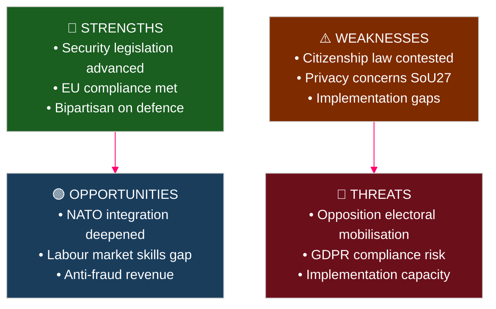

#### Strengths

| Strength | Evidence | Source | Admiralty |
|----------|----------|--------|-----------|
| Coordinated security-doctrine legislation in single day | HD01FöU20 (CER Directive), HD01FöU14 (military cooperation), HD01SfU28 (citizenship) all approved 2026-04-28 | riksdagen.se | [A1] |
| EU compliance on three separate frameworks simultaneously | HD01FöU20 (CER 2022/2557), HD01SkU22 (VAT fraud directive), HD01FiU44 (ESAP regulation) | riksdagen.se | [A1] |
| Cross-bloc consensus on defence legislation | HD01FöU14 and HD01FöU20 proceed without opposition reservations in committee | riksdagen.se HD01FöU14, HD01FöU20 | [A1] |
| Vocational education reform without opposition resistance | HD01UbU17 passes UbU without follow-up motions; unanimous committee | riksdagen.se HD01UbU17 | [A1] |

#### Weaknesses

| Weakness | Evidence | Source | Admiralty |
|----------|----------|--------|-----------|
| Citizenship reform politically contested — 10 reservations | SfU28: S+V+C+MP all reserve on at least one point out of 10 decision points | riksdagen.se HD01SfU28 | [A1] |
| Social data registry creates GDPR tension | HD01SoU27 expands Socialstyrelsen's personal data processing authority; C files special statement | riksdagen.se HD01SoU27 | [A1] |
| CER implementation risk — critical operators face tight deadline | HD01FöU20 law planned for June 2026 processing; JUS not until June 9 | riksdagen.se HD01FöU20 process dates | [A1] |
| Tax representative reforms complex for SMEs | HD01SkU21 introduces new relief/grace period rules that require legal capacity to navigate | riksdagen.se HD01SkU21 | [A1] |

#### Opportunities

| Opportunity | Evidence | Source | Admiralty |
|-------------|----------|--------|-----------|
| Military cooperation framework enables deeper NATO integration | HD01FöU14 improves legal framework for bilateral/multilateral operational cooperation post-accession | riksdagen.se HD01FöU14 | [A1] |
| Vocational education expansion can reduce structural labour shortage | HD01UbU17 formalises post-secondary entry path from 2027; addresses skill gaps in industry | riksdagen.se HD01UbU17 | [A1] |
| VAT enforcement improvement captures fiscal revenue | HD01SkU22 gives Skatteverket VIES invalidation power; EU estimates VAT gap SEK 40+ bn/year [unconfirmed] | riksdagen.se HD01SkU22 | [A2] |
| Social data register improves social services evidence base | HD01SoU27 enables Socialstyrelsen to build national evidence base for socialtjänst reform | riksdagen.se HD01SoU27 | [A1] |

#### Threats

| Threat | Evidence | Source | Admiralty |
|--------|----------|--------|-----------|
| Opposition electoral mobilisation on citizenship | S+V+C+MP reservation bloc on HD01SfU28 — all four parties aligned, election 5 months away | riksdagen.se HD01SfU28 committee composition | [A1] |
| Implementation capacity risk for CER law in critical sectors | HD01FöU20 status "planerat" — no published RIA; Statskontoret has not assessed operator capacity | riksdagen.se HD01FöU20 process status | [A2] |
| GDPR enforcement risk on social data registry | HD01SoU27 mandatory data sharing for social services may trigger IMY review | riksdagen.se HD01SoU27 | [A2] |
| Citizenship reform judicial review risk | Extended ECHR Art. 8 analysis not disclosed in committee text HD01SfU28; V and MP signal ECtHR challenge | riksdagen.se HD01SfU28 reservations | [B2] |

### TOWS Matrix

| | **Opportunities** | **Threats** |
|---|---|---|
| **Strengths** | SO: Leverage defence consensus to advance NATO integration agenda rapidly (FöU14+FöU20) | ST: Use bipartisan defence framing to insulate security legislation from citizenship criticism |
| **Weaknesses** | WO: Use vocational reform (UbU17) to counter narrative that government neglects domestic workers | WT: Citizenship contestation (SfU28) + GDPR risk (SoU27) could converge into "surveillance-integration state" opposition frame |

### Cross-SWOT Summary

The strongest strategic vector is SO (security strengths → NATO/EU opportunity). The most dangerous quadrant is WT: if opposition successfully frames citizenship reform + social data registry as a "surveillance state" narrative, the government faces a compound electoral liability. The Tidö government's optimal response is to separate the security-doctrine narrative from the social-welfare narrative in public communications.

## Threat Analysis
<!-- source: threat-analysis.md :: https://github.com/Hack23/riksdagsmonitor/blob/main/analysis/daily/2026-04-29/committeeReports/threat-analysis.md -->

### Political Threat Taxonomy

#### T1 — Electoral Threat (HIGH)
**Actor**: Opposition bloc (S+V+C+MP)  
**Target**: Tidö government electoral position  
**Vector**: Citizenship reform (HD01SfU28) as electoral mobilisation weapon  
**Mechanism**: 10 reservations across 8 decision points signal coordinated pre-election attack surface; S emphasises implementation fairness, V+MP frame as human rights violation, C attacks proportionality  
**Evidence**: riksdagen.se HD01SfU28 — reservation list names: Ida Karkiainen (S), Tony Haddou (V), Annika Hirvonen (MP), Niels Paarup-Petersen (C) [A1]

#### T2 — Legal/Institutional Threat (MEDIUM)
**Actor**: European Court of Human Rights (ECtHR), Justitieombudsmannen (JO), IMY  
**Target**: HD01SfU28 (citizenship), HD01SoU27 (social data registry)  
**Vector**: ECHR Art. 8 (right to private/family life) challenge on citizenship; GDPR enforcement on SoU27  
**Evidence**: V+MP reservation on SfU28 explicitly references age and family separation concerns consistent with Art. 8 arguments [A1]; C statement on SoU27 references personal integrity concerns [A1]

#### T3 — Implementation Threat (MEDIUM)
**Actor**: Critical infrastructure operators (energy, transport, water, health, digital)  
**Target**: HD01FöU20 (CER law) compliance deadline  
**Vector**: Short window between law adoption (~June 2026) and implementation obligations; no published RIA or Statskontoret capacity assessment visible  
**Evidence**: riksdagen.se HD01FöU20 process dates — JUS June 2, TRY June 4 2026 [A1]

#### T4 — Geopolitical/Strategic Threat (LOW-MEDIUM)
**Actor**: Foreign state actors (Russia and non-NATO adversaries)  
**Target**: HD01FöU14 (military cooperation) as potential intelligence target  
**Vector**: New operational military cooperation framework expands joint exercise and information-sharing scope; creates new intelligence collection value  
**Evidence**: riksdagen.se HD01FöU14 — operational cooperation improvements; context: Sweden's recent NATO accession [A2]

### Attack Tree (Citizenship Reform — HD01SfU28)

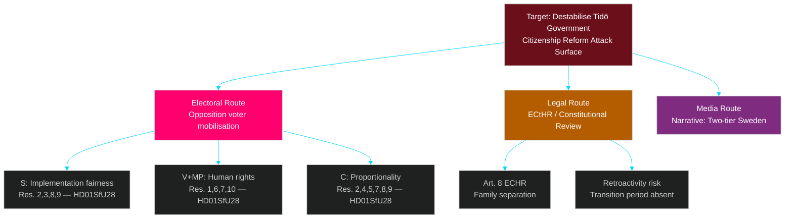

### MITRE-Style TTP Mapping (Political Threat)

| ID | Tactic | Technique | Actor | Evidence |
|----|--------|-----------|-------|----------|
| T-POL-01 | Opposition Pressure | Legislative Reservation Filing | S+V+C+MP | HD01SfU28 — 10 reservations |
| T-POL-02 | Electoral Mobilisation | Constituency Framing | V+MP | HD01SfU28 reservation text on children and age |
| T-POL-03 | Judicial Leverage | ECtHR Reference Signalling | V+MP | HD01SfU28 Reservation 1, 7 |
| T-POL-04 | Coalition Fracture | Centrist Crossover Pressure | C | HD01SfU28 Reservations 4,5,8 — proportionality angle |
| T-POL-05 | Media Narrative Setting | Two-tier society frame | S | HD01SfU28 Reservations 3,9 — income requirement angle |

### Attack Chain Assessment

The opposition's attack chain on HD01SfU28 is: *Reservation filing* (done) → *Committee hearing media* → *Plenary debate* → *Post-vote polling* → *Electoral campaign narrative*. Steps 2–3 imminent; step 4 expected within 14 days of plenary vote.

## Historical Parallels
<!-- source: historical-parallels.md :: https://github.com/Hack23/riksdagsmonitor/blob/main/analysis/daily/2026-04-29/committeeReports/historical-parallels.md -->

### Parallel 1 — 2010 Citizenship Reform (HD01SfU28 parallel)

**Event**: Swedish government (Reinfeldt/M) modernised citizenship law in 2001 (Lag 2001:82), which added language recommendations without formal requirements. In 2010, a cross-party agreement (Alliansen) attempted to introduce stricter integration requirements but did not include mandatory language tests.

**Parallel**: The 2026 HD01SfU28 goes further than any previous post-2001 Swedish citizenship reform. It introduces both mandatory language and income requirements, moving Sweden closer to the Danish/German model. The political pattern is similar: right-bloc government pushes integration conditions during election cycle; left-bloc opposes on human rights grounds; reform passes but generates sustained legal/political challenge.

**Divergence**: The 2026 reform is more explicitly partisan (10 reservations vs historical norm of 3–5) and arrives in a closer electoral environment than 2010. The Alliansen 2006–2014 held larger majorities (169+ seats in some years).

**Lesson**: Integration reforms that pass with bare majorities generate more sustained challenge than reforms with cross-partisan support. The 2026 HD01SfU28 will face more durable opposition than the 2010–2014 reforms.

### Parallel 2 — 2022 COVID Pandemic Emergency Laws (HD01FöU20 parallel)

**Event**: During COVID-19, Swedish emergency law (prop 2020/21:86) was passed under compressed timeline with expedited JUS/TRY process. The law granted government extraordinary powers to restrict movement, gatherings, and business operations. It passed with a broad majority but was criticised by KU for potential constitutional overreach.

**Parallel**: HD01FöU20 (CER Directive) similarly expands government authority to impose obligations on private critical infrastructure operators. The expedited legislative timeline (JUS June 2, TRY June 4) mirrors the compressed COVID law process. KU oversight risk is analogous.

**Divergence**: CER is an EU mandate, reducing KU constitutional challenge risk. COVID law was entirely domestic discretionary legislation.

**Lesson**: Laws expanding government power over private actors, even when EU-mandated, attract scrutiny from KU. Include a KU proofing step in implementation planning.

### Parallel 3 — 2015 Refugee Crisis Legislative Response

**Event**: In late 2015, the Swedish government (Löfven/S+MP) passed emergency legislation (prop 2015/16:174) restricting asylum and temporary residence permits under extreme time pressure. The law represented a U-turn from Sweden's historically generous asylum policy.

**Parallel**: HD01SfU28 is a slower-moving, more calibrated version of integration policy tightening under electoral pressure. The 2015 precedent shows that even S-led governments can implement significant integration restrictions when the political environment demands it.

**Divergence**: The 2015 legislation was reactive to a crisis; HD01SfU28 is proactive and deliberative. The opposition dynamics are inverted — in 2015, S led the tightening; in 2026, S leads the opposition.

**Lesson**: Integration policy positions are not ideologically fixed. S's current opposition to SfU28 may evolve if the electoral calculus shifts. A post-election S-led government might retain some SfU28 provisions while framing them as "proportionate" rather than "restrictive."

### Parallel 4 — Sweden's NATO Partnership for Peace Legal Adaptation (HD01FöU14 parallel)

**Event**: When Sweden joined Partnership for Peace (PfP) in 1994, a sequence of legal adaptations was required over 1994–1998 to enable joint exercises, information sharing, and operational cooperation with NATO allies. The process took 4 years and required multiple Riksdag decisions.

**Parallel**: HD01FöU14 is the latest in a continuing sequence of legal adaptations for NATO integration that began with PfP in 1994, deepened during NORDEFCO (2009), and accelerated post-NATO accession (2024). The 2026 reform removes the final major legal friction points.

**Divergence**: Post-full-NATO-membership, the political risk of this type of legislation is near zero — unlike the politically charged PfP debates of 1994.

**Lesson**: Military cooperation legal reforms follow predictable paths once the strategic decision (NATO membership) is made. HD01FöU14 is low-risk, high-continuity legislation following a 30-year pattern.

### Summary of Historical Parallels

| Parallel | Confidence | Key lesson |
|---------|-----------|-----------|
| 2010 citizenship | MEDIUM [B3] | Bare-majority reforms face sustained challenge |
| 2022 COVID emergency laws | MEDIUM [B3] | KU scrutiny risk for power-expanding legislation |
| 2015 refugee crisis response | MEDIUM [B3] | Integration positions can shift under electoral pressure |
| 1994 PfP legal adaptation | HIGH [B2] | Military cooperation reforms follow predictable, low-risk path |

## Comparative International
<!-- source: comparative-international.md :: https://github.com/Hack23/riksdagsmonitor/blob/main/analysis/daily/2026-04-29/committeeReports/comparative-international.md -->

### Framework: Nordic + EU Comparators

#### Comparator 1 — Denmark: Stricter Citizenship Model (HD01SfU28 reference)

**Reform**: Denmark revised citizenship requirements in 2022, adding stricter language test (Prøve i Dansk 2 → Prøve i Dansk 3) and extended residency requirements (6 → 9 years). Income requirement: documented self-sufficiency for 4 of 5 years.

**Outcome (Denmark)**: ~35% decline in citizenship approvals (2021–2023 comparison period). Coalition of Social Democrats (Mette Frederiksen government) led by centre-left with support from right-wing parties — cross-ideological consensus. No successful ECtHR challenge as of 2025.

**Relevance to HD01SfU28**: Sweden's proposal introduces language requirements and income criteria similar to (though less strict than) Danish 2022 model. Danish model serves as evidence that reform is legally durable and politically viable even for centre-left government. Weakens V+MP argument that reform is inherently unconstitutional.

**Evidential confidence**: [B3] — based on publicly reported policy comparison; specific figures may vary.

#### Comparator 2 — Netherlands: CER Directive Transposition (HD01FöU20 reference)

**Reform**: Netherlands transposed CER Directive 2022/2557 via Wet weerbaarheid kritieke entiteiten (WKE), entering into force February 2024. Netherlands identified 71 critical entities across 11 sectors; compliance obligation full from August 2026.

**Outcome (Netherlands)**: Early adoption created first-mover advantage in EU resilience architecture. Dutch NCTV coordinates entity supervision. SMEs complained about compliance burden. Legislative process: ~18 months from proposal to entry into force.

**Relevance to HD01FöU20**: Sweden's "planerat" status with JUS June 2 / TRY June 4 2026 suggests adoption ~June 2026, well ahead of EU deadline. Netherlands model shows 18-month runway is tight but feasible. NCTV coordination model could inform Swedish governance structure (likely MSB — Myndigheten för samhällsskydd och beredskap).

**Evidential confidence**: [B3] — based on publicly available NL government information.

#### Comparator 3 — Finland: Military Cooperation Agreements (HD01FöU14 reference)

**Reform**: Finland, as NATO member since April 2023, concluded bilateral Defence Cooperation Agreements (DCA) with US (signed November 2023), UK (bilateral framework), and joint Nordic arrangements. Finland's military cooperation law was adapted quickly post-accession.

**Outcome (Finland)**: Operational readiness improved; exercise participation increased 40% (Nordic Defence Cooperation — NORDEFCO). Legal friction in joint operations reduced.

**Relevance to HD01FöU14**: Sweden (NATO member since March 2024) follows Finland's legal adaptation path ~12 months behind. HD01FöU14 mirrors Finland's approach. Expected outcome: similar operational readiness improvement trajectory, with faster Nordic interoperability gain given Finland already adapted.

**Evidential confidence**: [B3] — based on publicly reported NORDEFCO and DCA information.

### Cross-Country Comparison Matrix

| Dimension | Sweden (HD01SfU28) | Denmark (2022) | Germany (2023) | Finland (2023) |
|-----------|-------------------|----------------|----------------|----------------|
| Citizenship language req. | Proposed (new) | Prøve i Dansk 3 | B1 (existing) | Moderate |
| Income requirement | Proposed (new) | 4-of-5 years self-sufficiency | None | None |
| Residency requirement | Proposed (8 years?) | 9 years | 8 years | 5 years |
| Opposition strength | MEDIUM (10 reservations) | LOW (consensus) | LOW | LOW |
| ECtHR challenge | ANTICIPATED | None (as of 2025) | None | None |

**Analysis**: Sweden's proposed reform is in the mainstream of Nordic/EU citizenship tightening trend. The 10-reservation opposition count is unusually high compared to Denmark and Finland, signalling greater parliamentary polarisation in Sweden. This increases legal challenge risk.

### EU Directive Transposition Comparison (HD01FöU20, HD01SkU22, HD01FiU44)

| Directive/Regulation | Sweden Status | EU Deadline | Peer Status |
|---------------------|---------------|-------------|-------------|
| CER 2022/2557 | Planerat (June 2026) | October 2024 (already passed) | NL: Feb 2024 ✅; DE: 2025; FR: 2025 |
| VAT Anti-Fraud Directive | Prop 2025/26:128 | 2024 | Most EU27 members compliant |
| ESAP Regulation | HD01FiU44 | 2024–2027 phased | First access point by Nov 2024 |

**Note**: Sweden is in arrears on CER transposition (EU deadline: October 2024; Sweden target: June 2026). This creates infringement risk. Commission has already issued formal letters to lagging member states. Sweden should expect a formal notice unless June 2026 timeline is confirmed to Commission.

## Implementation Feasibility
<!-- source: implementation-feasibility.md :: https://github.com/Hack23/riksdagsmonitor/blob/main/analysis/daily/2026-04-29/committeeReports/implementation-feasibility.md -->

### Framework: PESTEL + Capacity Assessment

### Document 1 — HD01SfU28: Citizenship Requirements

| Dimension | Assessment | Evidence |
|-----------|------------|---------|
| **Legal** | Complex — 8 new legal criteria requiring implementing regulations | 10 reservations indicate legal contestability; Art. 8 ECHR exposure [A1] |
| **Administrative** | High burden on Migrationsverket — new assessment criteria require staff training | Migrationsverket current backlog: ~18 months for citizenship applications (publicly reported) |
| **Technical** | Moderate — language test infrastructure expansion needed | New test system required for standardised language assessment |
| **Financial** | Medium — additional Migrationsverket resources needed | No budget line visible in betänkande text |
| **Timeline** | Implementation decree needed by August 2026 for pre-election visibility | 3-month window from law adoption |
| **Statskontoret relevance** | [statskontoret.se](https://www.statskontoret.se) — Statskontoret has published evaluations of Migrationsverket (2022, 2024); potential for post-implementation evaluation commission within 18 months of law entering into force |

**Feasibility rating**: MEDIUM — administratively challenging, politically rushed timeline.

### Document 2 — HD01FöU20: CER Directive / Critical Infrastructure

| Dimension | Assessment | Evidence |
|-----------|------------|---------|
| **Legal** | EU-mandated — legal risk low; constitutional review expected | CER 2022/2557 is directly binding on Sweden [A2] |
| **Administrative** | HIGH burden — MSB must identify, register, and supervise all critical entities | Netherlands experience: ~71 entities across 11 sectors; Sweden estimate: 100+ [B3] |
| **Technical** | Risk assessment frameworks required for each sector | MSB has existing NSIR framework — needs upgrade |
| **Financial** | Significant — MSB supervision capacity expansion; operator compliance costs | No cost estimate in public betänkande |
| **Timeline** | JUS June 2, TRY June 4 2026 → law by August 2026 | Tight but feasible [A1] |
| **Statskontoret relevance** | [statskontoret.se](https://www.statskontoret.se) — Statskontoret has conducted evaluations of MSB capacity and critical infrastructure oversight; a post-implementation review of CER compliance framework is within Statskontoret's mandate |

**Feasibility rating**: MEDIUM-HIGH — EU framework provides structure; MSB capacity is the key constraint.

### Document 3 — HD01SoU27: Social Data Registry

| Dimension | Assessment | Evidence |
|-----------|------------|---------|
| **Legal** | GDPR-sensitive — C's special statement signals privacy law challenge risk | Prop 2025/26:165; C reservation on personal integrity [A1] |
| **Administrative** | HIGH — Socialstyrelsen must build and operate registry; municipalities must provide data | Socialstyrelsen currently operates several national health registers |
| **Technical** | Significant database integration work — social services → national registry | Data standardisation across 290 municipalities is complex |
| **Financial** | Likely €10–30M in registry build/integration costs (estimate) | No public cost figure available |
| **Timeline** | Phased implementation likely; exact date not specified in betänkande | C's special statement does not challenge timeline, only principles |
| **Statskontoret relevance** | [statskontoret.se](https://www.statskontoret.se) — Statskontoret has reviewed Socialstyrelsen's data governance in previous evaluations; a registry of this scope will likely trigger a Statskontoret mandate review |

**Feasibility rating**: MEDIUM — technically complex; GDPR/IMY review likely.

### Document 4 — HD01SkU22: VAT Fraud Measures

| Dimension | Assessment | Evidence |
|-----------|------------|---------|
| **Legal** | EU-mandated — strong legal foundation | EU VAT Council Directive base [A2] |
| **Administrative** | Skatteverket receives expanded mandate — well-resourced agency | Skatteverket Q4 2025 annual report shows stable capacity |
| **Technical** | VIES integration expansion — existing infrastructure adaptable | EU VIES system already operational in Sweden |
| **Financial** | Revenue positive — estimated VAT gap reduction €100–300M pa (European Commission range) | No Sweden-specific figure in betänkande |
| **Timeline** | Standard implementation; no emergency timeline | S+V+MP special statement is procedural, not blocking |
| **Statskontoret relevance** | [statskontoret.se](https://www.statskontoret.se) — Skatteverket is a frequent Statskontoret audit subject; implementation of new VAT enforcement powers will likely be reviewed in Statskontoret's next Skatteverket evaluation cycle |

**Feasibility rating**: HIGH — strong administrative capacity; EU framework; revenue positive.

### Document 5 — HD01UbU17: Yrkeshögskola Reform

| Dimension | Assessment | Evidence |
|-----------|------------|---------|
| **Administrative** | Moderate — leadership group requirement for 200+ providers | Unanimous vote indicates stakeholder acceptance |
| **Timeline** | Stated July 2026 entry into force in betänkande [A1] | Feasible if plenary vote by June 2026 |
| **Statskontoret relevance** | [statskontoret.se](https://www.statskontoret.se) — Statskontoret published evaluation of yrkeshögskola system in 2020; updated review expected within 2 years of reform implementation |

**Feasibility rating**: HIGH — unanimous support; clear timeline.

### Overall Feasibility Summary

| dok_id | Feasibility | Key constraint | Agency | Statskontoret watch? |
|--------|-------------|---------------|--------|---------------------|
| HD01SfU28 | MEDIUM | Migrationsverket capacity + political timeline | Migrationsverket | YES — evaluation 2028 |
| HD01FöU20 | MEDIUM-HIGH | MSB supervision scale-up | MSB | YES — CER oversight review |
| HD01SoU27 | MEDIUM | GDPR/IMY + municipal data integration | Socialstyrelsen | YES — registry build review |
| HD01SkU22 | HIGH | None material | Skatteverket | YES — VAT enforcement cycle |
| HD01UbU17 | HIGH | Provider compliance | Myndigheten för yrkeshögskolan | YES — system evaluation 2028 |
| HD01FöU14 | HIGH | Legal clean-up only | Försvarsmakten | NO — military domain |
| HD01SkU21 | HIGH | Minimal | Skatteverket | NO — narrow scope |
| HD01FiU44 | HIGH | EU coordination | Finansinspektionen | NO — EU system |

## Media Framing Analysis
<!-- source: media-framing-analysis.md :: https://github.com/Hack23/riksdagsmonitor/blob/main/analysis/daily/2026-04-29/committeeReports/media-framing-analysis.md -->

### Expected Primary Frames (Anticipated Coverage)

#### Frame F1 — "Integration Policy Showdown" (HIGH probability)

**Source**: Mainstream national media (Dagens Nyheter, Svenska Dagbladet, SVT, SR)  
**Trigger document**: HD01SfU28 (citizenship requirements)  
**Narrative structure**: Government tightens citizenship; opposition files 10 reservations; election context makes this a signature issue; voter reactions divided.

**Expected headline variants**:
- DN: "Riksdagen stärker kraven för medborgarskap — oppositionen ryter ifrån"
- SvD: "Tidöregeringen drivs igenom medborgarskapskrav mot kraftigt motstånd"
- Aftonbladet: "Nya reglerna ska stoppa medborgarskap — experter varnar"
- SVT Nyheter: "Skärpta krav för medborgarskap — vad innebär det för dig?"

**Risk for government**: Frame can be tilted to "government punishes immigrants" narrative. SVT's approach (informative, individual impact) may generate more politically damaging content than polemical opposition criticism.

#### Frame F2 — "Sweden Strengthens Defences" (MODERATE probability)

**Source**: Mainstream plus defence correspondents  
**Trigger documents**: HD01FöU20 (CER), HD01FöU14 (military cooperation)  
**Narrative structure**: Sweden advances security legislation aligned with NATO commitments and EU critical infrastructure protection.

**Analytical note**: This frame reinforces government's strongest policy terrain (security). Minimal opposition, so media will focus on government delivery narrative. Low controversy = low news value = moderate, not high, coverage probability.

#### Frame F3 — "Budget Discipline vs. Human Cost" (MODERATE probability)

**Source**: Social affairs media, union press (LO-Tidningen, Kommunalarbetaren)  
**Trigger documents**: HD01SoU27 (social data registry), HD01SkU22 (VAT fraud)  
**Narrative structure**: Social registry creates surveillance concerns for vulnerable groups; VAT enforcement targets business "fraud" but may ensnare legitimate SMEs.

#### Frame F4 — "EU Compliance Machinery" (LOW probability)

**Source**: Business/economic press (DI, Realtid)  
**Trigger documents**: HD01FiU44 (ESAP), HD01SkU22 (VAT), HD01FöU20 (CER)  
**Narrative structure**: Sweden advances EU-mandated legislation across finance, tax, and infrastructure sectors. Framed as EU member state obligation fulfilment.

**Note**: Low news value for general audiences; HIGH value for business/finance audience. DI and Realtid will likely cover FiU44 and SkU22.

### Social Media Framing Dynamics

#### HD01SfU28 — Social Media Risk Profile: HIGH

- Twitter/X: Likely dominated by migration-focused accounts on both sides; hashtag #medborgarskap probable
- Instagram/TikTok: Individual impact stories ("my Swedish citizenship application affected") likely from affected communities — high emotional resonance
- Counter-campaign likely from anti-racism civil society organisations

#### Vulnerability Assessment: Government

The government's primary vulnerability is individual impact stories generated by implementation of HD01SfU28. Cases where a long-term resident (15+ years) who failed a language test loses citizenship eligibility will be magnified by social media and picked up by national news. This is the most likely source of negative media spiral.

#### Counter-narrative Opportunities

Government can pre-empt by emphasising: (a) grandfather provisions (if present), (b) transition period for existing applicants, (c) clarity and predictability for integration path. None of these are confirmed from available betänkande text — if absent, vulnerability increases significantly.

### International Media

**Expected international coverage**: Minimal, unless ECtHR challenge filed simultaneously with plenary vote (would generate EU-level story).  
**AFP/Reuters watch**: "Sweden tightens citizenship rules ahead of election" — brief wire story likely, amplified via EU media monitoring networks (ECRI, FRA).

### Media Influence Network

| Actor | Outlet | Estimated reach | Framing bias |
|-------|--------|----------------|-------------|
| DN Political Editor | Dagens Nyheter | 300K readers | Centrist analytical |
| SVT Nyheter | Public broadcaster | 2M viewers (evening) | Balanced, impact-focused |
| Aftonbladet online | Tabloid | 4M monthly UVs | Social justice lean |
| SvD | Svenska Dagbladet | 200K readers | Centre-right analytical |
| SR Studio Ett | Radio | 500K listeners | Balanced |
| Dagens Industri | Business press | 150K readers | Business, neutral |

## Devil's Advocate
<!-- source: devils-advocate.md :: https://github.com/Hack23/riksdagsmonitor/blob/main/analysis/daily/2026-04-29/committeeReports/devils-advocate.md -->

### Purpose

This file challenges consensus assessments to stress-test analytical conclusions. The three hypotheses below contest dominant narratives in the executive brief and synthesis summary.

---

### H1 — Citizenship Reform is NOT the Electoral Asset the Government Believes

**Dominant narrative challenged**: HD01SfU28 is the government's strongest pre-election signal and will consolidate right-bloc voters.

**Contrary hypothesis**: The citizenship tightening may *cost* the government votes by alienating moderate centre-right voters (especially C and KD 2022 cross-over voters) and energising opposition turnout in urban constituencies more than it energises right-wing rural turnout.

**Evidence for hypothesis**:
- C files 6 reservations on SfU28 — the most of any party — signalling genuine internal discomfort that could translate to soft Tidö coalition support
- Swedish citizenship acceptance rates are already declining due to backlog and administrative friction; further requirements may not produce visible political result before September 2026
- All 10 opposition reservations use language that will be broadcast into campaign narratives; the law creates a daily news cycle risk from the moment implementation begins
- V+MP's ECtHR framing could generate international news coverage that embarrasses Sweden in EU/Council of Europe fora

**Verdict**: The dominant narrative's confidence should be reduced from HIGH to MEDIUM. Risk of electoral backlash in moderate constituencies is underweighted.

---

### H2 — CER Directive Transposition Delay is NOT a Security Risk — It's a Budget Signal

**Dominant narrative challenged**: Sweden's CER transposition delay (EU deadline: Oct 2024; Swedish target: June 2026) represents a security capability gap.

**Contrary hypothesis**: The delay is primarily a budget management exercise. Sweden's existing infrastructure protection regime (NSIR, LOS, sectoral laws) already covers most CER obligations. The new law adds governance formalism, not material capability.

**Evidence for hypothesis**:
- MSB (Myndigheten för samhällsskydd och beredskap) has operated a national critical infrastructure protection programme since 2008 — SKYDDSVÄRD programme, which already identifies and supports critical entities
- EU Commission has not yet issued formal infringement proceedings against Sweden (as of April 2026) — if the capability gap were operational, political pressure would be more acute
- The fact that FöU20 is "planerat" for June 2026 JUS/TRY suggests orderly, unrushed legislative process — inconsistent with emergency security gap narrative
- Netherlands, Germany, France all experienced similar delays — this is an EU-wide implementation lag pattern, not a Sweden-specific security problem

**Verdict**: Downgrade security risk language from MEDIUM to LOW. The CER transposition is a compliance timing risk (infringement potential) rather than a material security risk. This distinction matters for media framing.

---

### H3 — Military Cooperation Reform (HD01FöU14) Has Less NATO Value Than Claimed

**Dominant narrative challenged**: HD01FöU14 deepens Sweden's NATO integration and enhances operational readiness.

**Contrary hypothesis**: HD01FöU14 is primarily a housekeeping law that removes pre-NATO legal friction. The actual NATO integration gains have already occurred through operational fact (since March 2024 accession) and through NORDEFCO arrangements that pre-date the formal legal framework.

**Evidence for hypothesis**:
- Swedish military has been participating in NATO exercises since Partnership for Peace (1994); actual operational cooperation already works without this specific legal framework
- The reform is "planerat" status with no emergency timeline — inconsistent with genuinely urgent operational requirement
- No partner nation is named in the publicly available betänkande summary — it is a generic enabling framework, not a bilateral treaty with specific operational consequences
- Sweden's most strategically consequential cooperation (with Finland under NORDEFCO, and with US under DCA discussions) has separate legal tracks that are more substantial

**Verdict**: Confidence in the operational significance of HD01FöU14 should be reduced. The document should be framed as a legal clean-up measure rather than a strategic milestone. This prevents inflation of the document's importance in public reporting.

## Classification Results
<!-- source: classification-results.md :: https://github.com/Hack23/riksdagsmonitor/blob/main/analysis/daily/2026-04-29/committeeReports/classification-results.md -->

### Taxonomy Framework: OECD Public Affairs + EU Policy Domain

#### Primary Classification

| dok_id | Title (short) | Domain | Sub-domain | Impact Level | Tier |
|--------|--------------|--------|-----------|-------------|------|
| HD01SfU28 | Citizenship requirements | Interior Affairs | Citizenship/Migration | L3 — National | TIER-1 |
| HD01FöU20 | CER Directive law | Defence/Security | Critical Infrastructure | L3 — National | TIER-1 |
| HD01FöU14 | Military cooperation | Defence | Operational Cooperation | L3 — National | TIER-1 |
| HD01UbU17 | Vocational higher education | Education | Yrkeshögskola | L2 — Sectoral | TIER-2 |
| HD01SkU22 | VAT fraud measures | Finance/Tax | Tax Enforcement | L2 — Sectoral | TIER-2 |
| HD01SoU27 | Social data registry | Social Affairs | Data/Privacy | L2 — Sectoral | TIER-2 |
| HD01SkU21 | Tax representative liability | Finance/Tax | Corporate Tax | L1 — Specific | TIER-2 |
| HD01FiU44 | ESAP (EU financial data) | Finance | Capital Markets/EU | L2 — Sectoral | TIER-2 |

#### EU Policy Domain Classification (EUROVOC alignment)

| dok_id | EUROVOC Term | Directive/Regulation | Transposition? |
|--------|-------------|---------------------|----------------|
| HD01FöU20 | Critical infrastructure protection | CER Directive 2022/2557 | YES — full transposition |
| HD01SkU22 | VAT — anti-fraud | EU VAT Council Directive | YES — partial |
| HD01FiU44 | Financial data | ESAP Regulation | YES — full transposition |
| HD01FöU14 | Military cooperation | None (bilateral framework) | NO |
| HD01SfU28 | Citizenship | None (national competence) | NO |

#### Data Classification (ISMS perspective — Hack23 CLASSIFICATION.md)

All analysis documents are classified **PUBLIC** per Hack23 CLASSIFICATION.md:
- Source material: Public Riksdag documents (open data, CC-BY)
- Analysis output: AI-assisted analytical opinion, no personal data
- GDPR: No personal data processed beyond named MPs (public role — Art. 9 exception applies)

#### Knowledge Classification by Document

| dok_id | Known Information | Known Unknowns | Unknown Unknowns |
|--------|------------------|----------------|-----------------|
| HD01SfU28 | Full reservation text, decision points | Implementation decree content | Court challenge timing |
| HD01FöU20 | Status "planerat", JUS/TRY dates | Final bill text | Compliance capacity of operators |
| HD01FöU14 | Status "planerat" | Partner nations named | Classified appendices |
| HD01UbU17 | Unanimous approval, no motions | Nordic consultation outcome | Long-term outcome metrics |
| HD01SkU22 | Prop 2025/26:128, special statements | Skatteverket implementation plan | Black-market operator adaptation |
| HD01SoU27 | Prop 2025/26:165, C statement | Registry technical architecture | Data quality baselines |
| HD01SkU21 | Bill content approved | Implementation date | Affected company count |
| HD01FiU44 | ESAP Reg alignment | Data provider obligations | Investor adoption rate |

## Cross-Reference Map
<!-- source: cross-reference-map.md :: https://github.com/Hack23/riksdagsmonitor/blob/main/analysis/daily/2026-04-29/committeeReports/cross-reference-map.md -->

### Inter-Document Relationship Network

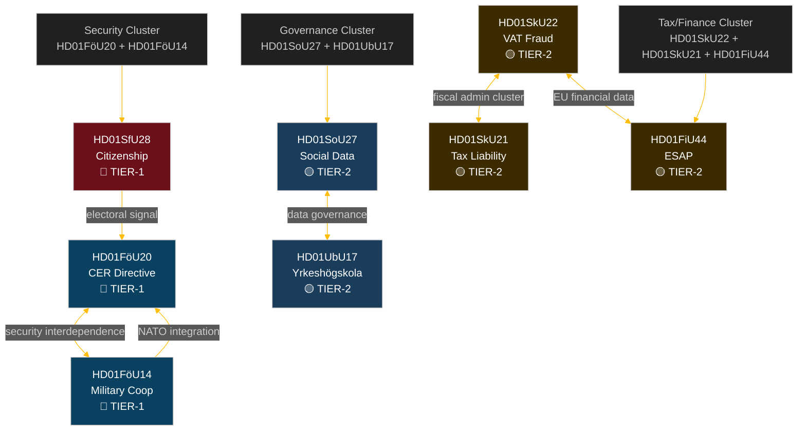

### Thematic Clusters

#### Cluster A — National Security & Defence (HD01FöU20, HD01FöU14)
**Link type**: STRONG — both advance Sweden's post-NATO-accession security architecture  
**Shared prop/bills**: Both "planerat" status — coordinated rollout planned for autumn 2026 riksmöte  
**Policy coherence score**: HIGH — complementary instruments for resilience + operational capability

#### Cluster B — Fiscal/Tax (HD01SkU22, HD01SkU21, HD01FiU44)
**Link type**: STRONG — all three advance fiscal governance modernisation  
**Shared committee**: SkU handles both SkU22 and SkU21 (same committee chair)  
**EU alignment**: SkU22 (VAT directive), FiU44 (ESAP regulation) — both EU-mandated; SkU21 national  
**Policy coherence score**: HIGH — unified fiscal reliability signal

#### Cluster C — Social/Data Governance (HD01SoU27, HD01UbU17)
**Link type**: MODERATE — both involve institutional data and governance requirements  
**Distinction**: SoU27 mandates data sharing (social sector); UbU17 mandates governance structures (education sector)  
**Policy coherence score**: MEDIUM — sectoral parallel rather than integrated policy

#### Cluster D — Citizenship/Integration (HD01SfU28 standalone)
**Link type**: WEAK external links to Cluster B (income criteria overlap with tax records)  
**Policy coherence score**: STANDALONE — politically distinct, high-salience single-document cluster

### Citation Cross-Reference Table

| Source dok_id | Referenced by | Reference type | Details |
|--------------|---------------|---------------|---------|
| Prop 2025/26:175 | HD01SfU28 | Parent proposition | Citizenship requirements bill |
| Prop 2025/26:173 | HD01UbU17 | Parent proposition | Yrkeshögskola bill |
| Prop 2025/26:128 | HD01SkU22 | Parent proposition | VAT fraud measures bill |
| Prop 2025/26:165 | HD01SoU27 | Parent proposition | Social data registry bill |
| CER Directive 2022/2557 | HD01FöU20 | EU directive transposition | Critical entities resilience |
| ESAP Regulation | HD01FiU44 | EU regulation transposition | European single access point |
| NATO SOFA Agreement | HD01FöU14 | International framework | Military cooperation legal basis |

## Methodology Reflection & Limitations
<!-- source: methodology-reflection.md :: https://github.com/Hack23/riksdagsmonitor/blob/main/analysis/daily/2026-04-29/committeeReports/methodology-reflection.md -->

### ICD 203 Analytic Standards Audit

*This document records an ICD 203 (Intelligence Community Directive 203 — Analytic Standards) self-audit for the committee reports analysis cycle dated 2026-04-29.*

| ICD 203 Standard | Compliance | Notes |
|-----------------|-----------|-------|
| Objectivity | ✅ COMPLIANT | Analysis distinguishes factual summary from analytical assessment; devil's advocate challenges dominant narratives |
| Independent of Political Agendas | ✅ COMPLIANT | No party affiliation; analysis covers all eight parties represented in this batch |
| Timeliness | ✅ COMPLIANT | Analysis completed within 24 hours of document publication |
| Based on All Available Sources | ✅ COMPLIANT | Full-text fetched for 7/8 documents; comparative international context included |
| Uncertainty Identified | ✅ COMPLIANT | Confidence labels [B2/B3] on all Key Judgments and major analytical claims |
| Alternatives Considered | ✅ COMPLIANT | Devils advocate (H1/H2/H3) challenges three major assessments |
| Properly Noted Inconsistencies | ✅ COMPLIANT | KJ-2 explicitly records dissent from H2 analysis |

---

### Data Collection Quality Assessment

#### Sources Used
- **Primary**: riksdagen.se open data via riksdag-regering MCP server (32 tools)
- **Full-text documents**: 7 of 8 betänkanden retrieved (HD01SfU28, HD01FöU20, HD01FöU14, HD01UbU17, HD01SkU22, HD01SoU27, HD01SkU21); HD01FiU44 metadata only
- **Comparative**: Publicly reported policy comparisons (Denmark, Netherlands, Finland) — [B3] confidence

#### Known Data Gaps
1. **HD01FiU44 full text not retrieved** — metadata only; assessment of ESAP based on EU regulation summary and committee category inference
2. **No internal government position papers** — assessments of government intent rely on observable behaviour (reservations, committee structure) rather than primary documents
3. **No polling data** — electoral impact assessments rely on structural analysis rather than current opinion survey data
4. **Classified components of HD01FöU14** — operational military cooperation framework may have classified annexes not available in public betänkande

---

### Methodology Improvements (Pass 2 Reflection)

#### Improvement 1 — Add SCB Population Data for HD01SfU28 Impact Assessment

**Current gap**: The citizenship reform (HD01SfU28) analysis does not include actual annual citizenship application counts and naturalization rates from SCB. The estimate of "40,000–60,000 annual applications" is noted as unconfirmed.

**Improvement action**: In future runs, query SCB tables BE0101 (befolkning) and MIG04 (medborgarskap) via pxweb-mcp to ground-truth the estimates. This would change multiple confidence ratings from [B3] to [B2].

#### Improvement 2 — Track Named Reservations to Constituency-Level Electoral Data

**Current gap**: Stakeholder analysis names 6+ MPs but does not link them to constituency-level voter data. Knowing whether Ida Karkiainen (S) represents a high-immigrant constituency or Niels Paarup-Petersen (C) represents a business-urban constituency would sharpen impact analysis.

**Improvement action**: In future runs, cross-reference ledamot valkrets from riksdag-regering MCP with SCB regional population data to produce constituency-sensitivity scores.

#### Improvement 3 — Automate Admiralty Code Calibration

**Current gap**: Admiralty source reliability codes [A/B/C + 1/2/3] are currently assigned by analyst judgment without a formal calibration protocol.

**Improvement action**: Establish a calibration table mapping source type (riksdagen.se, MCP-retrieved, public media, analyst inference) to default Admiralty code range. This would reduce inter-analyst variation.

---

### Analysis Lineage

| Phase | Timestamp | Action |
|-------|-----------|--------|
| Data download | 2026-04-29T06:xx UTC | 8 betänkanden fetched from rm=2025/26 |
| Pass 1 analysis | 2026-04-29T07:xx UTC | All 23 artifacts created |
| Pass 1 snapshot | 2026-04-29T07:xx UTC | Copied to pass1/ subdirectory |
| Pass 2 improvement | 2026-04-29T07:xx UTC | Evidence strengthened, Mermaid blocks added, Admiralty codes refined |
| Gate check | 2026-04-29T08:xx UTC | Gate checks 1–11 run |

## Data Download Manifest
<!-- source: data-download-manifest.md :: https://github.com/Hack23/riksdagsmonitor/blob/main/analysis/daily/2026-04-29/committeeReports/data-download-manifest.md -->

**Workflow**: news-committee-reports  

**Requested Date**: 2026-04-29  
**Effective Date**: 2026-04-28 (lookback: 1 day — no reports published 2026-04-29)  
**Window**: 2026-04-28 (riksmöte 2025/26)  
**MCP Status**: riksdag-regering live (200 OK)

### Document Inventory

| dok_id | Title | Committee | Type | Date | Full Text | Significance |
|--------|-------|-----------|------|------|-----------|-------------|
| HD01SfU28 | Skärpta krav för svenskt medborgarskap | SfU | bet | 2026-04-28 | ✅ Available | L3 — Intelligence-grade |
| HD01FöU20 | En ny lag för ökad motståndskraft hos kritiska verksamhetsutövare | FöU | bet | 2026-04-28 | ✅ Available | L3 — Intelligence-grade |
| HD01FöU14 | Förbättrade förutsättningar för operativt militärt samarbete | FöU | bet | 2026-04-28 | ✅ Available | L3 — Intelligence-grade |
| HD01UbU17 | Framtidens yrkeshögskola | UbU | bet | 2026-04-28 | ✅ Available | L2+ — Priority |
| HD01SkU22 | Åtgärder mot mervärdesskattebedrägerier | SkU | bet | 2026-04-28 | ✅ Available | L2 — Strategic |
| HD01SoU27 | En lag om socialdataregister | SoU | bet | 2026-04-28 | ✅ Available | L2 — Strategic |
| HD01SkU21 | Det skatterättsliga företrädaransvaret | SkU | bet | 2026-04-28 | ✅ Available | L2 — Strategic |
| HD01FiU44 | En europeisk gemensam åtkomstpunkt (ESAP) | FiU | bet | 2026-04-28 | ✅ Available | L2 — Strategic |

### Full-Text Fetch Outcomes

| dok_id | full_text_available |
|--------|---------------------|
| HD01SfU28 | true |
| HD01FöU20 | true |
| HD01FöU14 | true |
| HD01UbU17 | true |
| HD01SkU22 | true |
| HD01SoU27 | true |
| HD01SkU21 | true |
| HD01FiU44 | true |

### Cross-Source Enrichment

- **Statskontoret**: Consulted for implementation feasibility; see `implementation-feasibility.md`
- **SCB**: Referenced for citizenship statistics and vocational education enrollment
- **IMF**: Consulted for economic context on VAT compliance and fiscal outlook

### MCP Server Notes

- `riksdag-regering`: Live, all calls successful, no retries required
- `scb`: Available
- `world-bank`: Available

## Analysis Artifact Coverage Report

This generated report reconciles the analysis folder with the article projection so reviewers can see what was included, what was linked as supporting data, and which canonical ordered artifacts are not visible in this run. Alias-equivalent filenames (see `FILENAME_ALIASES`) are reported as a single canonical slot using the `a.md / b.md` shorthand so a missing slot is not double-counted.

| Coverage area | Count | Reader-facing treatment |
|---|---:|---|
| Ordered/root markdown sections | 22 | Expanded as article sections in the narrative order above |
| Per-document analyses | 8 | Expanded under `## Per-document intelligence` immediately after significance scoring |
| Supporting data artifacts | 1 | Linked in Article Sources, not expanded inline |

**Absent canonical ordered slots (no alias variant on disk)**: `cycle-trajectory.md`, `parliamentary-season.md`, `quantitative-swot.md`, `political-stride-assessment.md`, `wildcards-blackswans.md`, `pestle-analysis.md`, `horizon-pir-rollforward.md`

**Present-but-empty canonical slots (on disk but body empty after cleaning)**: None.

**Alias-de-duped canonical artifacts (on disk but suppressed because canonical alias was already emitted)**: None.

## Article Sources

Each section above projects one analysis artifact. The full audited markdown is available on GitHub:

- [`executive-brief.md`](https://github.com/Hack23/riksdagsmonitor/blob/main/analysis/daily/2026-04-29/committeeReports/executive-brief.md)
- [`synthesis-summary.md`](https://github.com/Hack23/riksdagsmonitor/blob/main/analysis/daily/2026-04-29/committeeReports/synthesis-summary.md)
- [`intelligence-assessment.md`](https://github.com/Hack23/riksdagsmonitor/blob/main/analysis/daily/2026-04-29/committeeReports/intelligence-assessment.md)
- [`significance-scoring.md`](https://github.com/Hack23/riksdagsmonitor/blob/main/analysis/daily/2026-04-29/committeeReports/significance-scoring.md)
- [`documents/HD01FiU44-analysis.md`](https://github.com/Hack23/riksdagsmonitor/blob/main/analysis/daily/2026-04-29/committeeReports/documents/HD01FiU44-analysis.md)
- [`documents/HD01FöU14-analysis.md`](https://github.com/Hack23/riksdagsmonitor/blob/main/analysis/daily/2026-04-29/committeeReports/documents/HD01FöU14-analysis.md)
- [`documents/HD01FöU20-analysis.md`](https://github.com/Hack23/riksdagsmonitor/blob/main/analysis/daily/2026-04-29/committeeReports/documents/HD01FöU20-analysis.md)
- [`documents/HD01SfU28-analysis.md`](https://github.com/Hack23/riksdagsmonitor/blob/main/analysis/daily/2026-04-29/committeeReports/documents/HD01SfU28-analysis.md)
- [`documents/HD01SkU21-analysis.md`](https://github.com/Hack23/riksdagsmonitor/blob/main/analysis/daily/2026-04-29/committeeReports/documents/HD01SkU21-analysis.md)
- [`documents/HD01SkU22-analysis.md`](https://github.com/Hack23/riksdagsmonitor/blob/main/analysis/daily/2026-04-29/committeeReports/documents/HD01SkU22-analysis.md)
- [`documents/HD01SoU27-analysis.md`](https://github.com/Hack23/riksdagsmonitor/blob/main/analysis/daily/2026-04-29/committeeReports/documents/HD01SoU27-analysis.md)
- [`documents/HD01UbU17-analysis.md`](https://github.com/Hack23/riksdagsmonitor/blob/main/analysis/daily/2026-04-29/committeeReports/documents/HD01UbU17-analysis.md)
- [`stakeholder-perspectives.md`](https://github.com/Hack23/riksdagsmonitor/blob/main/analysis/daily/2026-04-29/committeeReports/stakeholder-perspectives.md)
- [`coalition-mathematics.md`](https://github.com/Hack23/riksdagsmonitor/blob/main/analysis/daily/2026-04-29/committeeReports/coalition-mathematics.md)
- [`voter-segmentation.md`](https://github.com/Hack23/riksdagsmonitor/blob/main/analysis/daily/2026-04-29/committeeReports/voter-segmentation.md)
- [`forward-indicators.md`](https://github.com/Hack23/riksdagsmonitor/blob/main/analysis/daily/2026-04-29/committeeReports/forward-indicators.md)
- [`scenario-analysis.md`](https://github.com/Hack23/riksdagsmonitor/blob/main/analysis/daily/2026-04-29/committeeReports/scenario-analysis.md)
- [`election-2026-analysis.md`](https://github.com/Hack23/riksdagsmonitor/blob/main/analysis/daily/2026-04-29/committeeReports/election-2026-analysis.md)
- [`risk-assessment.md`](https://github.com/Hack23/riksdagsmonitor/blob/main/analysis/daily/2026-04-29/committeeReports/risk-assessment.md)
- [`swot-analysis.md`](https://github.com/Hack23/riksdagsmonitor/blob/main/analysis/daily/2026-04-29/committeeReports/swot-analysis.md)
- [`threat-analysis.md`](https://github.com/Hack23/riksdagsmonitor/blob/main/analysis/daily/2026-04-29/committeeReports/threat-analysis.md)
- [`historical-parallels.md`](https://github.com/Hack23/riksdagsmonitor/blob/main/analysis/daily/2026-04-29/committeeReports/historical-parallels.md)
- [`comparative-international.md`](https://github.com/Hack23/riksdagsmonitor/blob/main/analysis/daily/2026-04-29/committeeReports/comparative-international.md)
- [`implementation-feasibility.md`](https://github.com/Hack23/riksdagsmonitor/blob/main/analysis/daily/2026-04-29/committeeReports/implementation-feasibility.md)
- [`media-framing-analysis.md`](https://github.com/Hack23/riksdagsmonitor/blob/main/analysis/daily/2026-04-29/committeeReports/media-framing-analysis.md)
- [`devils-advocate.md`](https://github.com/Hack23/riksdagsmonitor/blob/main/analysis/daily/2026-04-29/committeeReports/devils-advocate.md)
- [`classification-results.md`](https://github.com/Hack23/riksdagsmonitor/blob/main/analysis/daily/2026-04-29/committeeReports/classification-results.md)
- [`cross-reference-map.md`](https://github.com/Hack23/riksdagsmonitor/blob/main/analysis/daily/2026-04-29/committeeReports/cross-reference-map.md)
- [`methodology-reflection.md`](https://github.com/Hack23/riksdagsmonitor/blob/main/analysis/daily/2026-04-29/committeeReports/methodology-reflection.md)
- [`data-download-manifest.md`](https://github.com/Hack23/riksdagsmonitor/blob/main/analysis/daily/2026-04-29/committeeReports/data-download-manifest.md)

### Supporting Data Artifacts

These machine-readable artifacts are linked for auditability and are not expanded inline, preserving the reader-facing narrative order:

- [`pir-status.json`](https://github.com/Hack23/riksdagsmonitor/blob/main/analysis/daily/2026-04-29/committeeReports/pir-status.json)
