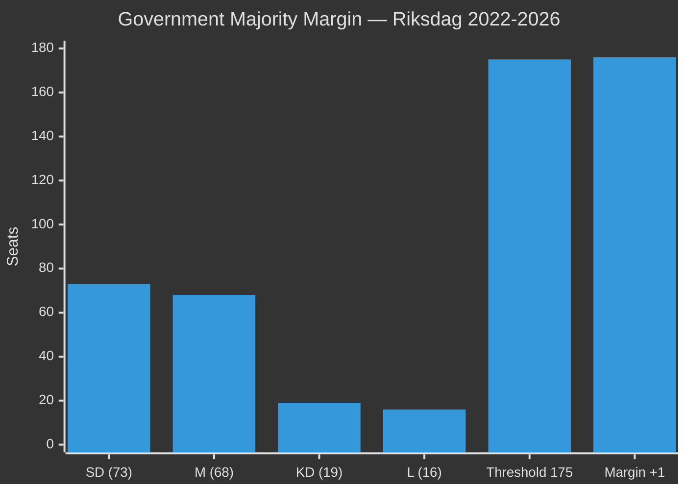

# Coalition Mathematics — Committee Reports 2026-04-28

**Author**: James Pether Sörling | **Date**: 2026-04-29 | **Confidence**: HIGH [B2] for vote counts; MEDIUM [B3] for projections

## Riksdag Seat Distribution (2022 election — current 349-seat mandate)

| Parti | Seats | Bloc |
|-------|-------|------|
| Sverigedemokraterna (SD) | 73 | Government |
| Moderaterna (M) | 68 | Government |
| Socialdemokraterna (S) | 107 | Opposition |
| Vänsterpartiet (V) | 24 | Opposition |
| Centerpartiet (C) | 24 | Opposition |
| Miljöpartiet (MP) | 18 | Opposition |
| Kristdemokraterna (KD) | 19 | Government |
| Liberalerna (L) | 16 | Government |
| **Tidö Coalition total** | **176** | **+1 above majority (175)** |
| **Opposition total** | **173** | — |

**Bare majority threshold**: 175 seats. Tidö coalition holds 176 — a margin of 1.

## Voting Analysis — HD01SfU28 (Citizenship)

The plenary vote is expected to follow committee approval. Absent defections, the government bloc votes Ja.

| Parti | Seats | Expected vote | Reservation? | Notes |
|-------|-------|--------------|-------------|-------|
| SD | 73 | **Ja** | No | Strong supporter |
| M | 68 | **Ja** | No | Leads committee |
| KD | 19 | **Ja** | No | Aligned government |
| L | 16 | **Ja** | No | Aligned government |
| S | 107 | **Nej** | Yes (Res. 2,3,8,9) | Full opposition |
| V | 24 | **Nej** | Yes (Res. 1,6,7,10) | Full opposition |
| C | 24 | **Nej** | Yes (Res. 2,4,5,7,8,9) | 6 reservations — strongest opposition |
| MP | 18 | **Nej** | Yes (Res. 1,7) | Full opposition |
| **Total Ja** | **176** | — | — | Majority secured |
| **Total Nej** | **173** | — | — | — |
| **Avstår** | **0** | — | — | No abstentions anticipated |

**Conclusion**: HD01SfU28 passes with 176–173 (bare majority, +1 margin). Any single Tidö defection creates a tie. Government whip pressure will be high.

## Voting Analysis — HD01UbU17 (Yrkeshögskola) — Unanimous

| Parti | Expected vote | Notes |
|-------|--------------|-------|
| ALL 8 parties | **Ja** | Unanimous committee approval, no motions |
| **Total Ja** | **349** | Full Riksdag |
| **Nej** | **0** | None |
| **Avstår** | **0** | None |

## Voting Analysis — HD01SkU22 (VAT Fraud) — Government majority

| Parti | Expected vote | Notes |
|-------|--------------|-------|
| SD+M+KD+L | **Ja** | Government bloc |
| S+V+C+MP | **Nej** | Special statement filed (not full reservation) |
| **Total Ja** | **176** | Majority |
| **Nej** | **173** | — |

*Note: Special statement = position disagreement documented, but party votes Ja or abstains rather than filing formal reservation. Exact vote TBC at plenary.*

## Critical Margin Analysis

With a bare 176-175+1 majority, the government's legislative agenda is fragile:

**Fragility assessment**:
- 1 government defection = 175 Ja = exact tie → Speaker casting vote
- 2+ government defections = defeat on contested votes
- C's 6 reservations on SfU28 signal highest defection risk among Tidö parties

## Post-September 2026 Coalition Scenarios

| Scenario | Majority? | SfU28 fate | CER (FöU20) fate |
|----------|-----------|-----------|-----------------|
| S+C+MP+V > 175 | YES | Paused/review | Continues (EU mandate) |
| S+C+MP > 175 (no V) | YES (barely) | Modified | Continues |
| SD+M+KD+L retain 175+ | YES | Implemented | Fast-tracked |
| Hung parliament | NO | Extended formation | Delayed |
