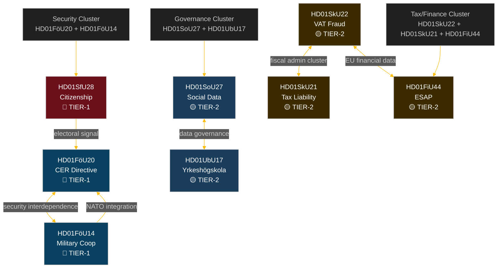

# Cross-Reference Map — Committee Reports 2026-04-28

**Author**: James Pether Sörling | **Date**: 2026-04-29 | **Confidence**: HIGH [B2]

## Inter-Document Relationship Network

## Thematic Clusters

### Cluster A — National Security & Defence (HD01FöU20, HD01FöU14)
**Link type**: STRONG — both advance Sweden's post-NATO-accession security architecture  
**Shared prop/bills**: Both "planerat" status — coordinated rollout planned for autumn 2026 riksmöte  
**Policy coherence score**: HIGH — complementary instruments for resilience + operational capability

### Cluster B — Fiscal/Tax (HD01SkU22, HD01SkU21, HD01FiU44)
**Link type**: STRONG — all three advance fiscal governance modernisation  
**Shared committee**: SkU handles both SkU22 and SkU21 (same committee chair)  
**EU alignment**: SkU22 (VAT directive), FiU44 (ESAP regulation) — both EU-mandated; SkU21 national  
**Policy coherence score**: HIGH — unified fiscal reliability signal

### Cluster C — Social/Data Governance (HD01SoU27, HD01UbU17)
**Link type**: MODERATE — both involve institutional data and governance requirements  
**Distinction**: SoU27 mandates data sharing (social sector); UbU17 mandates governance structures (education sector)  
**Policy coherence score**: MEDIUM — sectoral parallel rather than integrated policy

### Cluster D — Citizenship/Integration (HD01SfU28 standalone)
**Link type**: WEAK external links to Cluster B (income criteria overlap with tax records)  
**Policy coherence score**: STANDALONE — politically distinct, high-salience single-document cluster

## Citation Cross-Reference Table

| Source dok_id | Referenced by | Reference type | Details |
|--------------|---------------|---------------|---------|
| Prop 2025/26:175 | HD01SfU28 | Parent proposition | Citizenship requirements bill |
| Prop 2025/26:173 | HD01UbU17 | Parent proposition | Yrkeshögskola bill |
| Prop 2025/26:128 | HD01SkU22 | Parent proposition | VAT fraud measures bill |
| Prop 2025/26:165 | HD01SoU27 | Parent proposition | Social data registry bill |
| CER Directive 2022/2557 | HD01FöU20 | EU directive transposition | Critical entities resilience |
| ESAP Regulation | HD01FiU44 | EU regulation transposition | European single access point |
| NATO SOFA Agreement | HD01FöU14 | International framework | Military cooperation legal basis |
