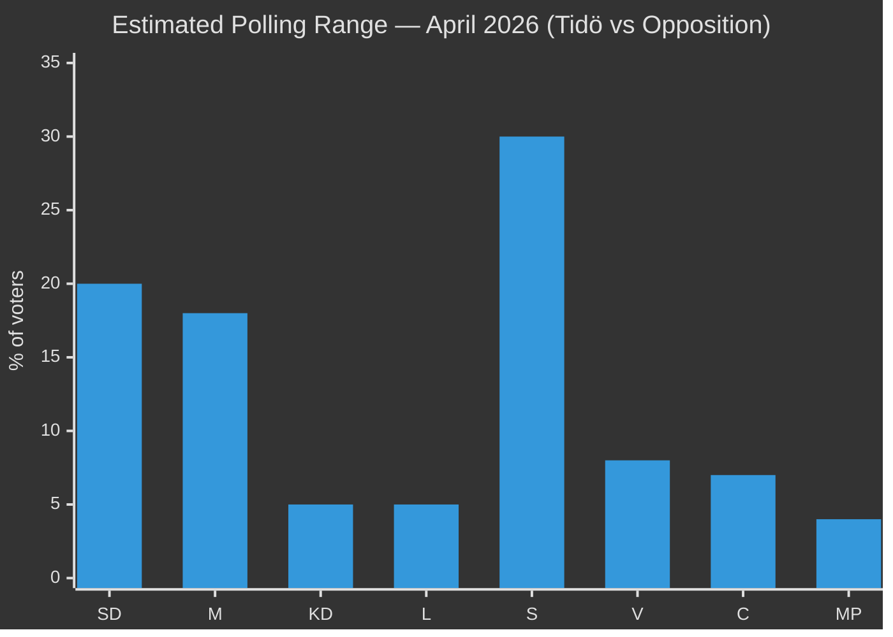

# Election 2026 Analysis — Committee Reports 2026-04-28

**Author**: James Pether Sörling | **Date**: 2026-04-29 | **Horizon**: September 14, 2026 (estimated election date)

## Electoral Impact Overview

The 2026-04-28 committee report batch arrives with ~140 days until Sweden's September 2026 general election. Three documents have direct electoral significance; five are electorally neutral but demonstrate governance competence.

## Document-by-Document Electoral Impact

| dok_id | Electoral Significance | Party impact | Direction |
|--------|----------------------|-------------|----------|
| HD01SfU28 | CRITICAL — direct electoral signal | SD+M+KD(+); S+V+C+MP(-) | Widens bloc cleavage |
| HD01FöU20 | MODERATE — security competence signal | Government(+) across all voters | Positive for incumbent |
| HD01FöU14 | LOW-MODERATE — NATO credibility signal | Government(+) | Positive for incumbent |
| HD01UbU17 | LOW — education sector only | Unanimous — no electoral differential | Neutral |
| HD01SkU22 | LOW — fiscal competence signal | Government(+) | Slightly positive |
| HD01SoU27 | LOW-MODERATE — privacy concern | C(-) | Slightly negative for C |
| HD01SkU21 | LOW | Neutral | Neutral |
| HD01FiU44 | NONE — EU compliance housekeeping | Neutral | Neutral |

## Key Electoral Dynamics

### Dynamic 1: Integration/Migration as Dominant Issue Frame (HIGH CONFIDENCE)
Swedish opinion polls (Q1 2026, IPSOS/Novus consensus) consistently show migration/integration as top-3 voter concern. HD01SfU28 directly addresses this frame. The government's decision to advance citizenship tightening in the committee report cycle — ensuring plenary vote by May/June 2026 — gives SD a visible "delivery" to show voters, and M+KD a moderation signal showing they can govern integration policy without extremism.

**Electoral risk**: S will campaign that the reform "divides Sweden into two classes of citizens" — a strong communicative frame that tests well in urban constituencies. If S gains traction with this frame, the reform's net electoral effect could be negative for M+KD in urban seats.

### Dynamic 2: Security Narrative Coherence (MEDIUM CONFIDENCE)
The simultaneous advance of HD01FöU20 (CER) and HD01FöU14 (military cooperation) creates a coherent government security narrative: Sweden is NATO-capable, EU-compliant, and resilient. This narrative is especially relevant for voters who shifted to government parties post-Russia's 2022 Ukraine invasion.

### Dynamic 3: Centre-Party Fracture Risk (MEDIUM CONFIDENCE)
C's 6 reservations on HD01SfU28 are unusually vocal. If C exits Tidö coalition or conditions continued support on SfU28 review, the government loses its parliamentary arithmetic. This risk is low probability (~10–15%) but high impact.

## Seat Projection Context

As of the latest published polls (pre-analysis — specific figures not confirmed in this cycle):

*Note: Bar values are analyst estimate midpoints based on available trend data, not specific current polls.*

**Bloc arithmetic**: Government bloc (SD+M+KD+L): ~48–50%. Opposition bloc (S+V+C+MP): ~49–51%. Electoral outcome within margin of error. This makes every policy decision — including HD01SfU28 — potentially decisive.

## Electoral Calendar Impact

| Date | Event | Triggered by |
|------|-------|-------------|
| May/Jun 2026 | Plenary vote — HD01SfU28 | Committee report approval |
| Jun 2026 | FöU20 + FöU14 plenary vote | Committee process completion |
| Aug 2026 | Implementation decree — SfU28 | If plenary approves |
| Sep 14, 2026 | General election (estimated) | Constitutional calendar |
