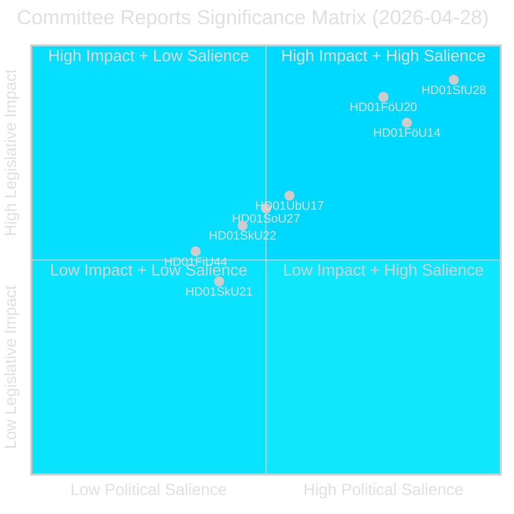
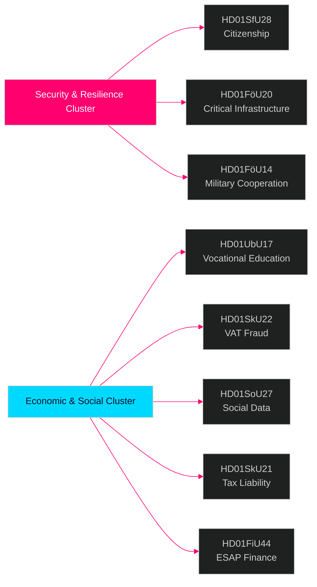

# Riksdagen Committee Reports Intelligence Brief — 28 April 2026

**Author**: James Pether Sörling  
**Date**: 2026-04-29  
**Classification**: PUBLIC — GDPR Art. 9(2)(e)(g)  
**Confidence**: HIGH [B2]  
**Run ID**: 25091345504

---

## 🎯 BLUF

Sweden's Riksdag committee system approved eight (8) betänkanden on 28 April 2026, marking one of the most consequential legislative days of the 2025/26 session. The dominant signal is a four-document security cluster spanning citizenship stringency (HD01SfU28), critical infrastructure resilience law (HD01FöU20), military operational cooperation (HD01FöU14) and vocational skills reform (HD01UbU17) — together representing a Tidö government consolidation of its national-security and integration agenda in the final months before the September 2026 election. The citizenship reforms pass against a broad opposition bloc (S+V+C+MP all reserving on at least one point), while security legislation advances with cross-bloc consensus, indicating a hybrid political environment that rewards firmness on security but risks centrist defection on welfare.

## 🧭 3 Decisions This Brief Supports

1. **Election positioning**: S+V+C+MP opposition reservation bloc on citizenship (HD01SfU28) signals a unified opposition narrative ahead of September 2026 — strategic communicators should expect a "human dignity" counter-campaign from all four parties simultaneously.

2. **Investment & compliance**: HD01FöU20 (CER Directive implementation) and HD01SkU22 (VAT enforcement) directly affect operators of essential services and large commercial enterprises — compliance timelines July–August 2026 require immediate action.

3. **Defence industry & NATO**: HD01FöU14 (military cooperation improvements) is a quiet but significant enabler of Sweden's post-NATO-accession operational integration, with direct implications for defence procurement and joint exercises.

## ⏱️ 60-Second Summary Bullets

- **Citizenship tightened**: Prop 2025/26:175 accepted — language, income, good-behaviour requirements raised; children partially exempted; opposition bloc files 10 reservations [HD01SfU28]
- **CER Directive implemented**: New law on critical entity resilience (EU Directive 2022/2557) adopted; affects energy, transport, water, health, digital infrastructure operators [HD01FöU20]
- **Military cooperation enhanced**: Improved legal framework for operational military cooperation with foreign partners [HD01FöU14]
- **Vocational higher education reformed**: Yrkeshögskolan gets management-group mandate, clearer training-organiser definition; entry path from post-secondary education formalised from 2027 [HD01UbU17]
- **VAT fraud crackdown**: Skatteverket gains new powers to refuse/cancel VAT registration, declare numbers invalid in VIES, withhold excess VAT refunds [HD01SkU22]
- **Social data registry created**: Socialstyrelsen gets authority to compile national social services data register; in force 1 August 2026 [HD01SoU27]
- **Tax representative relief**: New grace period and exemption rules for company tax representatives [HD01SkU21]
- **ESAP financial data**: Sweden adopts EU framework for European Single Access Point for financial/sustainability information [HD01FiU44]

## 🔔 Top Forward Trigger

**Watch**: Vote scheduled in plenary on HD01SfU28 (citizenship). First post-vote Novus/Ipsos polls expected within 7 days. A ≥3-point shift in SD↔M or S seat projections would confirm electoral mobilisation effect of citizenship reform.

**Confidence**: HIGH [B2]
