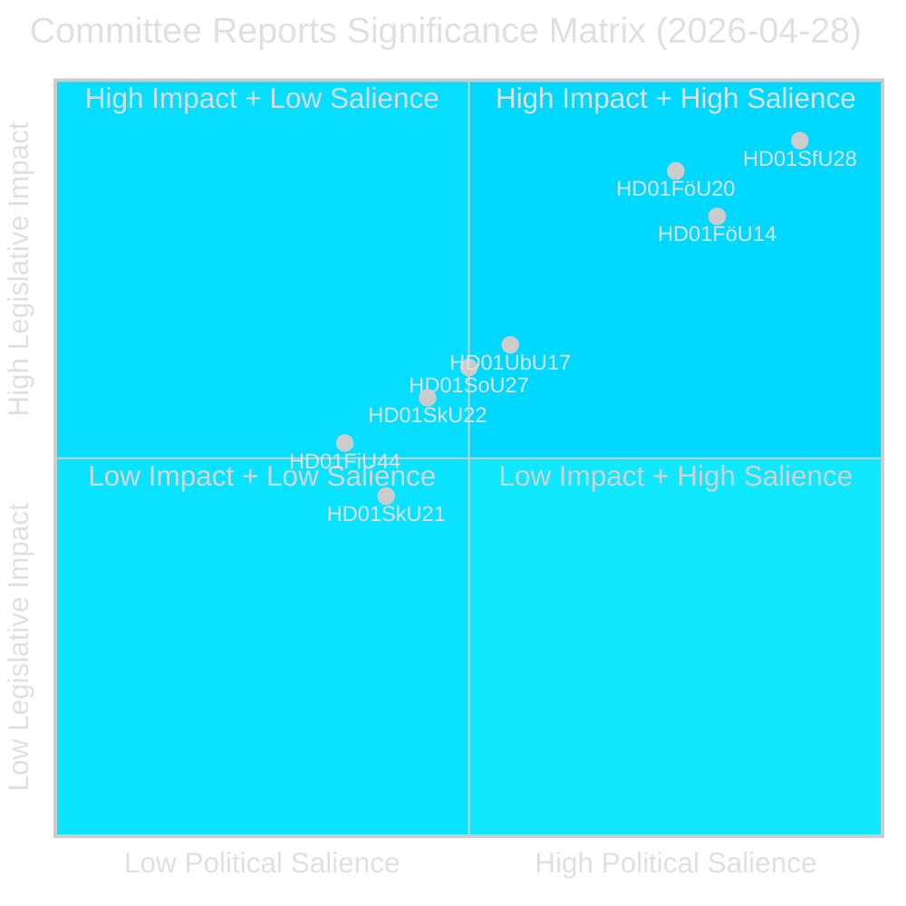
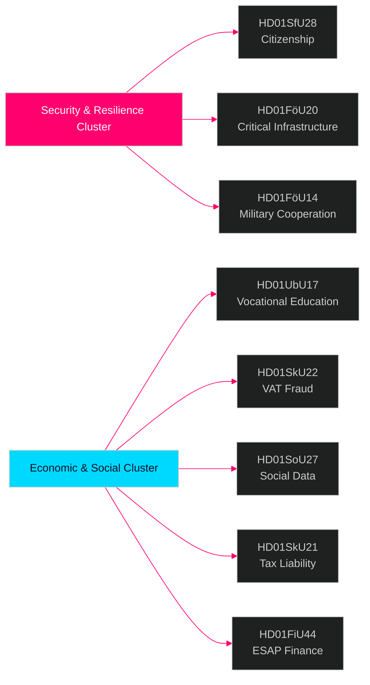

# تقارير لجان البرلمان السويدي — نشرة استخباراتية 28 أبريل 2026

**المؤلف**: James Pether Sörling  
**التاريخ**: 2026-04-29  
**التصنيف**: عام — المادة 9(2)(ه)(و) من اللائحة الأوروبية لحماية البيانات  
**الثقة**: عالية [B2]  
**معرف التشغيل**: 25091345504

---

## 🎯 الملخص التنفيذي

وافق نظام اللجان في البرلمان السويدي (Riksdag) على ثمانية (8) betänkanden في 28 أبريل 2026، مما يجعل هذا اليوم أحد أكثر الأيام التشريعية أهمية في الدورة 2025/26. الإشارة المهيمنة هي عنقود أمني من أربعة وثائق يشمل تشديد شروط الجنسية (HD01SfU28)، وقانون مرونة البنية التحتية الحيوية (HD01FöU20)، والتعاون العسكري العملياتي (HD01FöU14)، وإصلاح التعليم المهني (HD01UbU17) — وتمثل معاً توطيد حكومة Tidö لأجندتها في الأمن القومي والاندماج في الأشهر الأخيرة قبل انتخابات سبتمبر 2026. تُقرّ إصلاحات الجنسية في مواجهة تكتل معارضة واسع (S+V+C+MP يُبدون تحفظات على نقطة واحدة على الأقل)، بينما تتقدم التشريعات الأمنية بتوافق ما بين الكتل، مما يشير إلى بيئة سياسية هجينة تكافئ الحزم في قضايا الأمن لكنها تخاطر بانفضاض التيار الوسطي في ملفات الرفاه.

## 🧭 3 قرارات يدعمها هذا التقرير

1. **التموضع الانتخابي**: يُشير تكتل التحفظات S+V+C+MP بشأن الجنسية (HD01SfU28) إلى رواية معارضة موحدة قبيل سبتمبر 2026 — ينبغي لصانعي الخطاب الاستراتيجي أن يتوقعوا حملة مضادة متزامنة من جميع الأحزاب الأربعة تحت شعار "كرامة الإنسان".

2. **الاستثمار والامتثال**: يؤثر كل من HD01FöU20 (تطبيق توجيه CER) وHD01SkU22 (إنفاذ ضريبة القيمة المضافة) مباشرةً على مشغّلي الخدمات الأساسية والشركات التجارية الكبرى — تواريخ الامتثال في يوليو وأغسطس 2026 تستلزم اتخاذ إجراءات فورية.

3. **صناعة الدفاع والناتو**: يُعدّ HD01FöU14 (تعزيزات التعاون العسكري) محرّكاً صامتاً لكنه ذا أثر بالغ لتكامل السويد العملياتي بعد الانضمام إلى الناتو، مع انعكاسات مباشرة على المشتريات الدفاعية والمناورات المشتركة.

## ⏱️ ملخص 60 ثانية

- **تشديد شروط الجنسية**: اعتُمد Prop 2025/26:175 — رُفعت اشتراطات اللغة والدخل وحسن السيرة؛ الأطفال مُعفون جزئياً؛ يُقدّم تكتل المعارضة 10 تحفظات [HD01SfU28]
- **تطبيق توجيه CER**: اعتُمد قانون جديد لمرونة الكيانات الحيوية (التوجيه الأوروبي 2022/2557)؛ يشمل مشغّلي الطاقة والنقل والمياه والصحة والبنية التحتية الرقمية [HD01FöU20]
- **تعزيز التعاون العسكري**: إطار قانوني محسّن للتعاون العسكري العملياتي مع شركاء أجانب [HD01FöU14]
- **إصلاح التعليم المهني العالي**: حصلت Yrkeshögskolan على تفويض مجموعة الإدارة، وتعريف أوضح لمنظّم التدريب؛ سيُعتمد مسار الالتحاق من التعليم الثانوي إلى التعليم المهني العالي اعتباراً من 2027 [HD01UbU17]
- **مكافحة الاحتيال في ضريبة القيمة المضافة**: تحصل Skatteverket على صلاحيات جديدة لرفض/إلغاء تسجيل ضريبة القيمة المضافة، والإعلان عن بطلان الأرقام في VIES، وحجب المبالغ الزائدة في المستردات [HD01SkU22]
- **إنشاء سجل البيانات الاجتماعية**: تُخوَّل Socialstyrelsen تجميع سجل وطني لبيانات الخدمات الاجتماعية؛ يسري اعتباراً من 1 أغسطس 2026 [HD01SoU27]
- **تخفيف على ممثلي الضرائب**: قواعد إمهال وإعفاء جديدة لممثلي الضرائب الخاصين بالشركات [HD01SkU21]
- **بيانات ESAP المالية**: تتبنى السويد إطار الاتحاد الأوروبي لنقطة الوصول الأوروبية الموحدة للمعلومات المالية والاستدامة [HD01FiU44]

## 🔔 أهم مشغّل مستقبلي

**تابع**: تُجرى تصويتات مقررة في الجلسة العامة بشأن HD01SfU28 (الجنسية). يُتوقع صدور أول استطلاعات Novus/Ipsos بعد التصويت خلال 7 أيام. سيُؤكد تحوّل بمقدار ≥3 نقاط في توقعات مقاعد SD↔M أو S الأثرَ التعبوي الانتخابي لإصلاح الجنسية.

**الثقة**: عالية [B2]

<!-- source-sha: aec9c4c63be21515d55b3a22362bc344c0b4a20e -->
