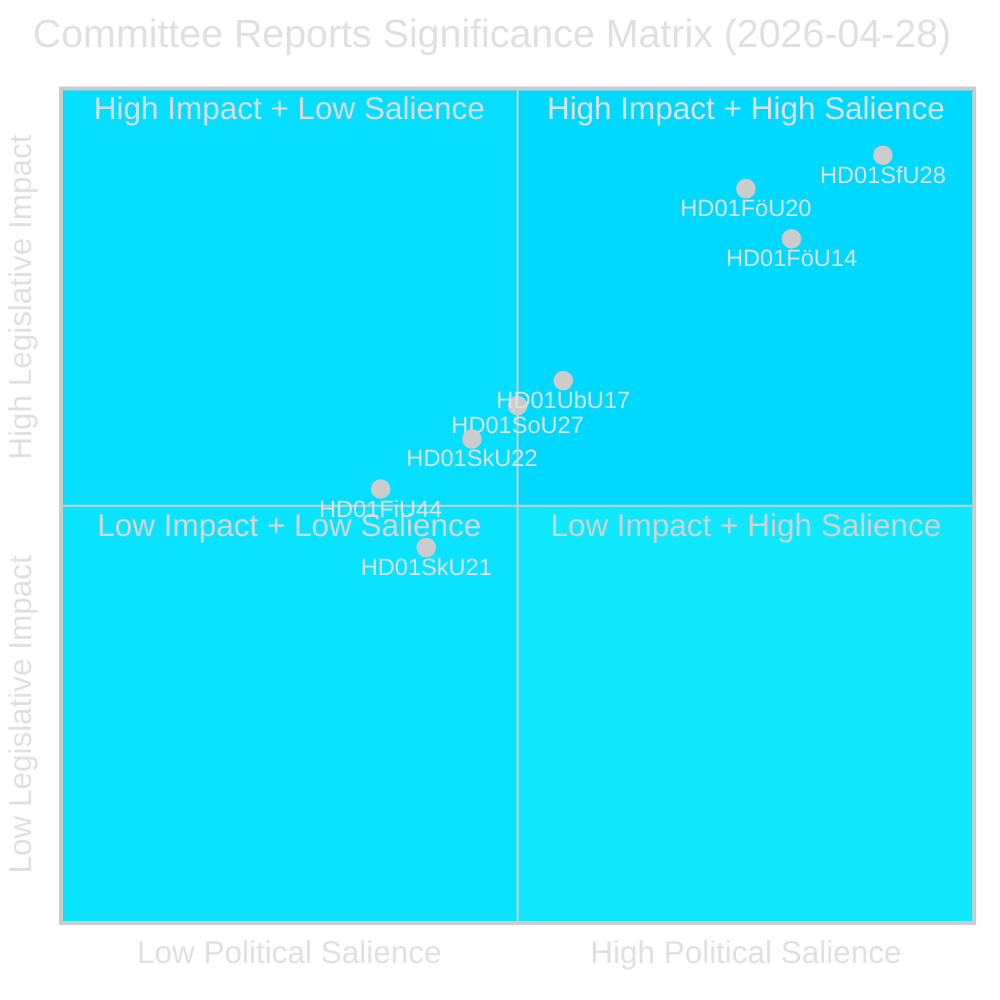
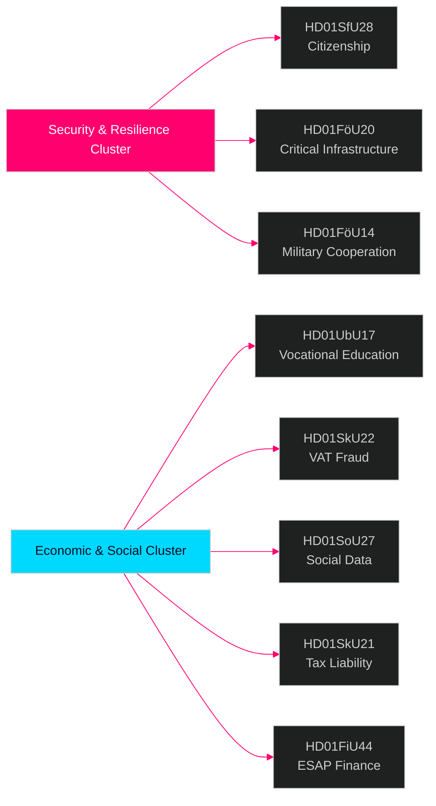

# Riksdagens udvalgsrapporter — efterretningsbrev 28. april 2026

**Forfatter**: James Pether Sörling  
**Dato**: 2026-04-29  
**Klassificering**: OFFENTLIG — GDPR Art. 9(2)(e)(g)  
**Konfidens**: HØJ [B2]  
**Kørsel-ID**: 25091345504

---

## 🎯 Kortfattet resumé

Riksdagens udvalgsystem godkendte otte (8) betänkanden den 28. april 2026, hvilket markerer en af de mest konsekvensrige lovgivningsdage i 2025/26-sessionen. Det dominerende signal er en firedokuments sikkerhedsklynge, der dækker statsborgerskabsstramninger (HD01SfU28), lov om kritisk infrastrukturmodstandsdygtighed (HD01FöU20), militært operativt samarbejde (HD01FöU14) og erhvervskompetencereform (HD01UbU17) — samlet set repræsenterer de Tidöregeringens konsolidering af sin nationale sikkerheds- og integrationsagenda i de sidste måneder inden valget i september 2026. Statsborgerskabsreformerne vedtages mod en bred oppositionsblok (S+V+C+MP reserverer sig alle på mindst ét punkt), mens sikkerhedslovgivning skrider frem med tværblokskonsensus, hvilket indikerer et hybridpolitisk miljø, der belønner fasthed i sikkerhedsspørgsmål men risikerer centristisk afvigelse på velfærdsområdet.

## 🧭 3 beslutninger dette notat understøtter

1. **Valgpositionering**: S+V+C+MPs reservationsblok vedrørende statsborgerskab (HD01SfU28) signalerer en samlet oppositionsfortælling frem mod september 2026 — strategiske kommunikatører bør forvente en mod-kampagne om "menneskelig værdighed" fra alle fire partier simultant.

2. **Investering og compliance**: HD01FöU20 (implementering af CER-direktivet) og HD01SkU22 (momshåndhævelse) berører direkte operatører af kritisk infrastruktur og store kommercielle virksomheder — overholdelsesfrister juli–august 2026 kræver øjeblikkelig handling.

3. **Forsvarsindustri og NATO**: HD01FöU14 (forbedringer af militært samarbejde) er en stille men betydningsfuld muliggører af Sveriges operative integration efter NATO-optagelsen, med direkte implikationer for forsvarsindkøb og fælles øvelser.

## ⏱️ 60-sekunders resumé

- **Statsborgerskabet strammet**: Prop 2025/26:175 vedtaget — sprog-, indkomst- og vandelbetingelser hævet; børn delvist undtaget; oppositionsblok indgiver 10 reservationer [HD01SfU28]
- **CER-direktivet implementeret**: Ny lov om modstandsdygtighed for kritiske enheder (EU-direktiv 2022/2557) vedtaget; berører energi-, transport-, vand-, sundheds- og digital infrastrukturoperatører [HD01FöU20]
- **Militært samarbejde styrket**: Forbedret retlig ramme for operativt militært samarbejde med udenlandske partnere [HD01FöU14]
- **Erhvervsuddannelse reformeret**: Yrkeshögskolan får ledelsesgruppmandat, klarere definition af uddannelsesarrangør; adgangsvej fra ungdomsuddannelse til videregående uddannelse formaliseres fra 2027 [HD01UbU17]
- **Momssvig modvirket**: Skatteverket får nye beføjelser til at nægte/annullere momsregistrering, erklære numre ugyldige i VIES, tilbageholde overskydende momsrefusioner [HD01SkU22]
- **Socialdataregister oprettet**: Socialstyrelsen bemyndiges til at kompilere nationalt register over socialtjenestedata; i kraft 1. august 2026 [HD01SoU27]
- **Skattemedhjælperlettelse**: Nye karensregler og fritagelsesregler for virksomhedens skattemedhjælpere [HD01SkU21]
- **ESAP-finansdata**: Sverige vedtager EU-rammen for European Single Access Point for finansielle og bæredygtighedsoplysninger [HD01FiU44]

## 🔔 Vigtigste fremadskuende signal

**Overvåg**: Afstemning planlagt i plenarsalen om HD01SfU28 (statsborgerskab). Første Novus/Ipsos-målinger efter afstemningen forventes inden for 7 dage. En ≥3-punkts ændring i SD↔M eller S mandatprojektioner ville bekræfte valgmobiliseringseffekten af statsborgerskabsreformen.

**Konfidens**: HØJ [B2]

<!-- source-sha: aec9c4c63be21515d55b3a22362bc344c0b4a20e -->
