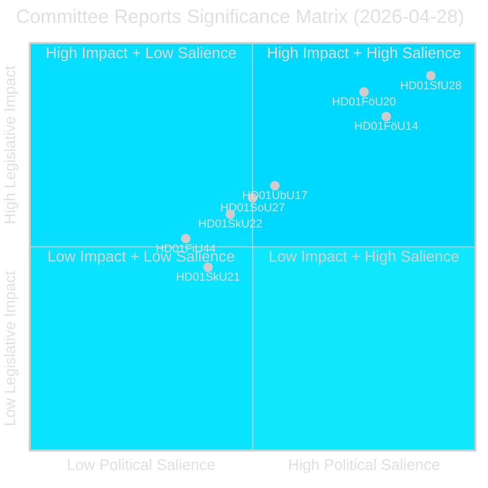
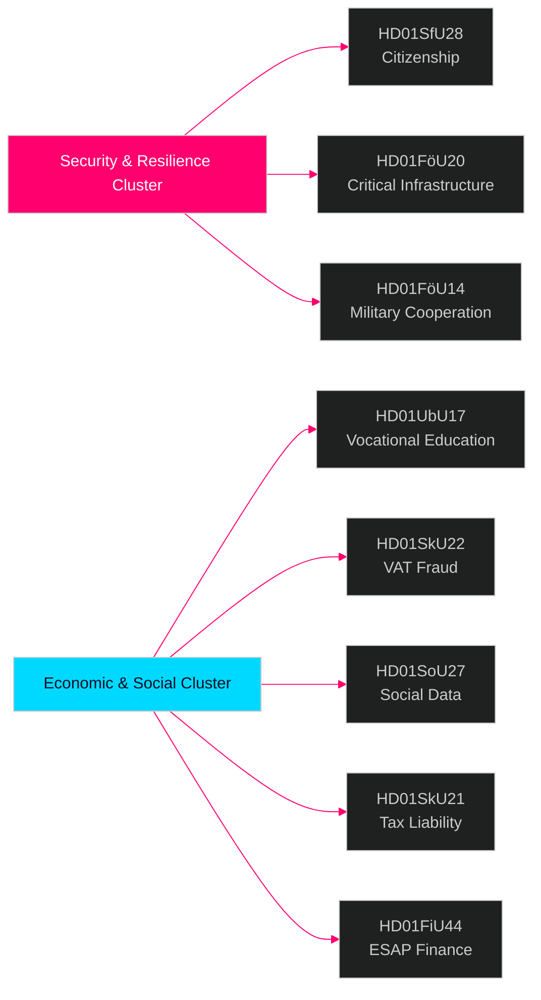

# Riksdagen-Ausschussberichte — Nachrichtenbulletin 28. April 2026

**Autor**: James Pether Sörling  
**Datum**: 2026-04-29  
**Einstufung**: ÖFFENTLICH — DSGVO Art. 9(2)(e)(g)  
**Konfidenz**: HOCH [B2]  
**Lauf-ID**: 25091345504

---

## 🎯 Kurzfassung

Das Ausschusssystem des Riksdagen genehmigte am 28. April 2026 acht (8) betänkanden und markierte damit einen der folgenreichsten Gesetzgebungstage der Sitzungsperiode 2025/26. Das dominierende Signal ist ein Vier-Dokument-Sicherheitscluster, das die Verschärfung der Staatsbürgerschaft (HD01SfU28), das Gesetz zur Resilienz kritischer Infrastrukturen (HD01FöU20), die militärische operative Zusammenarbeit (HD01FöU14) und die Reform der Berufsqualifikationen (HD01UbU17) umfasst — zusammen repräsentieren sie die Konsolidierung der Tidö-Regierung ihrer nationalen Sicherheits- und Integrationsagenda in den letzten Monaten vor der Wahl im September 2026. Die Staatsbürgerschaftsreformen werden gegen einen breiten Oppositionsblock verabschiedet (S+V+C+MP reservieren sich alle mindestens in einem Punkt), während Sicherheitsgesetzgebung mit blocküberschreitendem Konsens voranschreitet — was auf ein hybrides politisches Umfeld hindeutet, das Standhaftigkeit in Sicherheitsfragen belohnt, aber zentristische Abwanderung im Wohlfahrtsbereich riskiert.

## 🧭 3 Entscheidungen, die dieser Brief unterstützt

1. **Wahlpositionierung**: Der Reservationsblock S+V+C+MP zur Staatsbürgerschaft (HD01SfU28) signalisiert eine einheitliche Oppositionserzählung vor September 2026 — strategische Kommunikatoren sollten eine simultane „Menschenwürde"-Gegenkampagne aller vier Parteien erwarten.

2. **Investition und Compliance**: HD01FöU20 (Umsetzung der CER-Direktive) und HD01SkU22 (Mehrwertsteuerdurchsetzung) betreffen direkt Betreiber kritischer Infrastrukturen und große Handelsunternehmen — Compliance-Fristen Juli–August 2026 erfordern sofortige Maßnahmen.

3. **Verteidigungsindustrie und NATO**: HD01FöU14 (Verbesserungen der militärischen Zusammenarbeit) ist ein stiller, aber bedeutender Enabler für Schwedens operative Integration nach dem NATO-Beitritt mit direkten Auswirkungen auf die Verteidigungsbeschaffung und gemeinsame Übungen.

## ⏱️ 60-Sekunden-Zusammenfassung

- **Staatsbürgerschaft verschärft**: Prop 2025/26:175 angenommen — Sprach-, Einkommens- und Leumund­sanforderungen erhöht; Kinder teilweise ausgenommen; Oppositionsblock stellt 10 Reservationen [HD01SfU28]
- **CER-Direktive umgesetzt**: Neues Gesetz zur Resilienz kritischer Einrichtungen (EU-Direktive 2022/2557) verabschiedet; betrifft Betreiber von Energie-, Verkehrs-, Wasser-, Gesundheits- und digitaler Infrastruktur [HD01FöU20]
- **Militärische Zusammenarbeit gestärkt**: Verbesserter Rechtsrahmen für operative militärische Zusammenarbeit mit ausländischen Partnern [HD01FöU14]
- **Berufliche Hochschule reformiert**: Yrkeshögskolan erhält Leitungsgruppmandat, klarere Definition des Ausbildungsveranstalters; Aufnahmeweg von der Sekundarstufe in die berufliche Hochschulbildung ab 2027 formalisiert [HD01UbU17]
- **MwSt.-Betrug bekämpft**: Skatteverket erhält neue Befugnisse zur Verweigerung/Aufhebung der MwSt.-Registrierung, Ungültigerklärung von Nummern in VIES, Einbehaltung übermäßiger MwSt.-Erstattungen [HD01SkU22]
- **Sozialdatenregister erstellt**: Socialstyrelsen erhält Befugnis zur Erstellung eines nationalen Sozialdienstdatenregisters; in Kraft ab 1. August 2026 [HD01SoU27]
- **Erleichterung für Steuerbevollmächtigte**: Neue Karenzfristen und Ausnahmeregelungen für steuerliche Vertreter von Unternehmen [HD01SkU21]
- **ESAP-Finanzdaten**: Schweden übernimmt EU-Rahmen für European Single Access Point für Finanz- und Nachhaltigkeitsinformationen [HD01FiU44]

## 🔔 Wichtigster Vorwärts-Trigger

**Beobachten**: Abstimmung im Plenum über HD01SfU28 (Staatsbürgerschaft) geplant. Erste Novus/Ipsos-Umfragen nach der Abstimmung werden innerhalb von 7 Tagen erwartet. Eine ≥3-Punkte-Verschiebung in SD↔M oder S Mandatprojektionen würde den Wahlmobilisierungseffekt der Staatsbürgerschaftsreform bestätigen.

**Konfidenz**: HOCH [B2]

<!-- source-sha: aec9c4c63be21515d55b3a22362bc344c0b4a20e -->
