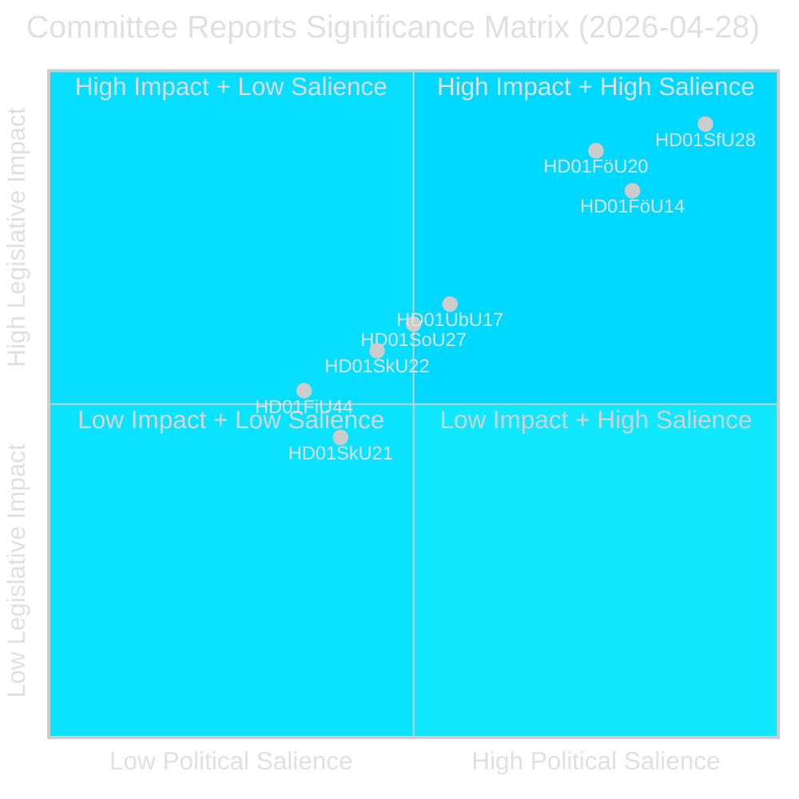
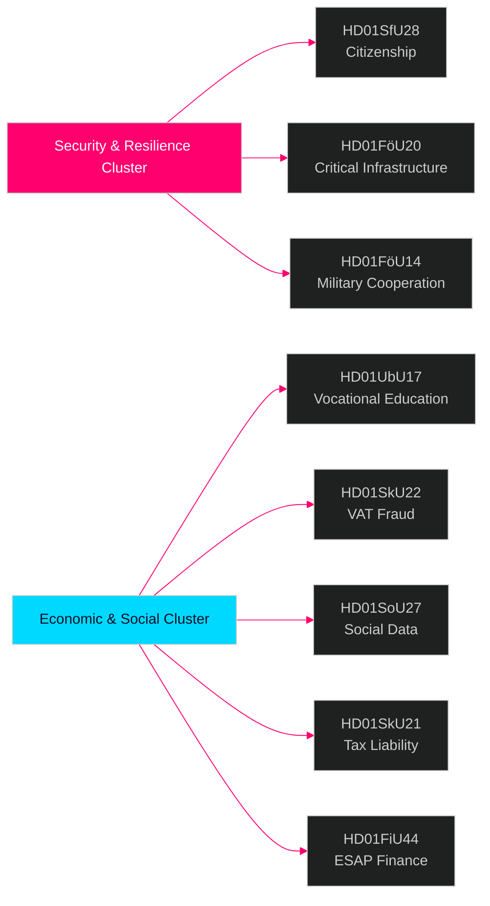

# Informes de comisiones del Riksdag — boletín de inteligencia 28 de abril de 2026

**Autor**: James Pether Sörling  
**Fecha**: 2026-04-29  
**Clasificación**: PÚBLICO — RGPD Art. 9(2)(e)(g)  
**Confianza**: ALTA [B2]  
**ID de ejecución**: 25091345504

---

## 🎯 Resumen ejecutivo

El sistema de comisiones del Riksdag aprobó ocho (8) betänkanden el 28 de abril de 2026, marcando uno de los días legislativos más significativos de la sesión 2025/26. La señal dominante es un clúster de seguridad de cuatro documentos que abarca el endurecimiento de los requisitos de ciudadanía (HD01SfU28), la ley de resiliencia de infraestructuras críticas (HD01FöU20), la cooperación militar operativa (HD01FöU14) y la reforma de la formación profesional (HD01UbU17) — en conjunto representan la consolidación por parte del gobierno Tidö de su agenda de seguridad nacional e integración en los últimos meses antes de las elecciones de septiembre de 2026. Las reformas de ciudadanía se aprueban contra un amplio bloque opositor (S+V+C+MP reservan todos al menos en un punto), mientras que la legislación de seguridad avanza con consenso interbloque, lo que indica un entorno político híbrido que recompensa la firmeza en materia de seguridad pero arriesga la deserción centrista en el ámbito del bienestar.

## 🧭 3 decisiones que apoya este informe

1. **Posicionamiento electoral**: El bloque de reservas S+V+C+MP sobre ciudadanía (HD01SfU28) señala una narrativa de oposición unificada de cara a septiembre de 2026 — los comunicadores estratégicos deben esperar una contra-campaña simultánea sobre "dignidad humana" de los cuatro partidos.

2. **Inversión y cumplimiento**: HD01FöU20 (implementación de la Directiva CER) y HD01SkU22 (aplicación del IVA) afectan directamente a los operadores de servicios esenciales y grandes empresas comerciales — los plazos de cumplimiento de julio-agosto de 2026 requieren acción inmediata.

3. **Industria de defensa y OTAN**: HD01FöU14 (mejoras de la cooperación militar) es un habilitador discreto pero significativo de la integración operativa de Suecia tras su adhesión a la OTAN, con implicaciones directas para la contratación de defensa y los ejercicios conjuntos.

## ⏱️ Resumen en 60 segundos

- **Ciudadanía endurecida**: Prop 2025/26:175 aprobada — requisitos de idioma, ingresos y buena conducta elevados; menores parcialmente exentos; bloque opositor presenta 10 reservas [HD01SfU28]
- **Directiva CER implementada**: Nueva ley sobre resiliencia de entidades críticas (Directiva UE 2022/2557) adoptada; afecta a operadores de energía, transporte, agua, salud e infraestructura digital [HD01FöU20]
- **Cooperación militar reforzada**: Marco jurídico mejorado para la cooperación militar operativa con socios extranjeros [HD01FöU14]
- **Educación profesional superior reformada**: Yrkeshögskolan recibe mandato de grupo directivo, definición más clara del organizador de formación; vía de acceso desde la educación secundaria a la formación profesional superior formalizada a partir de 2027 [HD01UbU17]
- **Fraude al IVA combatido**: Skatteverket recibe nuevas competencias para rechazar/cancelar el registro del IVA, declarar números inválidos en VIES, retener devoluciones excesivas de IVA [HD01SkU22]
- **Registro de datos sociales creado**: Socialstyrelsen recibe autorización para compilar registro nacional de datos de servicios sociales; en vigor el 1 de agosto de 2026 [HD01SoU27]
- **Alivio para representantes fiscales**: Nuevas reglas de período de gracia y exención para representantes fiscales de empresas [HD01SkU21]
- **Datos financieros ESAP**: Suecia adopta el marco de la UE para el Punto de Acceso Único Europeo de información financiera y de sostenibilidad [HD01FiU44]

## 🔔 Principal señal prospectiva

**Vigilar**: Votación prevista en el pleno sobre HD01SfU28 (ciudadanía). Las primeras encuestas Novus/Ipsos tras la votación se esperan en 7 días. Una variación de ≥3 puntos en las proyecciones de escaños SD↔M o S confirmaría el efecto de movilización electoral de la reforma de ciudadanía.

**Confianza**: ALTA [B2]

<!-- source-sha: aec9c4c63be21515d55b3a22362bc344c0b4a20e -->
