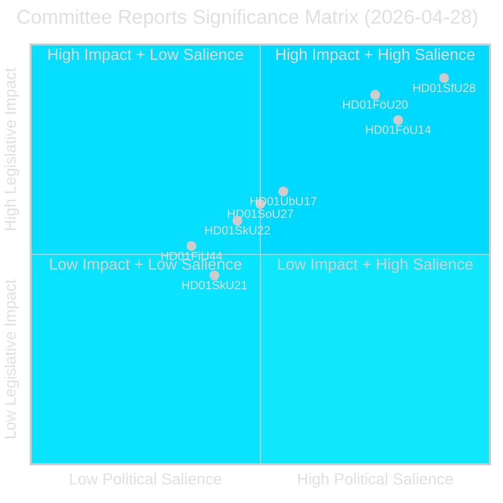
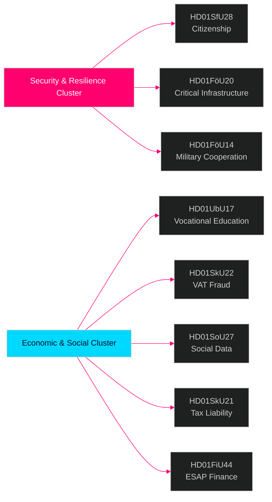

# Riksdagenin valiokuntaraportit — tiedustelutiedote 28. huhtikuuta 2026

**Tekijä**: James Pether Sörling  
**Päivämäärä**: 2026-04-29  
**Luokitus**: JULKINEN — GDPR Art. 9(2)(e)(g)  
**Luotettavuus**: KORKEA [B2]  
**Ajo-ID**: 25091345504

---

## 🎯 Lyhyt yhteenveto

Riksdagenin valiokunnat hyväksyivät kahdeksan (8) betänkandea 28. huhtikuuta 2026, mikä merkitsee yhtä 2025/26 istuntokauden merkittävimmistä lainsäädäntöpäivistä. Hallitseva signaali on neljän asiakirjan turvallisuusrypäs, joka kattaa kansalaisuusvaatimusten tiukentamisen (HD01SfU28), kriittisen infrastruktuurin resilienssilain (HD01FöU20), sotilaallisen operatiivisen yhteistyön (HD01FöU14) ja ammatillisen koulutuksen uudistuksen (HD01UbU17) — yhdessä nämä edustavat Tidö-hallituksen kansalliseen turvallisuuteen ja integraatioon tähtäävän ohjelman konsolidointia viimeisinä kuukausina ennen syyskuun 2026 vaaleja. Kansalaisuusuudistukset hyväksytään laajan oppositioblokin vastustuksesta huolimatta (S+V+C+MP kaikki varaumat vähintään yhdessä kohdassa), kun taas turvallisuuslainsäädäntö etenee blokkien välisellä konsensuksella — mikä osoittaa hybridistä poliittista ympäristöä, joka palkitsee turvallisuuslinjasta pitäytymisen mutta riskeeraa keskiryhmien irtautumisen hyvinvointiasioissa.

## 🧭 3 päätöstä, joita tämä tiedote tukee

1. **Vaaliasemointi**: S+V+C+MP:n varaumablokin kansalaisuutta (HD01SfU28) koskeva yhtenäinen oppositiokertomus syyskuuhun 2026 — strategisten viestijöiden on odotettava kaikkien neljän puolueen samanaikaista "ihmisarvo"-vastaiskua.

2. **Sijoittaminen ja sääntöjen noudattaminen**: HD01FöU20 (CER-direktiivin täytäntöönpano) ja HD01SkU22 (alv-valvonta) vaikuttavat suoraan kriittisen infrastruktuurin haltijoihin ja suuriin kaupallisiin yrityksiin — heinä–elokuun 2026 noudattamisaikataulut edellyttävät välittömiä toimia.

3. **Puolustusala ja NATO**: HD01FöU14 (sotilaallisen yhteistyön parannukset) on hiljainen mutta merkittävä mahdollistaja Ruotsin operatiiviselle integraatiolle NATO-jäsenyyden jälkeen, suorin vaikutuksin puolustushankintaan ja yhteisiin harjoituksiin.

## ⏱️ 60 sekunnin yhteenveto

- **Kansalaisuusvaatimuksia tiukennettu**: Prop 2025/26:175 hyväksytty — kieli-, tulo- ja hyvämaineisuusvaatimuksia korotettu; lapset osittain vapautettu; oppositioblokki jättää 10 varauma [HD01SfU28]
- **CER-direktiivi toimeenpantu**: Uusi laki kriittisten toimijoiden resilienssistä (EU-direktiivi 2022/2557) hyväksytty; koskee energia-, liikenne-, vesi-, terveys- ja digitaalisen infrastruktuurin haltijoita [HD01FöU20]
- **Sotilaallista yhteistyötä vahvistettu**: Parannettu oikeudellinen kehys operatiiviselle sotilaalliselle yhteistyölle ulkomaisten kumppaneiden kanssa [HD01FöU14]
- **Ammatillinen korkea-aste uudistettu**: Yrkeshögskolan saa johtoryhmämandaatin, selkeämmän koulutuksenjärjestäjän määritelmän; siirtymisreitti toisen asteen koulutuksesta ammatilliseen korkea-asteeseen virallisestaan vuodesta 2027 [HD01UbU17]
- **Alv-petoksia torjutaan**: Skatteverket saa uudet valtuudet kieltäytyä/peruuttaa alv-rekisteröinti, julistaa numerot pätemättömiksi VIES-järjestelmässä, pidättää ylimääräisiä alv-palautuksia [HD01SkU22]
- **Sosiaalirekisteri perustettu**: Socialstyrelsen saa valtuudet koota kansallinen sosiaalipalvelujen tietorekisteri; voimaan 1. elokuuta 2026 [HD01SoU27]
- **Veronmaksajavastuu helpottuu**: Uudet karensisäännöt ja vapautussäännöt yhtiön verovastuullisille edustajille [HD01SkU21]
- **ESAP-rahoitusdata**: Ruotsi hyväksyy EU-kehyksen European Single Access Point -palvelulle rahoitus- ja kestävyystiedoille [HD01FiU44]

## 🔔 Tärkein eteenpäin katsova signaali

**Seuraa**: Täysistunto äänestää HD01SfU28:sta (kansalaisuus). Ensimmäiset Novus/Ipsos-mittaukset äänestysten jälkeen odotetaan 7 päivän kuluessa. ≥3 pisteen muutos SD↔M tai S mandaattiprojektioissa vahvistaisi kansalaisuusuudistuksen vaalimobilisointivaikutuksen.

**Luotettavuus**: KORKEA [B2]

<!-- source-sha: aec9c4c63be21515d55b3a22362bc344c0b4a20e -->
