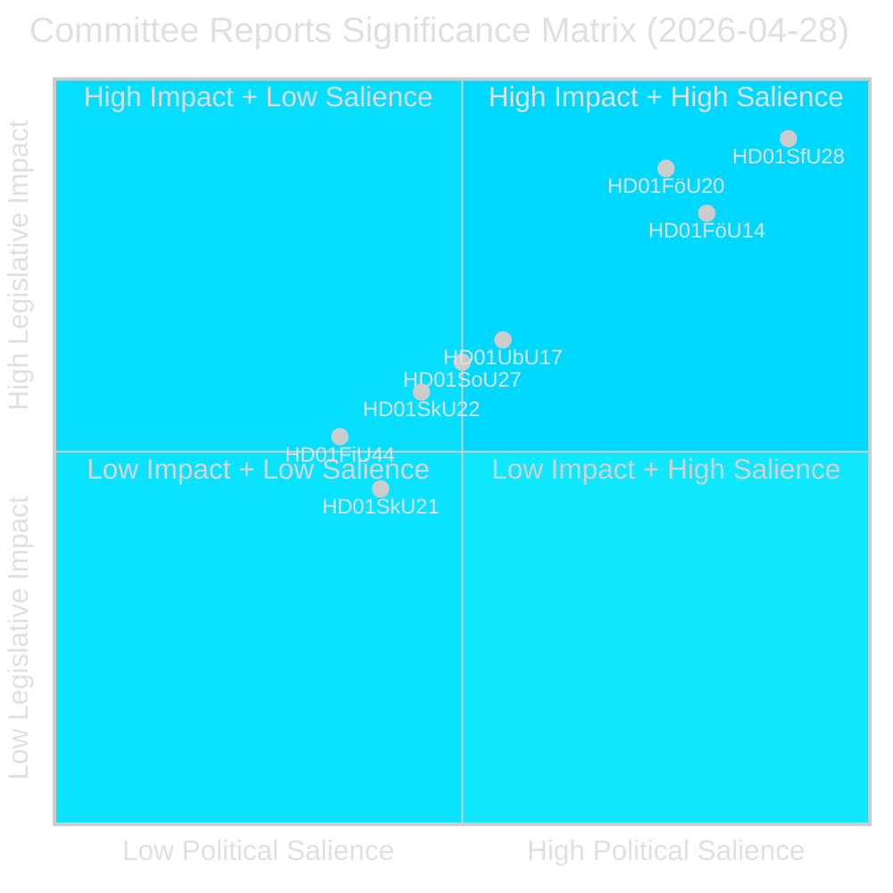
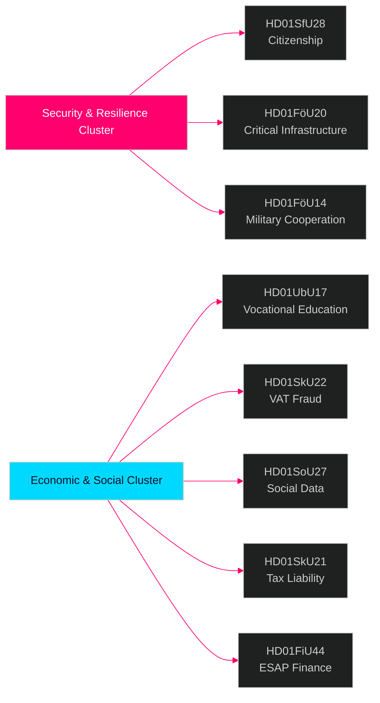

# Rapports des commissions du Riksdag — bulletin de renseignement 28 avril 2026

**Auteur** : James Pether Sörling  
**Date** : 2026-04-29  
**Classification** : PUBLIC — RGPD Art. 9(2)(e)(g)  
**Confiance** : HAUTE [B2]  
**Identifiant de traitement** : 25091345504

---

## 🎯 Résumé concis

Le système des commissions du Riksdag a approuvé huit (8) betänkanden le 28 avril 2026, marquant l'une des journées législatives les plus significatives de la session 2025/26. Le signal dominant est un groupe de sécurité à quatre documents couvrant le durcissement des conditions de citoyenneté (HD01SfU28), la loi sur la résilience des infrastructures critiques (HD01FöU20), la coopération militaire opérationnelle (HD01FöU14) et la réforme de la formation professionnelle (HD01UbU17) — ensemble, ils représentent la consolidation par le gouvernement Tidö de son agenda national de sécurité et d'intégration dans les derniers mois précédant les élections de septembre 2026. Les réformes de la citoyenneté sont adoptées contre un large bloc d'opposition (S+V+C+MP émettent tous des réserves sur au moins un point), tandis que la législation sécuritaire progresse avec un consensus inter-blocs, indiquant un environnement politique hybride qui récompense la fermeté en matière de sécurité mais risque la défection centriste sur le terrain social.

## 🧭 3 décisions que ce rapport soutient

1. **Positionnement électoral** : Le bloc de réserve S+V+C+MP sur la citoyenneté (HD01SfU28) signale un récit d'opposition unifié avant septembre 2026 — les communicants stratégiques doivent s'attendre à une contre-campagne simultanée sur la « dignité humaine » de la part des quatre partis.

2. **Investissement et conformité** : HD01FöU20 (mise en œuvre de la directive CER) et HD01SkU22 (application de la TVA) concernent directement les opérateurs de services essentiels et les grandes entreprises commerciales — les délais de conformité de juillet–août 2026 nécessitent une action immédiate.

3. **Industrie de défense et OTAN** : HD01FöU14 (améliorations de la coopération militaire) est un catalyseur discret mais significatif de l'intégration opérationnelle de la Suède après son adhésion à l'OTAN, avec des implications directes pour les marchés de défense et les exercices conjoints.

## ⏱️ Résumé en 60 secondes

- **Citoyenneté durcie** : Prop 2025/26:175 adoptée — conditions linguistiques, de revenu et de bonne conduite relevées ; enfants partiellement exemptés ; le bloc d'opposition dépose 10 réserves [HD01SfU28]
- **Directive CER mise en œuvre** : Nouvelle loi sur la résilience des entités critiques (directive UE 2022/2557) adoptée ; concerne les opérateurs de l'énergie, des transports, de l'eau, de la santé et des infrastructures numériques [HD01FöU20]
- **Coopération militaire renforcée** : Cadre juridique amélioré pour la coopération militaire opérationnelle avec des partenaires étrangers [HD01FöU14]
- **Enseignement professionnel supérieur réformé** : Yrkeshögskolan reçoit un mandat de groupe de direction, une définition plus claire de l'organisateur de formation ; voie d'accès de l'enseignement secondaire à l'enseignement professionnel supérieur formalisée à partir de 2027 [HD01UbU17]
- **Fraude à la TVA combattue** : Skatteverket reçoit de nouveaux pouvoirs pour refuser/annuler l'immatriculation à la TVA, déclarer des numéros invalides dans VIES, retenir les remboursements de TVA excédentaires [HD01SkU22]
- **Registre de données sociales créé** : Socialstyrelsen est habilitée à compiler un registre national des données des services sociaux ; en vigueur le 1er août 2026 [HD01SoU27]
- **Allègement pour les représentants fiscaux** : Nouvelles règles de délai de grâce et d'exemption pour les représentants fiscaux d'entreprises [HD01SkU21]
- **Données financières ESAP** : La Suède adopte le cadre de l'UE pour le Point d'Accès Unique Européen (ESAP) pour les informations financières et de durabilité [HD01FiU44]

## 🔔 Principal déclencheur prospectif

**À surveiller** : Vote prévu en séance plénière sur HD01SfU28 (citoyenneté). Les premiers sondages Novus/Ipsos après le vote sont attendus dans les 7 jours. Une variation de ≥3 points dans les projections de sièges SD↔M ou S confirmerait l'effet de mobilisation électorale de la réforme de la citoyenneté.

**Confiance** : HAUTE [B2]

<!-- source-sha: aec9c4c63be21515d55b3a22362bc344c0b4a20e -->
