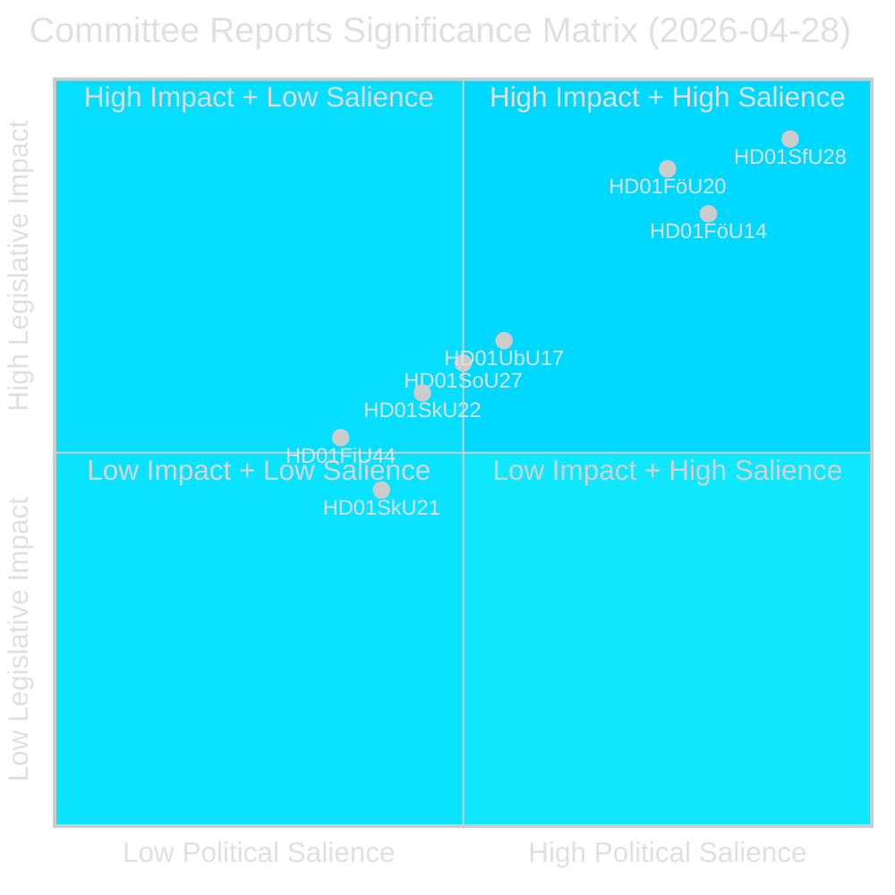
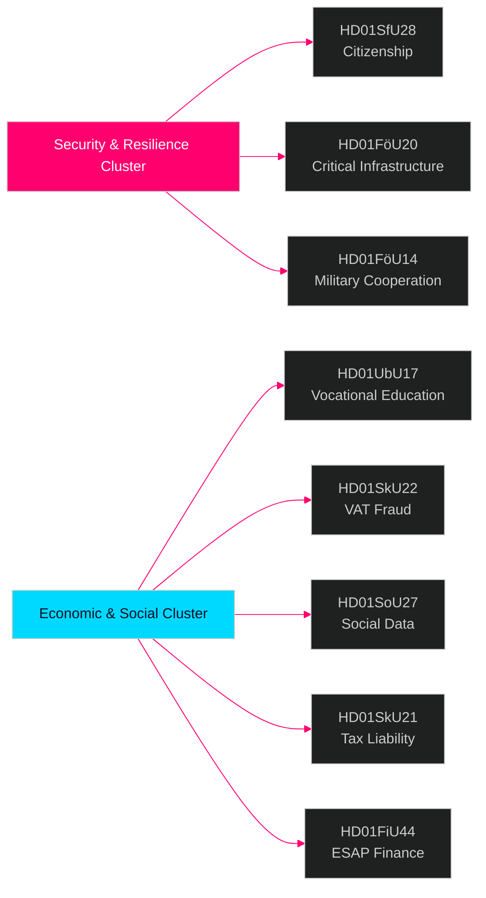

# דוחות ועדות הפרלמנט השוודי — עלון מודיעין 28 באפריל 2026

**מחבר**: James Pether Sörling  
**תאריך**: 2026-04-29  
**סיווג**: ציבורי — GDPR סעיף 9(2)(ה)(ו)  
**רמת אמינות**: גבוהה [B2]  
**מזהה הרצה**: 25091345504

---

## 🎯 סיכום מנהלים

מערכת הוועדות של הריקסדאג אישרה שמונה (8) betänkanden ב-28 באפריל 2026, המסמן את אחד מימי החקיקה המשמעותיים ביותר של מושב 2025/26. האות הדומיננטי הוא אשכול ביטחוני של ארבעה מסמכים הכולל הידוק תנאי האזרחות (HD01SfU28), חוק חוסן תשתיות קריטיות (HD01FöU20), שיתוף פעולה מבצעי צבאי (HD01FöU14) ורפורמת ההכשרה המקצועית (HD01UbU17) — יחד הם מייצגים גיבוש ממשלת Tidö של אג'נדת הביטחון הלאומי וההשתלבות בחודשים האחרונים לפני בחירות ספטמבר 2026. רפורמות האזרחות מתקבלות כנגד בלוק אופוזיציה רחב (S+V+C+MP כולם הגישו הסתייגויות על לפחות נקודה אחת), בעוד שחקיקת הביטחון מתקדמת בהסכמה בין-בלוקית — מה שמצביע על סביבה פוליטית היברידית המתגמלת על נחישות בנושאי ביטחון אך מסתכנת בעריקה צנטריסטית בתחום הרווחה.

## 🧭 3 החלטות שדוח זה תומך בהן

1. **מיצוב בחירות**: בלוק ההסתייגויות S+V+C+MP בנושא אזרחות (HD01SfU28) מאותת על נרטיב אופוזיציה מאוחד לקראת ספטמבר 2026 — על אנשי תקשורת אסטרטגית לצפות לקמפיין נגד מקביל בנושא "כבוד האדם" מכל ארבעת המפלגות.

2. **השקעה ועמידה בתקנות**: HD01FöU20 (יישום הנחיית CER) וHD01SkU22 (אכיפת מע"מ) משפיעים ישירות על מפעילי שירותים חיוניים ועסקים מסחריים גדולים — מועדי עמידה ביולי–אוגוסט 2026 דורשים פעולה מיידית.

3. **תעשיית הביטחון וNATO**: HD01FöU14 (שיפורי שיתוף הפעולה הצבאי) הוא מאפשר שקט אך משמעותי של האינטגרציה המבצעית של שוודיה לאחר ההצטרפות לNATO, עם השלכות ישירות על רכש ביטחוני ותרגילים משותפים.

## ⏱️ סיכום של 60 שניות

- **הידוק תנאי האזרחות**: Prop 2025/26:175 אושר — דרישות שפה, הכנסה והתנהגות נאותה הוגבהו; ילדים פטורים חלקית; בלוק האופוזיציה מגיש 10 הסתייגויות [HD01SfU28]
- **יישום הנחיית CER**: חוק חדש לחוסן גופים קריטיים (הנחיית האיחוד האירופי 2022/2557) אושר; משפיע על מפעילי תשתיות אנרגיה, תחבורה, מים, בריאות ודיגיטל [HD01FöU20]
- **שיתוף פעולה צבאי חוזק**: מסגרת משפטית משופרת לשיתוף פעולה צבאי מבצעי עם שותפים זרים [HD01FöU14]
- **רפורמה בהשכלה המקצועית**: Yrkeshögskolan מקבלת מנדט לצוות הנהלה, הגדרה ברורה יותר של מארגן הכשרה; מסלול כניסה מחינוך תיכוני להשכלה מקצועית גבוהה יפורמל מ-2027 [HD01UbU17]
- **מאבק בהונאות מע"מ**: Skatteverket מקבלת סמכויות חדשות לסרב/לבטל רישום מע"מ, להכריז על מספרים כבלתי תקפים ב-VIES, לעכב החזרי מע"מ עודפים [HD01SkU22]
- **הקמת רישום נתונים חברתי**: Socialstyrelsen מוסמכת לרכז רישום לאומי לנתוני שירותים חברתיים; בתוקף מ-1 באוגוסט 2026 [HD01SoU27]
- **הקלה על נציגי מס**: כללי תקופת חסד ופטור חדשים לנציגי המס של חברות [HD01SkU21]
- **נתוני ESAP פיננסיים**: שוודיה מאמצת את מסגרת האיחוד האירופי לנקודת גישה אירופית יחידה למידע פיננסי וקיימות [HD01FiU44]

## 🔔 הטריגר המוביל לעתיד

**עקוב**: הצבעה מתוכננת במליאה על HD01SfU28 (אזרחות). סקרי Novus/Ipsos ראשונים לאחר ההצבעה צפויים תוך 7 ימים. שינוי של ≥3 נקודות בתחזיות מנדטים SD↔M או S יאשר את אפקט הגיוס הבחירותי של רפורמת האזרחות.

**רמת אמינות**: גבוהה [B2]

<!-- source-sha: aec9c4c63be21515d55b3a22362bc344c0b4a20e -->
