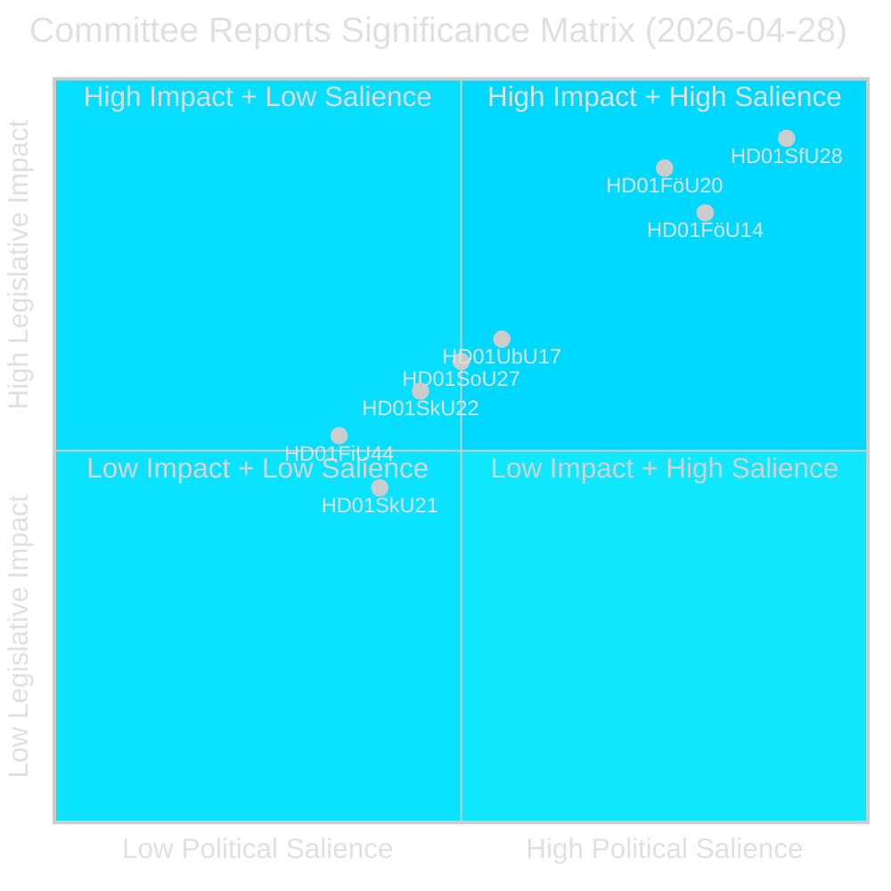
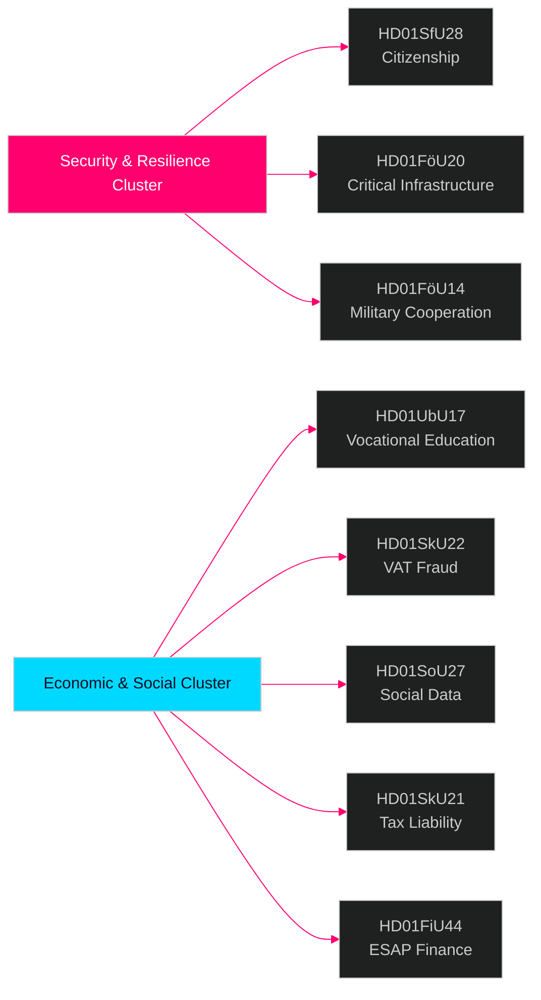

# スウェーデン議会委員会報告 — インテリジェンス・ブリーフィング 2026年4月28日

**著者**: James Pether Sörling  
**日付**: 2026-04-29  
**分類**: 公開 — GDPR第9条(2)(e)(g)  
**信頼度**: 高 [B2]  
**実行ID**: 25091345504

---

## 🎯 要約

スウェーデン議会（Riksdag）の委員会システムは2026年4月28日、8件のbetänkandenを承認し、2025/26年会期において最も重要な立法日の一つとなった。主要シグナルは市民権要件の厳格化（HD01SfU28）、重要インフラ強靭化法（HD01FöU20）、軍事的運用協力（HD01FöU14）、職業技能改革（HD01UbU17）にまたがる4文書の安全保障クラスターである。これらは2026年9月選挙前の最終月における、Tidö政府の国家安全保障・統合政策アジェンダの集大成を示す。市民権改革は広範な野党ブロック（S+V+C+MPは全て少なくとも1点について留保を提出）の反対の中で採択され、安全保障立法はブロック横断的なコンセンサスで前進している。これは安全保障における確固たる姿勢を評価しつつも、福祉分野における中道離脱リスクを抱えるハイブリッドな政治環境を示している。

## 🧭 本ブリーフが支援する3つの決定

1. **選挙ポジショニング**: 市民権（HD01SfU28）に関するS+V+C+MPの留保ブロックは、2026年9月に向けた統一された野党の論調を示す。戦略的コミュニケーション担当者は、4政党全ての「人間の尊厳」反対キャンペーンが同時展開されることに備えるべきである。

2. **投資とコンプライアンス**: HD01FöU20（CER指令の実施）とHD01SkU22（VAT執行）は、重要サービス事業者と大規模商業企業に直接影響する。2026年7〜8月のコンプライアンス期限には即時対応が必要である。

3. **防衛産業とNATO**: HD01FöU14（軍事協力の改善）は、スウェーデンのNATO加盟後の作戦統合に向けた静かだが重要な推進力であり、防衛調達と共同演習に直接影響を与える。

## ⏱️ 60秒サマリー

- **市民権の厳格化**: Prop 2025/26:175採択 — 言語・収入・素行要件が引き上げられ；未成年者は一部免除；野党ブロックが10件の留保を提出 [HD01SfU28]
- **CER指令の実施**: 重要主体の強靭性に関する新法（EU指令2022/2557）採択；エネルギー、輸送、水道、医療、デジタルインフラ事業者が対象 [HD01FöU20]
- **軍事協力の強化**: 外国パートナーとの作戦的軍事協力のための改善された法的枠組み [HD01FöU14]
- **職業高等教育の改革**: Yrkeshögskolanが経営グループ権限を取得、研修実施者の定義が明確化；2027年から中等後教育からの入学経路が正式化 [HD01UbU17]
- **VAT詐欺対策**: SkatteverketがVAT登録の拒否・取消、VIESでの番号無効化、過剰VAT還付の差し止めに関する新たな権限を取得 [HD01SkU22]
- **社会データレジストリの創設**: Socialstyrelsenが全国社会サービスデータレジストリの編纂権限を付与；2026年8月1日施行 [HD01SoU27]
- **税務代理人の負担軽減**: 企業の税務代理人に対する新たな猶予期間と免除規定 [HD01SkU21]
- **ESAPの財務データ**: スウェーデンが財務・持続可能性情報のEuropean Single Access PointのEU枠組みを採択 [HD01FiU44]

## 🔔 主要な将来のトリガー

**注視**: HD01SfU28（市民権）の本会議採決が予定されている。採決後7日以内に最初のNovus/Ipsos世論調査の発表が見込まれる。SD↔MまたはSの議席予測に≥3ポイントの変動があれば、市民権改革の選挙動員効果が確認される。

**信頼度**: 高 [B2]

<!-- source-sha: aec9c4c63be21515d55b3a22362bc344c0b4a20e -->
