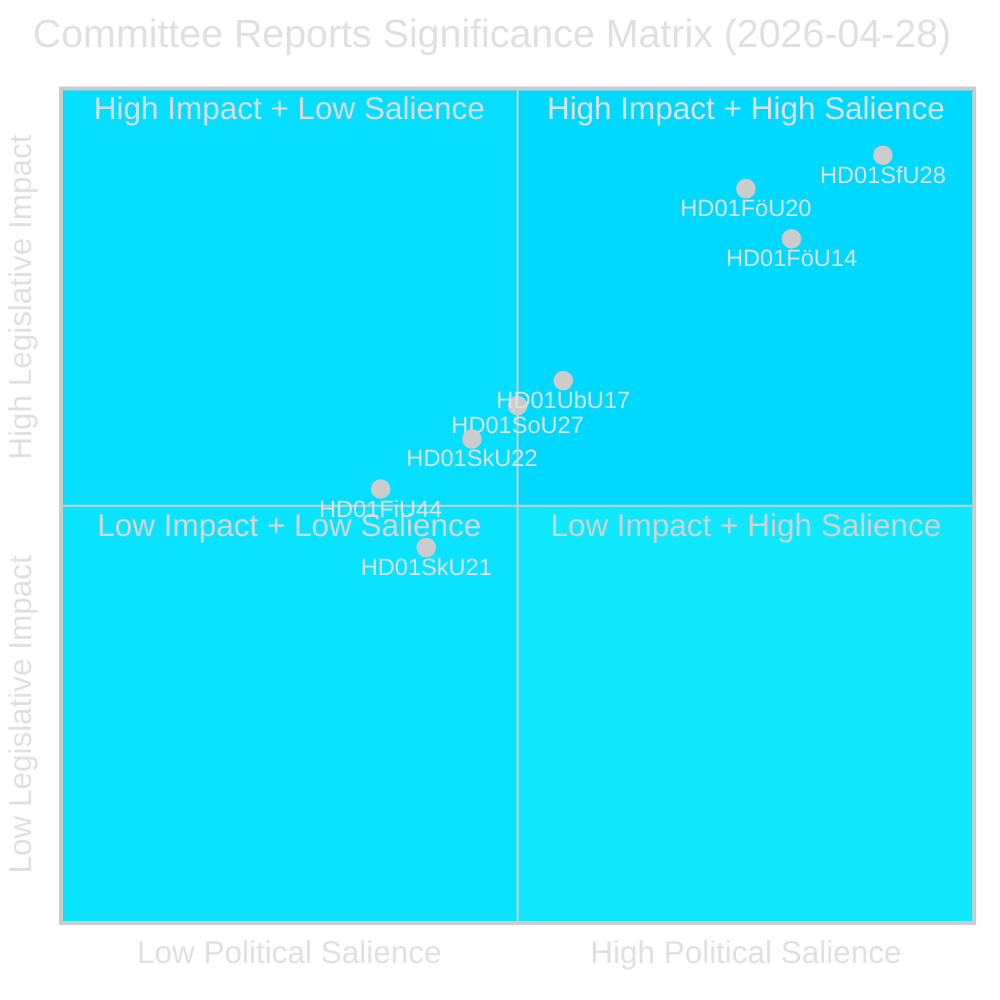
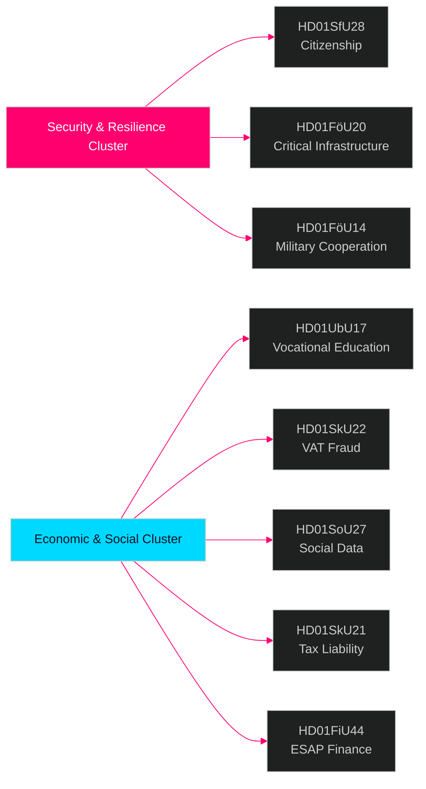

# 스웨덴 의회 위원회 보고서 — 인텔리전스 브리핑 2026년 4월 28일

**저자**: James Pether Sörling  
**날짜**: 2026-04-29  
**분류**: 공개 — GDPR 제9조(2)(e)(g)  
**신뢰도**: 높음 [B2]  
**실행 ID**: 25091345504

---

## 🎯 핵심 요약

스웨덴 의회(Riksdag) 위원회 시스템은 2026년 4월 28일 8건의 betänkanden을 승인하며, 2025/26 회기 중 가장 중요한 입법일 중 하나로 기록되었다. 주요 신호는 시민권 요건 강화(HD01SfU28), 핵심 인프라 탄력성 법안(HD01FöU20), 군사적 운용 협력(HD01FöU14), 직업 기술 개혁(HD01UbU17)에 걸친 4개 문서 안보 클러스터이다. 이는 2026년 9월 선거를 앞둔 마지막 몇 달간 Tidö 정부의 국가 안보 및 통합 의제 강화를 총체적으로 보여준다. 시민권 개혁은 광범위한 야당 블록(S+V+C+MP 모두 최소 한 항목에 유보)의 반대 속에 채택되었으며, 안보 입법은 블록 간 합의로 진전을 이루고 있어 안보 분야의 강경함을 보상하면서도 복지 분야의 중도 이탈 위험을 내포하는 혼합적 정치 환경을 시사한다.

## 🧭 이 브리핑이 지원하는 3가지 결정

1. **선거 포지셔닝**: 시민권(HD01SfU28)에 관한 S+V+C+MP의 유보 블록은 2026년 9월을 향한 통합된 야당 담론을 시사한다. 전략적 커뮤니케이터들은 4개 정당 모두의 동시 "인간 존엄성" 반캠페인을 예상해야 한다.

2. **투자 및 규정 준수**: HD01FöU20(CER 지침 시행)과 HD01SkU22(부가세 집행)는 필수 서비스 운영자 및 대형 상업 기업에 직접적인 영향을 미친다. 2026년 7~8월 준수 기한에 즉각적인 조치가 필요하다.

3. **방위산업과 NATO**: HD01FöU14(군사 협력 개선)는 NATO 가입 후 스웨덴의 작전적 통합에 있어 조용하지만 중요한 촉진제로, 방위 조달 및 합동 훈련에 직접적인 영향을 미친다.

## ⏱️ 60초 요약

- **시민권 강화**: Prop 2025/26:175 채택 — 언어·소득·품행 요건 상향; 아동 부분 면제; 야당 블록이 10개 유보 제출 [HD01SfU28]
- **CER 지침 시행**: 중요 개체 탄력성에 관한 새 법안(EU 지침 2022/2557) 채택; 에너지·교통·수도·의료·디지털 인프라 운영자 적용 [HD01FöU20]
- **군사 협력 강화**: 외국 파트너와의 작전적 군사 협력을 위한 개선된 법적 틀 [HD01FöU14]
- **직업고등교육 개혁**: Yrkeshögskolan이 경영 그룹 위임권 획득, 훈련 주관자 정의 명확화; 2027년부터 중등 이후 교육으로의 진입 경로 공식화 [HD01UbU17]
- **부가세 사기 단속**: Skatteverket이 부가세 등록 거부·취소, VIES에서 번호 무효화, 과도한 부가세 환급 보류에 관한 새로운 권한 획득 [HD01SkU22]
- **사회 데이터 레지스트리 창설**: Socialstyrelsen이 전국 사회 서비스 데이터 레지스트리 편찬 권한 부여; 2026년 8월 1일 시행 [HD01SoU27]
- **세무대리인 부담 경감**: 기업 세무대리인을 위한 새로운 유예 기간 및 면제 규정 [HD01SkU21]
- **ESAP 재무 데이터**: 스웨덴이 재무·지속가능성 정보의 유럽 단일 접근점(ESAP)에 관한 EU 체계 채택 [HD01FiU44]

## 🔔 최상위 향후 트리거

**주시**: HD01SfU28(시민권) 본회의 표결 예정. 표결 후 7일 이내 첫 Novus/Ipsos 여론조사 결과 발표 예상. SD↔M 또는 S 의석 예측에서 ≥3포인트 변동이 있다면 시민권 개혁의 선거 동원 효과 확인 가능.

**신뢰도**: 높음 [B2]

<!-- source-sha: aec9c4c63be21515d55b3a22362bc344c0b4a20e -->
