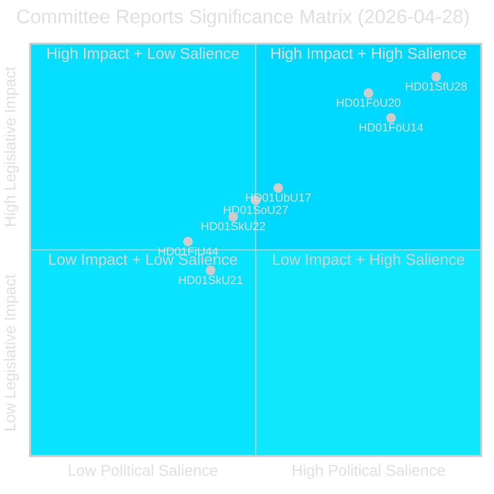
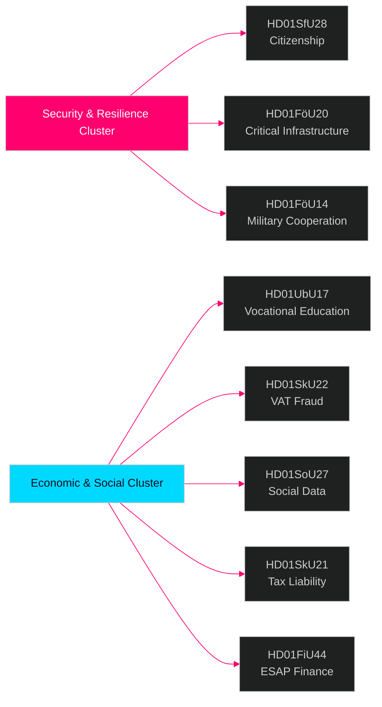

# Riksdag-commissierapporten — inlichtingenbulletin 28 april 2026

**Auteur**: James Pether Sörling  
**Datum**: 2026-04-29  
**Classificatie**: OPENBAAR — AVG Art. 9(2)(e)(g)  
**Betrouwbaarheid**: HOOG [B2]  
**Run-ID**: 25091345504

---

## 🎯 Samenvatting

Het commissiestelsel van de Riksdag keurde op 28 april 2026 acht (8) betänkanden goed, waarmee dit een van de meest ingrijpende wetgevingsdagen van de zittingsperiode 2025/26 was. Het dominante signaal is een veiligheidscluster van vier documenten dat de aanscherping van het staatsburgerschap (HD01SfU28), de wet op de weerbaarheid van kritieke infrastructuur (HD01FöU20), militaire operationele samenwerking (HD01FöU14) en de hervorming van beroepsvaardigheden (HD01UbU17) omvat — samen vertegenwoordigen zij de consolidatie door de Tidö-regering van haar nationale veiligheids- en integratieagenda in de laatste maanden voor de verkiezingen van september 2026. De staatsburgerschapshervormingen worden aangenomen tegen een brede oppositieblok (S+V+C+MP reserveren zich allen op ten minste één punt), terwijl veiligheidswetgeving voortgang boekt met blokoverkoepelende consensus — wat duidt op een hybride politieke omgeving die standvastigheid op veiligheidsgebied beloont maar centristisch defect op welzijnsgebied riskeer.

## 🧭 3 besluiten die dit verslag ondersteunt

1. **Verkiezingspositionering**: Het reservatieblok S+V+C+MP over staatsburgerschap (HD01SfU28) signaleert een eensgezinde oppositieverhaallijn voor september 2026 — strategische communicatoren moeten een simultane 'menselijke waardigheid'-tegencampagne van alle vier partijen verwachten.

2. **Investering en naleving**: HD01FöU20 (implementatie van de CER-richtlijn) en HD01SkU22 (btw-handhaving) raken direct operatoren van essentiële diensten en grote commerciële ondernemingen — nalevingstermijnen juli–augustus 2026 vereisen onmiddellijke actie.

3. **Defensie-industrie en NAVO**: HD01FöU14 (verbeteringen militaire samenwerking) is een stille maar significante enabler van Zweden's operationele integratie na de NAVO-toetreding, met directe implicaties voor defensieaanschaffing en gezamenlijke oefeningen.

## ⏱️ Samenvatting in 60 seconden

- **Staatsburgerschap aangescherpt**: Prop 2025/26:175 aangenomen — taal-, inkomens- en gedragsvereisten verhoogd; kinderen gedeeltelijk vrijgesteld; oppositieblok dient 10 voorbehouden in [HD01SfU28]
- **CER-richtlijn geïmplementeerd**: Nieuwe wet op de weerbaarheid van kritieke entiteiten (EU-richtlijn 2022/2557) aangenomen; treft energie-, transport-, water-, gezondheids- en digitale infrastructuuroperatoren [HD01FöU20]
- **Militaire samenwerking versterkt**: Verbeterd rechtskader voor operationele militaire samenwerking met buitenlandse partners [HD01FöU14]
- **Beroepshogerschool hervormd**: Yrkeshögskolan krijgt management-groepsmandaat, duidelijkere definitie van opleidingsorganisator; instroompad van middelbaar naar hoger beroepsonderwijs geformaliseerd vanaf 2027 [HD01UbU17]
- **Btw-fraude bestreden**: Skatteverket krijgt nieuwe bevoegdheden om btw-registratie te weigeren/annuleren, nummers ongeldig te verklaren in VIES, bovenmatige btw-teruggaven in te houden [HD01SkU22]
- **Sociaal gegevensregister gecreëerd**: Socialstyrelsen krijgt bevoegdheid tot opstellen nationaal register voor sociale dienstgegevens; van kracht per 1 augustus 2026 [HD01SoU27]
- **Verlichting voor belastingvertegenwoordigers**: Nieuwe respijttermijnen en vrijstellingsregels voor fiscale vertegenwoordigers van bedrijven [HD01SkU21]
- **ESAP-financiële data**: Zweden neemt EU-kader over voor het Europees Single Access Point voor financiële en duurzaamheidsinformatie [HD01FiU44]

## 🔔 Belangrijkste vooruitkijkend signaal

**Volg op**: Plenaire stemming over HD01SfU28 (staatsburgerschap) gepland. Eerste Novus/Ipsos-peilingen na de stemming worden binnen 7 dagen verwacht. Een verandering van ≥3 punten in SD↔M of S zetelprojekties zou het electorale mobilisatie-effect van de staatsburgerschapshervorming bevestigen.

**Betrouwbaarheid**: HOOG [B2]

<!-- source-sha: aec9c4c63be21515d55b3a22362bc344c0b4a20e -->
