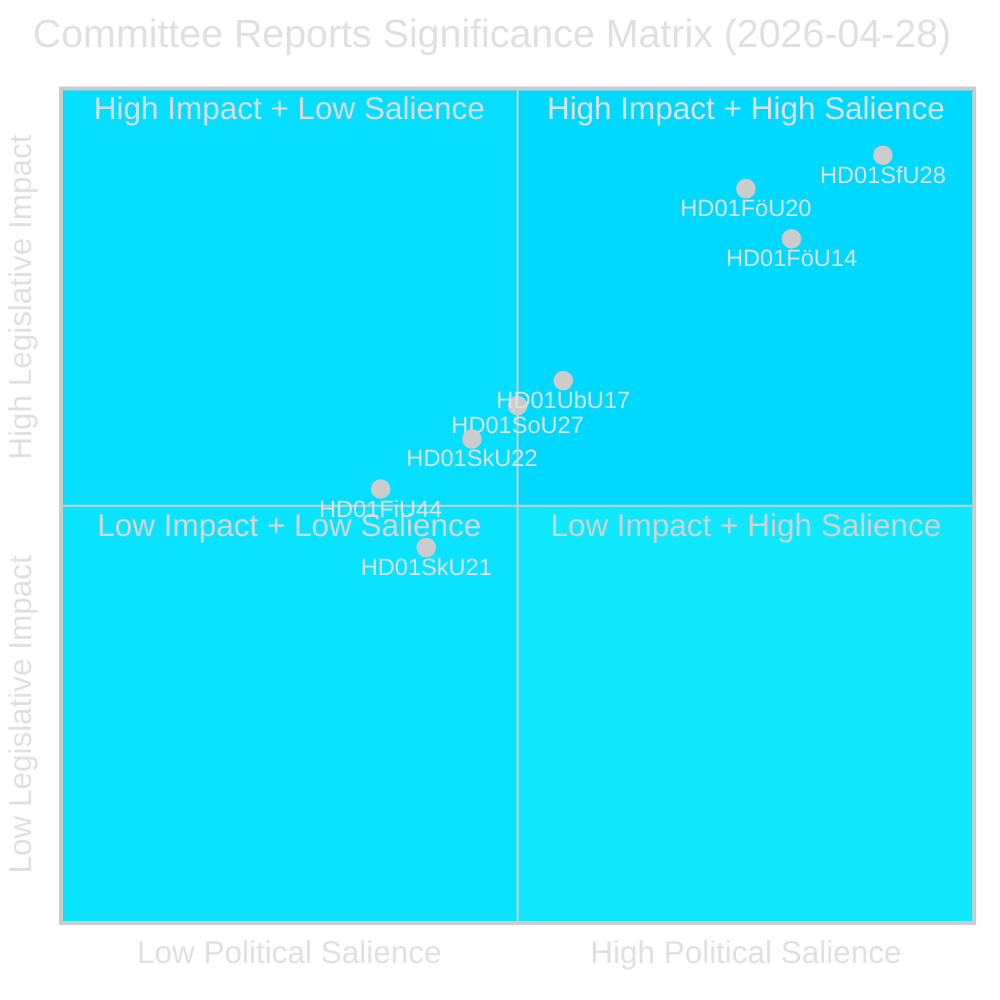
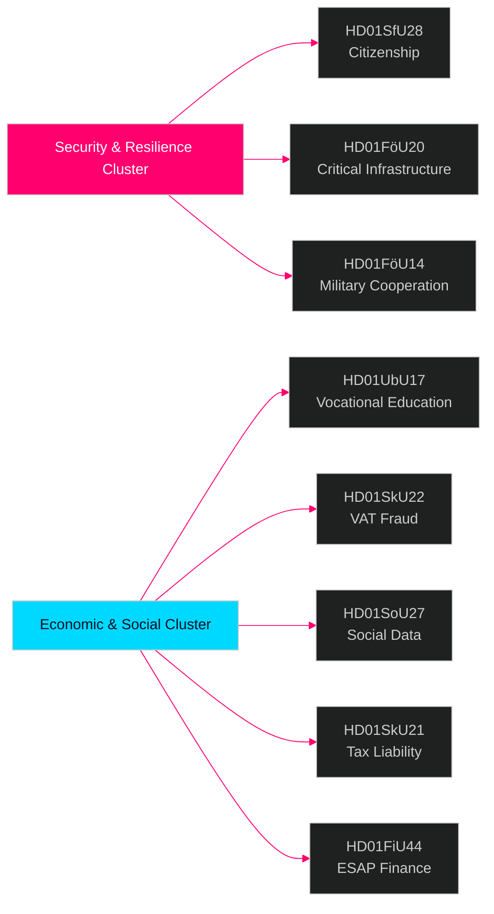

# Riksdagens utvalgsrapporter — etterretningsbrev 28. april 2026

**Forfatter**: James Pether Sörling  
**Dato**: 2026-04-29  
**Klassifisering**: OFFENTLIG — GDPR Art. 9(2)(e)(g)  
**Konfidens**: HØY [B2]  
**Kjøring-ID**: 25091345504

---

## 🎯 Kortfattet sammendrag

Riksdagens utvalgsystem godkjente åtte (8) betänkanden den 28. april 2026, noe som markerer en av de mest konsekvensrike lovgivningsdagene i 2025/26-sesjonen. Det dominerende signalet er en firedokuments sikkerhetsklynge som spenner over statsborgerskapsstrenghet (HD01SfU28), lov om kritisk infrastrukturresiliens (HD01FöU20), militært operativt samarbeid (HD01FöU14) og yrkeskompetansereform (HD01UbU17) — samlet representerer de Tidöregeringens konsolidering av sin nasjonale sikkerhets- og integreringsagenda i de siste månedene før valget i september 2026. Statsborgerskapsreformene vedtas mot en bred opposisjonsblokk (S+V+C+MP reserverer seg alle på minst ett punkt), mens sikkerhetslovgivning skrider frem med tverrblokks konsensus, noe som indikerer et hybridpolitisk miljø som belønner fasthet i sikkerhetsspørsmål men risikerer sentristisk avvik på velferdsområdet.

## 🧭 3 beslutninger dette notatet støtter

1. **Valgposisjonering**: S+V+C+MPs reservasjonsblokk vedrørende statsborgerskap (HD01SfU28) signaliserer en samlet opposisjonsfortelling frem mot september 2026 — strategiske kommunikatører bør forvente en motkampanje om «menneskelig verdighet» fra alle fire partier simultant.

2. **Investering og etterlevelse**: HD01FöU20 (implementering av CER-direktivet) og HD01SkU22 (momshåndhevelse) berører direkte operatører av kritisk infrastruktur og store kommersielle foretak — overholdelsesfrister juli–august 2026 krever umiddelbar handling.

3. **Forsvarsindustri og NATO**: HD01FöU14 (forbedringer av militært samarbeid) er en stille men betydningsfull muliggjører av Sveriges operative integrasjon etter NATO-inntreden, med direkte implikasjoner for forsvarsanskaffelser og felles øvelser.

## ⏱️ 60-sekunders sammendrag

- **Statsborgerskapet strammet inn**: Prop 2025/26:175 vedtatt — språk-, inntekts- og vandelbetingelser hevet; barn delvis unntatt; opposisjonsblokk leverer 10 reservasjoner [HD01SfU28]
- **CER-direktivet implementert**: Ny lov om resiliens for kritiske enheter (EU-direktiv 2022/2557) vedtatt; berører energi-, transport-, vann-, helse- og digital infrastrukturoperatører [HD01FöU20]
- **Militært samarbeid styrket**: Forbedret rettslig rammeverk for operativt militært samarbeid med utenlandske partnere [HD01FöU14]
- **Yrkesutdanning reformert**: Yrkeshögskolan får ledelsesgruppmandat, klarere definisjon av opplæringsarrangør; adgangsvei fra videregående til høyere yrkesfaglig utdanning formaliseres fra 2027 [HD01UbU17]
- **Momsbedrageri motvirket**: Skatteverket får nye fullmakter til å nekte/avregistrere momsregistrering, erklære numre ugyldige i VIES, tilbakeholde overskytende momsrefusjoner [HD01SkU22]
- **Sosialdataregister opprettet**: Socialstyrelsen gis myndighet til å samle nasjonalt register for sosialtjenestedata; i kraft 1. august 2026 [HD01SoU27]
- **Skattemedhjelperlettelse**: Nye karensregler og fritaksregler for selskapets skattemedhjelpere [HD01SkU21]
- **ESAP-finansdata**: Sverige vedtar EU-rammeverket for European Single Access Point for finansiell og bærekraftsinformasjon [HD01FiU44]

## 🔔 Viktigste fremoverskuende signal

**Følg med**: Avstemning planlagt i plenum om HD01SfU28 (statsborgerskap). Første Novus/Ipsos-målinger etter avstemningen forventes innen 7 dager. En ≥3-poengers endring i SD↔M eller S mandatprojeksjoner ville bekrefte valgmobiliseringseffekten av statsborgerskapsreformen.

**Konfidens**: HØY [B2]

<!-- source-sha: aec9c4c63be21515d55b3a22362bc344c0b4a20e -->
