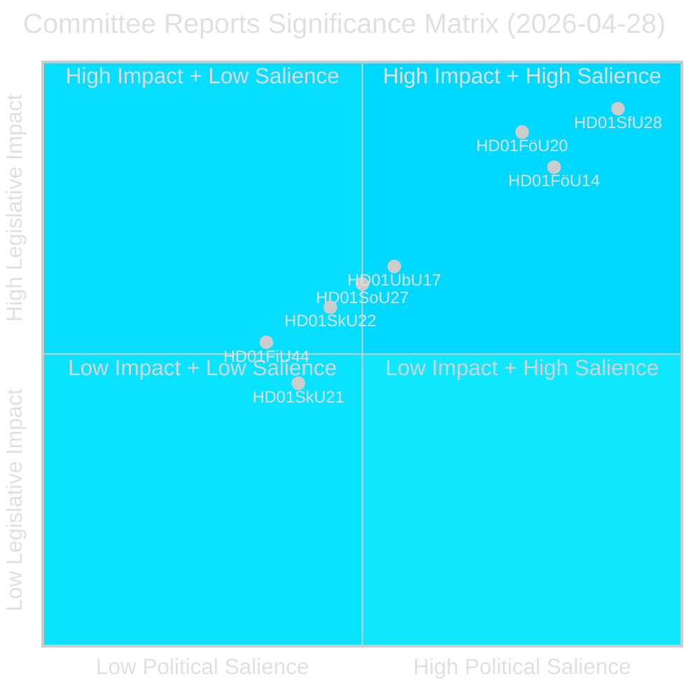
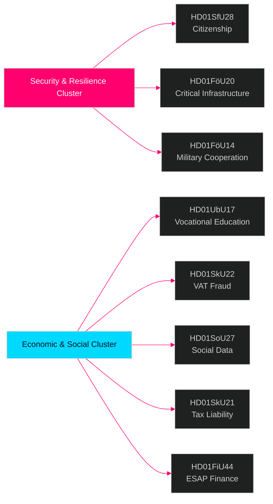

# Riksdagen utskottsrapporter — underrättelsebrev 28 april 2026

**Författare**: James Pether Sörling  
**Datum**: 2026-04-29  
**Klassificering**: OFFENTLIG — GDPR Art. 9(2)(e)(g)  
**Konfidens**: HÖG [B2]  
**Körnings-ID**: 25091345504

---

## 🎯 Kortfattad sammanfattning

Riksdagens utskottssystem godkände åtta (8) betänkanden den 28 april 2026, vilket markerar en av de mest konsekvensrika lagstiftningsdagarna under 2025/26 års riksmöte. Den dominerande signalen är ett fyradokuments säkerhetskluster som spänner över medborgarskapsstränghet (HD01SfU28), lag om kritisk infrastrukturresiliens (HD01FöU20), militärt operativt samarbete (HD01FöU14) och yrkeskompetensreform (HD01UbU17) — tillsammans representerar de Tidöregeringens konsolidering av sin nationalsäkerhets- och integrationsagenda under de sista månaderna inför valet i september 2026. Medborgarskapsreformerna antas mot ett brett oppositionsblock (S+V+C+MP reserverar sig alla på minst en punkt), medan säkerhetslagstiftning framskrider med blocköverskridande konsensus — vilket indikerar en hybrid politisk miljö som belönar fasthet i säkerhetsfrågor men riskerar centristisk deflektion på välfärdsområdet.

## 🧭 3 beslut som detta underlag stöder

1. **Valpositionering**: S+V+C+MPs reservationsblock gällande medborgarskap (HD01SfU28) signalerar en enad oppositionsberättelse inför september 2026 — strategiska kommunikatörer bör förvänta sig en motkampanj om "mänsklig värdighet" från samtliga fyra partier simultant.

2. **Investering och regelefterlevnad**: HD01FöU20 (implementering av CER-direktivet) och HD01SkU22 (momskontroll) berör direkt operatörer av samhällsviktig verksamhet och stora kommersiella företag — efterlevnadstidsfrister juli–augusti 2026 kräver omedelbar åtgärd.

3. **Försvarsindustri och NATO**: HD01FöU14 (förbättringar av militärt samarbete) är en tyst men betydelsefull möjliggörare för Sveriges operativa integration efter NATO-inträdet, med direkta implikationer för försvarsupphandling och gemensamma övningar.

## ⏱️ 60-sekunders sammanfattning

- **Medborgarskapet skärpt**: Prop 2025/26:175 antagen — språk-, inkomst- och vandelsvillkor höjda; barn delvis undantagna; oppositionsblock lämnar 10 reservationer [HD01SfU28]
- **CER-direktivet implementerat**: Ny lag om resiliens för kritiska entiteter (EU-direktiv 2022/2557) antagen; berör energi-, transport-, vatten-, hälso- och digitalinfrastrukturoperatörer [HD01FöU20]
- **Militärt samarbete förstärkt**: Förbättrat rättsligt ramverk för operativt militärt samarbete med utländska partner [HD01FöU14]
- **Yrkeshögskolan reformerad**: Yrkeshögskolan får ledningsgruppsmandat, tydligare definition av utbildningsanordnare; väg från gymnasialt till eftergymnasial utbildning formaliseras från 2027 [HD01UbU17]
- **Momsbedrägeri motverkas**: Skatteverket får nya befogenheter att vägra/avregistrera momsregistrering, ogiltigförklara nummer i VIES, hålla kvar överskjutande momsåterbetalningar [HD01SkU22]
- **Socialdataregister inrättat**: Socialstyrelsen ges befogenhet att sammanställa nationellt register för socialtjänstdata; i kraft 1 augusti 2026 [HD01SoU27]
- **Lättnad för skatteföreträdare**: Nya karensregler och undantag för bolagets skatteföreträdare [HD01SkU21]
- **ESAP-finansdata**: Sverige antar EU-ramverk för European Single Access Point för finansiell och hållbarhetsinformation [HD01FiU44]

## 🔔 Viktigaste framåtblickande signal

**Bevaka**: Omröstning planeras i kammaren om HD01SfU28 (medborgarskap). Första Novus/Ipsos-mätningar efter omröstningen väntas inom 7 dagar. En förändring på ≥3 procentenheter i SD↔M eller S mandatprojektioner skulle bekräfta valrörelsens mobiliseringseffekt av medborgarskapsreformen.

**Konfidens**: HÖG [B2]

<!-- source-sha: aec9c4c63be21515d55b3a22362bc344c0b4a20e -->
