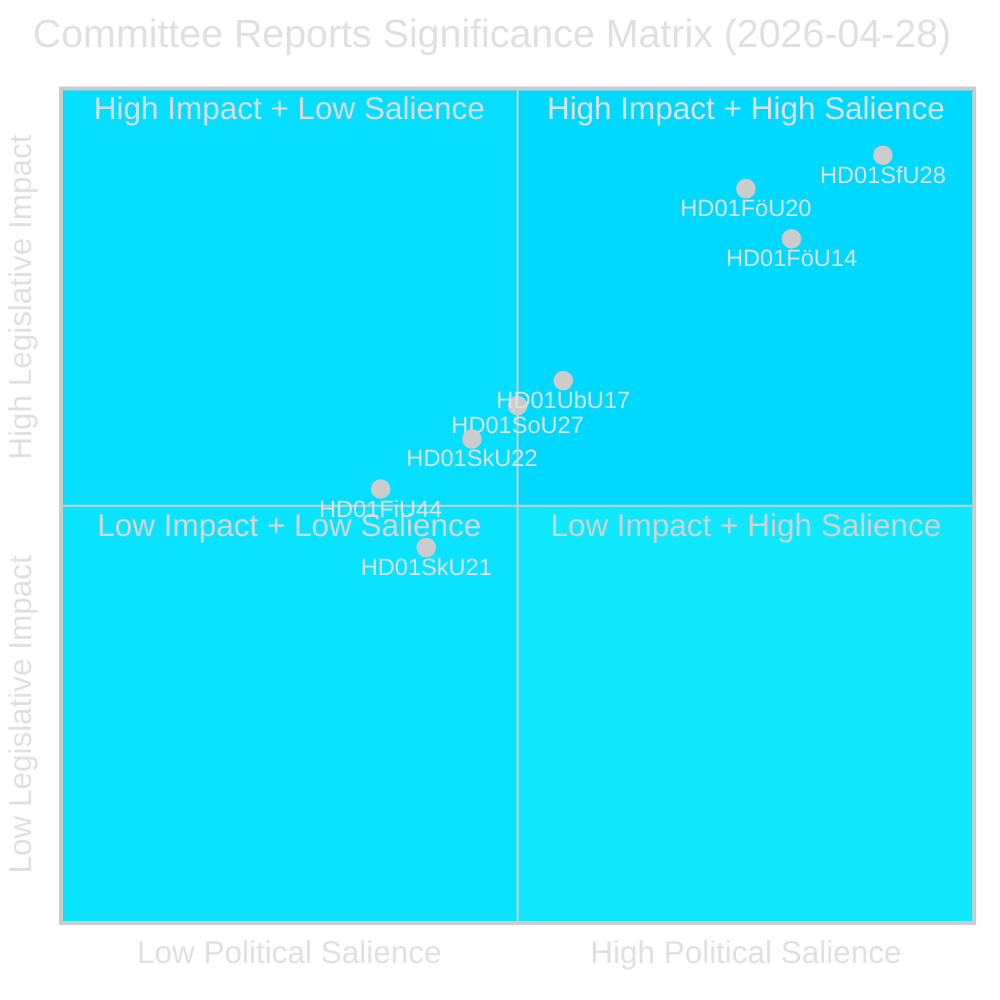
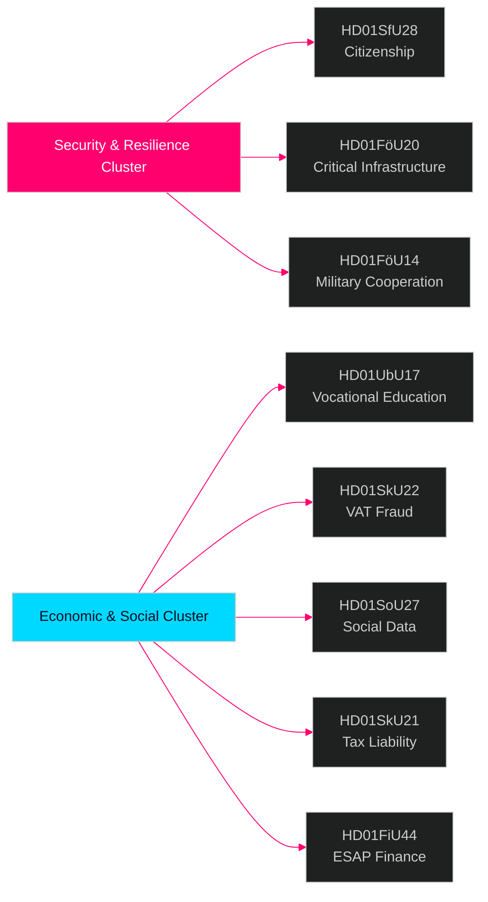

# 瑞典议会委员会报告 — 情报简报 2026年4月28日

**作者**: James Pether Sörling  
**日期**: 2026-04-29  
**分类**: 公开 — GDPR第9条(2)(e)(g)  
**置信度**: 高 [B2]  
**运行ID**: 25091345504

---

## 🎯 执行摘要

瑞典议会（Riksdag）委员会系统于2026年4月28日批准了八（8）项betänkanden，标志着2025/26年会期最具重要意义的立法日之一。主导信号是涵盖公民身份严格化（HD01SfU28）、关键基础设施韧性法（HD01FöU20）、军事作战合作（HD01FöU14）和职业技能改革（HD01UbU17）的四文件安全集群——这些共同代表Tidö政府在2026年9月大选前最后几个月对其国家安全与融合政策议程的巩固。公民身份改革在广泛的反对党联盟（S+V+C+MP均在至少一点上提出保留意见）的反对中获批，而安全立法则以跨阵营共识推进——这表明一种混合的政治环境：在安全问题上奖励坚定立场，但在福利领域面临中间派离心的风险。

## 🧭 本报告支持的3项决策

1. **选举定位**: S+V+C+MP在公民身份（HD01SfU28）上的联合保留意见表明，在2026年9月前形成统一的反对党叙事——战略传播人员应预期四党同步发起"人类尊严"反向宣传活动。

2. **投资与合规**: HD01FöU20（CER指令实施）和HD01SkU22（增值税执法）直接影响关键服务运营商和大型商业企业——2026年7—8月的合规截止期限需要立即采取行动。

3. **国防工业与北约**: HD01FöU14（军事合作改进）是瑞典加入北约后作战整合的重要但低调的推动因素，对国防采购和联合演习具有直接影响。

## ⏱️ 60秒摘要

- **公民身份条件收紧**: Prop 2025/26:175获批——语言、收入和品行要求提高；儿童部分豁免；反对党联盟提出10项保留意见 [HD01SfU28]
- **CER指令实施**: 关键实体韧性新法（欧盟指令2022/2557）获批；涉及能源、交通、水务、医疗和数字基础设施运营商 [HD01FöU20]
- **军事合作强化**: 与外国伙伴开展作战军事合作的改进法律框架 [HD01FöU14]
- **职业高等教育改革**: Yrkeshögskolan获得管理小组授权，培训组织者定义更加明确；自2027年起正式确立中等后教育的升学路径 [HD01UbU17]
- **打击增值税欺诈**: Skatteverket获得拒绝/取消增值税登记、在VIES中宣布号码无效、扣留过量增值税退款的新权力 [HD01SkU22]
- **社会数据登记册设立**: Socialstyrelsen获授权汇编全国社会服务数据登记册；自2026年8月1日起生效 [HD01SoU27]
- **税务代理人减负**: 针对公司税务代理人的新宽限期及豁免规定 [HD01SkU21]
- **ESAP金融数据**: 瑞典采纳欧盟关于金融和可持续性信息欧洲单一访问点（ESAP）的框架 [HD01FiU44]

## 🔔 主要前瞻性触发信号

**关注**: 计划就HD01SfU28（公民身份）在全体会议上进行表决。首批Novus/Ipsos表决后民调预计将在7天内公布。SD↔M或S席位预测出现≥3个百分点变化，将确认公民身份改革的选举动员效应。

**置信度**: 高 [B2]

<!-- source-sha: aec9c4c63be21515d55b3a22362bc344c0b4a20e -->
