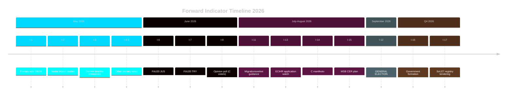

# Forward Indicators — Committee Reports 2026-04-28

**Author**: James Pether Sörling | **Date**: 2026-04-29 | **Confidence**: MEDIUM [B3]

## Purpose

Forward indicators provide dated, observable signals that will confirm or deny the scenario trajectories assessed in scenario-analysis.md. Organised across four time horizons.

## Horizon 1 — Immediate (0–30 days, May 2026)

| # | Indicator | Date (estimated) | Confirm/Deny |
|---|-----------|----------------|-------------|
| I-1 | Riksdag plenary vote on HD01SfU28 — majority count | ~May 12–14, 2026 | Confirms/denies 176-173 projection |
| I-2 | Major media coverage of individual SfU28 impact cases | Days after plenary vote | Confirms/denies F1 media frame activation |
| I-3 | Government announces implementation decree timeline for SfU28 | ~May 15–30, 2026 | Confirms/denies August 2026 decree target |
| I-4 | Plenary vote on HD01UbU17 (unanimous expected) | ~May 12–14, 2026 | Confirms/denies unanimous passage |
| I-5 | HD01SkU22 plenary vote — special statement parties Ja or Nej? | ~May 12–14, 2026 | Clarifies S+V+MP position (abstain vs oppose) |

## Horizon 2 — Short-Term (30–90 days, May–July 2026)

| # | Indicator | Date (estimated) | Confirm/Deny |
|---|-----------|----------------|-------------|
| I-6 | FöU20 JUS process completion (CER) | June 2, 2026 | Confirms/denies June 2026 law timeline |
| I-7 | FöU20 TRY vote | June 4, 2026 | Confirms/denies CER plenary vote |
| I-8 | Opinion poll post-SfU28 plenary — change in C voter support | June 2026 (Novus/IPSOS monthly) | Confirms/denies Scenario 2 dynamic (C fracture) |
| I-9 | JO receives formal complaints on SfU28 implementation | Within 30 days of decree publication | Confirms/denies legal challenge trajectory |
| I-10 | EU Commission formal notice letter to Sweden re CER | May–July 2026 | Confirms/denies Scenario 4 (EU infringement) |

## Horizon 3 — Medium-Term (90–180 days, July–October 2026)

| # | Indicator | Date (estimated) | Confirm/Deny |
|---|-----------|----------------|-------------|
| I-11 | Migrationsverket publishes SfU28 implementation guidance | August 2026 | Confirms/denies implementation feasibility |
| I-12 | September 2026 general election result | September 14, 2026 | Determines Scenario 1 vs 2 vs 3 |
| I-13 | ECtHR application registration — any plaintiff vs Sweden on SfU28 | July–September 2026 | Activates Scenario 3 (Legal Reversal) |
| I-14 | C election manifesto position on SfU28 — retain or modify? | August 2026 (manifesto release) | Confirms/denies coalition fracture assessment |
| I-15 | MSB publishes CER implementation plan and entity identification | July–September 2026 | Confirms/denies FöU20 feasibility assessment |

## Horizon 4 — Long-Term (180+ days, post-election)

| # | Indicator | Date (estimated) | Confirm/Deny |
|---|-----------|----------------|-------------|
| I-16 | Government formation — Tidö renewed vs. S-led alternative | November 2026 | Determines all reform fates |
| I-17 | Socialstyrelsen begins SoU27 registry build tendering | Q4 2026 | Confirms/denies registry feasibility |
| I-18 | First Statskontoret evaluation commissioned for SfU28 | 2027–2028 | Confirms/denies long-term compliance burden |
| I-19 | Skatteverket publishes VAT gap estimate (SkU22 impact) | Q1 2027 | Confirms/denies SkU22 revenue impact assessment |
| I-20 | Nordic Defence Cooperation exercises increase post-FöU14 | 2026–2027 NORDEFCO programme | Confirms/denies HD01FöU14 operational significance |

## Indicator Tracking Matrix

## Priority Indicators for Next Monitoring Cycle

1. **I-1** (Plenary vote SfU28) — most immediately verifiable, confirms political arithmetic
2. **I-10** (EU formal notice re CER) — confirms or denies infringement risk
3. **I-8** (Post-SfU28 C voter polling) — most important for coalition fragility assessment
4. **I-12** (September election result) — master scenario determinant
