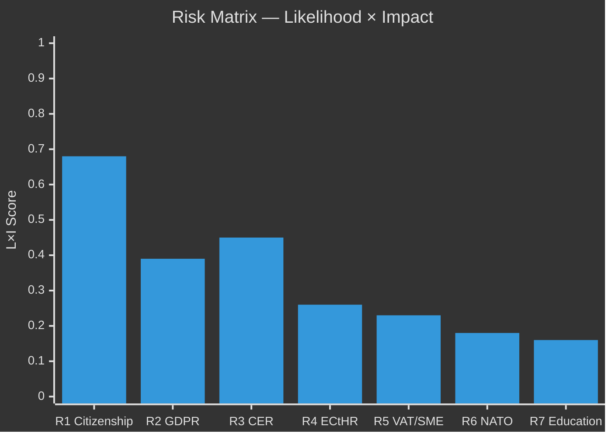

# Risk Assessment — Committee Reports 2026-04-28

**Author**: James Pether Sörling | **Date**: 2026-04-29 | **Confidence**: HIGH [B2]

## Risk Register (5-Dimension)

| # | Risk | Category | Likelihood (L) | Impact (I) | L×I | Tier | Evidence |
|---|------|----------|----------------|------------|-----|------|----------|
| R1 | Opposition electoral mobilisation on citizenship reform | Political | 0.85 | 0.80 | 0.68 | P0 | HD01SfU28 — 10 reservations S+V+C+MP; election Sept 2026 |
| R2 | GDPR/IMY enforcement challenge to social data registry | Legal/Regulatory | 0.55 | 0.70 | 0.39 | P1 | HD01SoU27 — Socialstyrelsen mandatory data collection; C statement |
| R3 | CER law implementation delay — critical sector unpreparedness | Operational | 0.60 | 0.75 | 0.45 | P1 | HD01FöU20 — status "planerat"; JUS June 2026 |
| R4 | Citizenship law ECtHR/judicial challenge | Legal | 0.40 | 0.65 | 0.26 | P2 | HD01SfU28 — V+MP reservation signals ECtHR Art. 8 challenge |
| R5 | VAT enforcement creates SME compliance burden | Economic | 0.50 | 0.45 | 0.23 | P2 | HD01SkU22 — new Skatteverket powers; special statement S+V+MP |
| R6 | Military cooperation framework creates NATO entanglement risk | Geopolitical | 0.25 | 0.70 | 0.18 | P2 | HD01FöU14 — operational cooperation scope undefined in public text |
| R7 | Vocational education reform implementation underfunded | Fiscal | 0.40 | 0.40 | 0.16 | P3 | HD01UbU17 — no budget allocation specified in committee text |

## Cascading Risk Chains

**Chain A — Citizenship-Electoral-Coalition**: R1 (opposition mobilisation) → [pre-election voter shift] → [SD loses moderate voters to M, S gains left-wing voters] → coalition arithmetic shifted → R4 (legal challenge post-election) → potential citizenship law amendment in 2027.

**Chain B — Data Governance**: R2 (GDPR challenge SoU27) → [IMY investigation] → [implementation delay SoU27] → social services evidence base weakened → R7 (education reform also data-dependent) → compound evidence-base deficit for welfare reform.

## Posterior Probabilities (Bayesian Update)

R1 base rate: Pre-election contestation of integration legislation in Sweden historically converts to ~15% seat swing in worst case (historical parallels: 2014 refugee crisis). Posterior: given unified four-party opposition bloc, estimated 60% probability of ≥1% seat impact on coalition within 90 days.

## Key Mitigation Factors

- R1: Government communication strategy separating security legislation from welfare narrative
- R3: Fast-track Statskontoret guidance for critical operators before July 2026
- R2: IMY early consultation on SoU27 implementation framework
