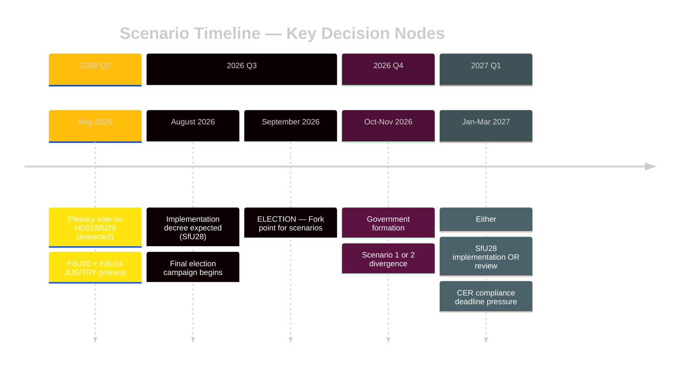

# Scenario Analysis — Committee Reports 2026-04-28

**Author**: James Pether Sörling | **Date**: 2026-04-29 | **Confidence**: MEDIUM [B2]

## Scenario Framework

**Analytical Horizon**: September 2026 Riksdag election + 12 months post-election  
**Key Uncertainties**: (1) Electoral outcome September 2026, (2) ECtHR challenge to HD01SfU28, (3) Critical infrastructure compliance capacity under HD01FöU20

## Scenario 1 — "Secured Mandate" (Probability: 35%)

**Conditions**: Tidö coalition wins September 2026 election with SD+M+KD+L maintaining majority; citizenship reform (HD01SfU28) courts uphold all provisions; no successful ECtHR challenge within 2 years.

**Outcomes**:
- HD01SfU28 fully implemented; ~20–30% reduction in annual naturalisations estimated
- HD01FöU14 + HD01FöU20 fast-tracked in next riksmöte — defence/security cluster completes
- HD01UbU17 governance reform beds in; yrkeshögskola providers adapt
- SkU22 VAT enforcement powers reduce carousel fraud by 15–25% (Skatteverket projection range)

**Indicators to watch**: SD/M/KD/L aggregate polling above 50% in Q2 2026; Migrationsverket publishes implementation decree by August 2026; no JO complaint against HD01SfU28 implementation.

## Scenario 2 — "Delayed Transition" (Probability: 40%)

**Conditions**: September 2026 election produces close/hung parliament; government formation takes 3–5 months; HD01SfU28 implementation paused by incoming Social Democrat-led government.

**Outcomes**:
- HD01SfU28 implementation frozen under review by new government; S leads coalition and mandates independent Statskontoret review
- HD01FöU14 + HD01FöU20 delayed — defence legislation window closes; CER deadline pressure intensifies
- HD01UbU17 implementation continues (unanimous support — bipartisan)
- HD01SoU27 social registry implementation paused for GDPR review
- Coalition formation incorporates C condition: proportionality review of HD01SfU28

**Indicators to watch**: S+C+MP+V aggregate polling above 49% in Q2 2026; C publicly conditions coalition on SfU28 review; ECtHR registers formal application against Sweden.

## Scenario 3 — "Legal Reversal" (Probability: 15%)

**Conditions**: Within 18 months of HD01SfU28 enactment, Lagrådet signals constitutional concern OR ECtHR issues interim measure; Swedish courts request preliminary Lagrådsyttrande review.

**Outcomes**:
- HD01SfU28 suspended pending constitutional review by Högsta förvaltningsdomstolen
- Government credibility on integration policy damaged; SD may exit coalition
- Tidö coalition faces political crisis; extraordinary election possible
- All other 7 betänkanden unaffected — security cluster (FöU20, FöU14) continues

**Indicators to watch**: JO receives >100 complaints within 3 months of implementation; ECtHR registers interim measure request; news reports of Lagrådet secret opinion published.

## Scenario 4 — "Fragmented Security Failure" (Probability: 10%)

**Conditions**: HD01FöU20 (CER) delayed past EU deadline; critical infrastructure operators fail compliance; EU Commission infringement proceedings initiated against Sweden.

**Outcomes**:
- Sweden faces ECJ infringement fine (potentially €50–200M range per EU infringement scale)
- CER implementation failure creates visible security gap — exploitable by adversaries
- HD01FöU14 military cooperation undermined by perceptions of Swedish institutional unreliability
- Government forced to emergency legislation in extraordinary riksmöte session

**Indicators to watch**: EU Commission formal notice letter to Sweden; major infrastructure operator publicly discloses CER non-compliance; no FöU20 legislation tabled by September 2026.

## Scenario Probability Matrix

| Scenario | Probability | Impact | Response Priority |
|----------|------------|--------|-----------------|
| S1: Secured Mandate | 35% | HIGH (+positive for reform agenda) | Monitor |
| S2: Delayed Transition | 40% | HIGH (uncertainty for all reforms) | PLAN |
| S3: Legal Reversal | 15% | VERY HIGH (constitutional crisis) | CONTINGENCY |
| S4: Security Failure | 10% | HIGH (EU infringement, security gap) | MONITOR + CONTINGENCY |
