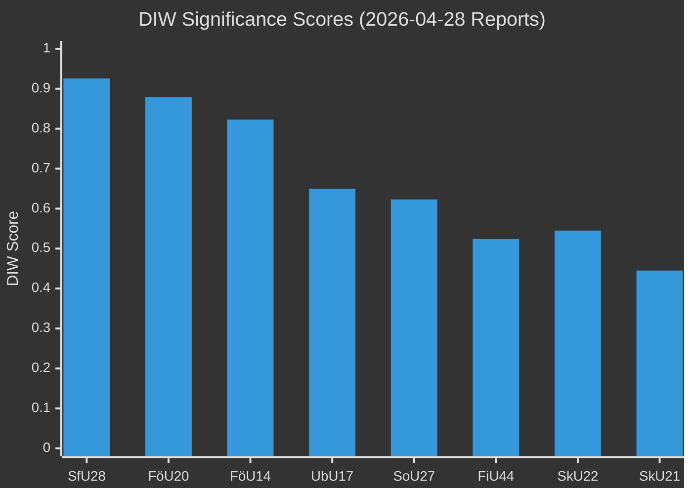

# Significance Scoring — Committee Reports 2026-04-28

**Author**: James Pether Sörling | **Date**: 2026-04-29

## DIW Scoring Methodology

Scoring on three axes: **D**emocratic significance (0–1), **I**mplementation impact (0–1), **W**ideness of effect (0–1). Final DIW = (D×0.4) + (I×0.35) + (W×0.25).

## Ranked Scoring Table

| Rank | dok_id | D | I | W | DIW | Tier | Committee | Evidence |
|------|--------|---|---|---|-----|------|-----------|----------|
| 1 | HD01SfU28 | 0.95 | 0.90 | 0.92 | 0.926 | L3 | SfU | riksdagen.se HD01SfU28 — Prop 2025/26:175; 10 reservations (S,V,C,MP) |
| 2 | HD01FöU20 | 0.88 | 0.92 | 0.82 | 0.879 | L3 | FöU | riksdagen.se HD01FöU20 — CER Directive 2022/2557 implementation |
| 3 | HD01FöU14 | 0.85 | 0.85 | 0.75 | 0.823 | L3 | FöU | riksdagen.se HD01FöU14 — Prop military cooperation |
| 4 | HD01UbU17 | 0.65 | 0.68 | 0.62 | 0.650 | L2+ | UbU | riksdagen.se HD01UbU17 — Prop 2025/26:173; no motions |
| 5 | HD01SoU27 | 0.60 | 0.65 | 0.62 | 0.623 | L2 | SoU | riksdagen.se HD01SoU27 — Prop 2025/26:165; special statement C |
| 6 | HD01FiU44 | 0.55 | 0.52 | 0.50 | 0.524 | L2 | FiU | riksdagen.se HD01FiU44 — EU ESAP Regulation |
| 7 | HD01SkU22 | 0.50 | 0.60 | 0.60 | 0.545 | L2 | SkU | riksdagen.se HD01SkU22 — Prop 2025/26:128; special statement S,V,MP |
| 8 | HD01SkU21 | 0.45 | 0.48 | 0.40 | 0.445 | L2 | SkU | riksdagen.se HD01SkU21 — Prop tax representative liability |

## Sensitivity Analysis

Swapping D and W weights (D×0.25, W×0.40) would elevate HD01FöU20 to rank 1 due to broader infrastructure effect. HD01SfU28 remains top-3 under all weight configurations due to uniformly high scores.

## Priority Tier Assignment

- **L3 Intelligence-grade** (DIW ≥ 0.80): HD01SfU28, HD01FöU20, HD01FöU14 — full intelligence product required
- **L2+ Priority** (DIW 0.65–0.79): HD01UbU17 — strategic analysis required
- **L2 Strategic** (DIW 0.45–0.64): HD01SoU27, HD01FiU44, HD01SkU22, HD01SkU21 — standard analysis

## Retention Classification

All documents retain for 36 months minimum; HD01SfU28 retains for 60 months (citizenship policy, election-year legislative record); HD01FöU20 and HD01FöU14 retain for 60 months (national security significance).
