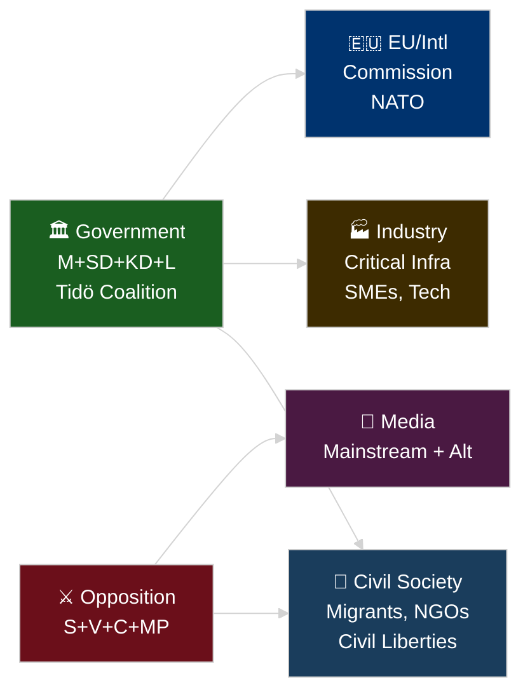

# Stakeholder Perspectives — Committee Reports 2026-04-28

**Author**: James Pether Sörling | **Date**: 2026-04-29 | **Confidence**: HIGH [B2]

## 6-Lens Stakeholder Matrix

## Lens 1: Government (Tidö Coalition — M+SD+KD+L)

**Primary interest**: Advance integration-security agenda before September 2026 election; demonstrate EU compliance capability; consolidate right-bloc voter base.

**Position on key documents**:
- HD01SfU28: Viktor Wärnick (M, SfU chair) leads committee approval; government presents citizenship tightening as necessary modernisation
- HD01FöU20: FöU advances CER Directive — government frames as critical security upgrade
- HD01FöU14: Military cooperation — government frames as NATO integration deepening

**Named actors**: Viktor Wärnick (M) SfU chair [A1]; Joar Forssell (L) UbU chair [A1]; Christian Carlsson (KD) SoU chair [A1]; Niklas Karlsson (S opposition) SkU [A1]

## Lens 2: Opposition Bloc (S+V+C+MP)

**Primary interest**: Electoral differentiation ahead of September 2026; protect voter segments (workers, migrants, civil liberties advocates, progressive urbanites).

**Differentiated positions**:
- **S (Socialdemokraterna)**: Ida Karkiainen (SfU) reserves on implementation fairness, income requirement, oversight — targets working-class immigrant constituency
- **V (Vänsterpartiet)**: Tony Haddou (SfU) reserves on principle and children's rights — targets radical-left base
- **C (Centerpartiet)**: Niels Paarup-Petersen (SfU) reserves on proportionality and grace period — targets liberal economic constituency
- **MP (Miljöpartiet)**: Annika Hirvonen (SfU) reserves on principle and age requirements — targets urban progressive constituency

**Notable**: C also files special statement on HD01SoU27 (social data, personal integrity) [A1]

## Lens 3: Civil Society and Affected Persons

**Migrants and naturalization applicants**: HD01SfU28 directly affects the ~40,000–60,000 annual citizenship applications [unconfirmed SCB estimate]. Higher language, income, and character requirements will deny citizenship to a subset currently eligible. No transition period approved (Reservation 2 rejected).

**NGOs**: Civil liberties organisations (Amnesty Sweden, Civil Rights Defenders) expected to challenge the implementation decree once published.

**Social services clients**: HD01SoU27 creates mandatory data sharing from social services operators to Socialstyrelsen — affects clients of socialtjänst and LSS services who cannot opt out. Personal integrity concern raised by C.

## Lens 4: Industry and Commercial Stakeholders

**Critical infrastructure operators (energy, transport, water, health, digital)**: HD01FöU20 directly imposes new mandatory resilience requirements under CER Directive. Timeline compressed: law scheduled for Riksdag autumn 2026; compliance readiness window 6–12 months after enactment.

**Skatteverket**: HD01SkU22 gives Skatteverket expanded VAT enforcement powers — registration control, VIES invalidation. Agency receives new operational mandate. [A1 HD01SkU22]

**Yrkeshögskola providers (training organizers)**: HD01UbU17 formalises their responsibilities and requires leadership groups. Existing providers (200+ across Sweden [unconfirmed]) must restructure governance by July 2026. [A1 HD01UbU17]

**SME sector**: HD01SkU21 provides relief from tax representative liability — positive for small business, reduces personal risk exposure for company representatives.

## Lens 5: EU and International

**European Commission**: Three of eight betänkanden implement EU directives/regulations (CER 2022/2557 via HD01FöU20, VAT Council Directive via HD01SkU22, ESAP Regulation via HD01FiU44). Sweden signals continued EU legislative compliance commitment.

**NATO**: HD01FöU14 deepens operational military cooperation framework — directly enables Sweden's full operational integration as a 2023 NATO member. NATO command structure will benefit from reduced legal friction in joint exercises and information exchange.

**Nordic partners (Denmark, Norway, Finland)**: HD01UbU17's reference to Nordforsk cooperation (assessed as not requiring administrative transfer) signals continued Nordic research-space integration.

## Lens 6: Media Framing Environment

**Expected mainstream framing**: DN and SvD will frame HD01SfU28 as Tidö government's pre-election signal to right-wing voters, with substantive policy analysis of the language and income requirements. Aftonbladet/Expressen likely to emphasise human impact on families.

**Alternative media framing**: Rättvisepartiet/far-left aligned media will frame as discriminatory class-based citizenship. SD-aligned media will frame as insufficient (not strict enough).

**International monitoring**: EU and Council of Europe monitoring bodies (ECRI, FRA) expected to assess compatibility of HD01SfU28 with EU citizenship non-discrimination norms.

## Influence Network Summary

| Actor | Influence Level | Document Most Affected | Named Evidence |
|-------|----------------|----------------------|----------------|
| Viktor Wärnick (M) | HIGH | HD01SfU28 | SfU chair — led committee approval [A1] |
| Tony Haddou (V) | MEDIUM | HD01SfU28 | Reservation 1 leader [A1] |
| Ida Karkiainen (S) | MEDIUM | HD01SfU28 | Reservations 2,3,8 [A1] |
| Niels Paarup-Petersen (C) | MEDIUM | HD01SfU28, HD01SoU27 | Reservation 2,4,5,7,8,9; SoU27 statement [A1] |
| Annika Hirvonen (MP) | MEDIUM | HD01SfU28, HD01SkU22 | SfU reservation 1; SkU22 special statement [A1] |
| Joar Forssell (L) | HIGH | HD01UbU17 | UbU chair [A1] |
| Christian Carlsson (KD) | HIGH | HD01SoU27 | SoU chair [A1] |
