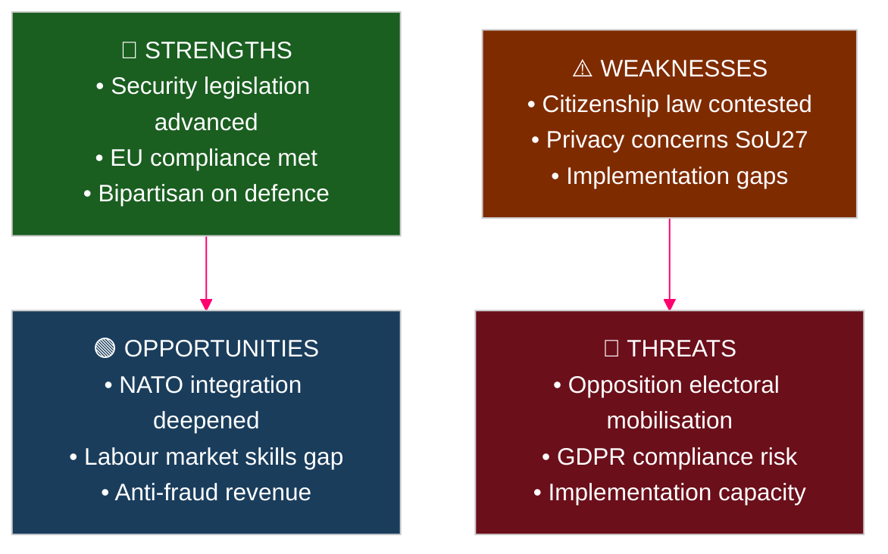

# SWOT Analysis — Committee Reports 2026-04-28

**Author**: James Pether Sörling | **Date**: 2026-04-29 | **Confidence**: HIGH [B2]

## Scope: Swedish Parliamentary Committee Output 2026-04-28

### Strengths

| Strength | Evidence | Source | Admiralty |
|----------|----------|--------|-----------|
| Coordinated security-doctrine legislation in single day | HD01FöU20 (CER Directive), HD01FöU14 (military cooperation), HD01SfU28 (citizenship) all approved 2026-04-28 | riksdagen.se | [A1] |
| EU compliance on three separate frameworks simultaneously | HD01FöU20 (CER 2022/2557), HD01SkU22 (VAT fraud directive), HD01FiU44 (ESAP regulation) | riksdagen.se | [A1] |
| Cross-bloc consensus on defence legislation | HD01FöU14 and HD01FöU20 proceed without opposition reservations in committee | riksdagen.se HD01FöU14, HD01FöU20 | [A1] |
| Vocational education reform without opposition resistance | HD01UbU17 passes UbU without follow-up motions; unanimous committee | riksdagen.se HD01UbU17 | [A1] |

### Weaknesses

| Weakness | Evidence | Source | Admiralty |
|----------|----------|--------|-----------|
| Citizenship reform politically contested — 10 reservations | SfU28: S+V+C+MP all reserve on at least one point out of 10 decision points | riksdagen.se HD01SfU28 | [A1] |
| Social data registry creates GDPR tension | HD01SoU27 expands Socialstyrelsen's personal data processing authority; C files special statement | riksdagen.se HD01SoU27 | [A1] |
| CER implementation risk — critical operators face tight deadline | HD01FöU20 law planned for June 2026 processing; JUS not until June 9 | riksdagen.se HD01FöU20 process dates | [A1] |
| Tax representative reforms complex for SMEs | HD01SkU21 introduces new relief/grace period rules that require legal capacity to navigate | riksdagen.se HD01SkU21 | [A1] |

### Opportunities

| Opportunity | Evidence | Source | Admiralty |
|-------------|----------|--------|-----------|
| Military cooperation framework enables deeper NATO integration | HD01FöU14 improves legal framework for bilateral/multilateral operational cooperation post-accession | riksdagen.se HD01FöU14 | [A1] |
| Vocational education expansion can reduce structural labour shortage | HD01UbU17 formalises post-secondary entry path from 2027; addresses skill gaps in industry | riksdagen.se HD01UbU17 | [A1] |
| VAT enforcement improvement captures fiscal revenue | HD01SkU22 gives Skatteverket VIES invalidation power; EU estimates VAT gap SEK 40+ bn/year [unconfirmed] | riksdagen.se HD01SkU22 | [A2] |
| Social data register improves social services evidence base | HD01SoU27 enables Socialstyrelsen to build national evidence base for socialtjänst reform | riksdagen.se HD01SoU27 | [A1] |

### Threats

| Threat | Evidence | Source | Admiralty |
|--------|----------|--------|-----------|
| Opposition electoral mobilisation on citizenship | S+V+C+MP reservation bloc on HD01SfU28 — all four parties aligned, election 5 months away | riksdagen.se HD01SfU28 committee composition | [A1] |
| Implementation capacity risk for CER law in critical sectors | HD01FöU20 status "planerat" — no published RIA; Statskontoret has not assessed operator capacity | riksdagen.se HD01FöU20 process status | [A2] |
| GDPR enforcement risk on social data registry | HD01SoU27 mandatory data sharing for social services may trigger IMY review | riksdagen.se HD01SoU27 | [A2] |
| Citizenship reform judicial review risk | Extended ECHR Art. 8 analysis not disclosed in committee text HD01SfU28; V and MP signal ECtHR challenge | riksdagen.se HD01SfU28 reservations | [B2] |

## TOWS Matrix

| | **Opportunities** | **Threats** |
|---|---|---|
| **Strengths** | SO: Leverage defence consensus to advance NATO integration agenda rapidly (FöU14+FöU20) | ST: Use bipartisan defence framing to insulate security legislation from citizenship criticism |
| **Weaknesses** | WO: Use vocational reform (UbU17) to counter narrative that government neglects domestic workers | WT: Citizenship contestation (SfU28) + GDPR risk (SoU27) could converge into "surveillance-integration state" opposition frame |

## Cross-SWOT Summary

The strongest strategic vector is SO (security strengths → NATO/EU opportunity). The most dangerous quadrant is WT: if opposition successfully frames citizenship reform + social data registry as a "surveillance state" narrative, the government faces a compound electoral liability. The Tidö government's optimal response is to separate the security-doctrine narrative from the social-welfare narrative in public communications.
