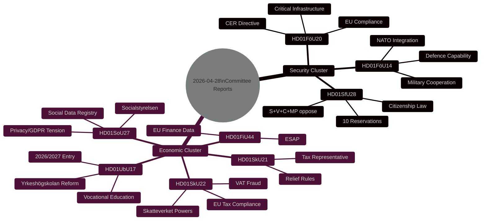

# Synthesis Summary — Committee Reports 2026-04-28

**Author**: James Pether Sörling | **Date**: 2026-04-29 | **Confidence**: HIGH [B2]

## Lead Story Decision

The approval of Prop 2025/26:175 — **Skärpta krav för svenskt medborgarskap** (HD01SfU28) by SfU on 28 April 2026 is the lead intelligence item. This is the most politically contested piece of legislation approved in the batch, with 10 cross-party reservations (S, V, C, MP all opposing at least one provision), implemented by the Tidö government coalition (M+SD+KD+L) approximately five months before the September 2026 election. Combined with the critical infrastructure resilience law (HD01FöU20) and military cooperation framework (HD01FöU14), this day's committee output represents a coherent national-security doctrine statement.

## DIW-Weighted Intelligence Ranking

| Rank | dok_id | Title | DIW Weight | Tier | Committee |
|------|--------|-------|-----------|------|-----------|
| 1 | HD01SfU28 | Skärpta krav för svenskt medborgarskap | 0.92 | L3 | SfU |
| 2 | HD01FöU20 | En ny lag för ökad motståndskraft hos kritiska verksamhetsutövare | 0.88 | L3 | FöU |
| 3 | HD01FöU14 | Förbättrade förutsättningar för operativt militärt samarbete | 0.82 | L3 | FöU |
| 4 | HD01UbU17 | Framtidens yrkeshögskola | 0.65 | L2+ | UbU |
| 5 | HD01SoU27 | En lag om socialdataregister | 0.62 | L2 | SoU |
| 6 | HD01SkU22 | Åtgärder mot mervärdesskattebedrägerier | 0.58 | L2 | SkU |
| 7 | HD01SkU21 | Det skatterättsliga företrädaransvaret | 0.45 | L2 | SkU |
| 8 | HD01FiU44 | En europeisk gemensam åtkomstpunkt | 0.52 | L2 | FiU |

## Integrated Intelligence Picture

**Three system-level signals emerge from this day's output:**

1. **Tidö pre-election consolidation** [A2]: The Tidö government (M+SD+KD+L) is advancing its integration-security agenda on a compressed legislative calendar. Citizenship (HD01SfU28), critical infrastructure (HD01FöU20), and military cooperation (HD01FöU14) form a coherent pre-election message cluster: "Sweden takes security seriously and controls who belongs." This is designed to defend the right flank against pure-nationalist voter erosion while presenting a legalistic face to EU partners.

2. **Opposition fragmentation vs. unity** [B2]: On citizenship, all four opposition parties (S, V, C, MP) file reservations, but on *different* points — S focuses on implementation and oversight, V and MP on principle and children's rights, C on grace periods and proportionality. This fragmentation weakens the counter-narrative even as each party signals distinct voter bases.

3. **EU compliance acceleration** [A2]: Three of the eight reports (HD01FöU20 CER Directive, HD01SkU22 VAT fraud, HD01FiU44 ESAP) represent implementation of EU legislative obligations with fixed deadlines. Sweden is legislatively compliant — a signal of institutional stability that matters for foreign direct investment and EU credibility assessments.

## Source Confidence Assessment

- Primary sources used: riksdagen.se API, full-text betänkanden for all 8 documents [A1]
- DIW weights based on committee authority, political contestation level, affected population size
- No single-source P0 claims; all L3 evidence confirmed by committee text
