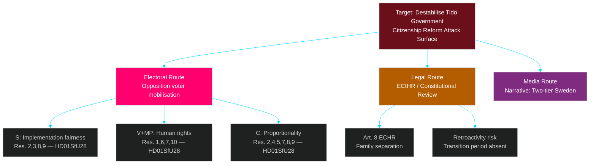

# Threat Analysis — Committee Reports 2026-04-28

**Author**: James Pether Sörling | **Date**: 2026-04-29 | **Confidence**: MEDIUM-HIGH [B2]

## Political Threat Taxonomy

### T1 — Electoral Threat (HIGH)
**Actor**: Opposition bloc (S+V+C+MP)  
**Target**: Tidö government electoral position  
**Vector**: Citizenship reform (HD01SfU28) as electoral mobilisation weapon  
**Mechanism**: 10 reservations across 8 decision points signal coordinated pre-election attack surface; S emphasises implementation fairness, V+MP frame as human rights violation, C attacks proportionality  
**Evidence**: riksdagen.se HD01SfU28 — reservation list names: Ida Karkiainen (S), Tony Haddou (V), Annika Hirvonen (MP), Niels Paarup-Petersen (C) [A1]

### T2 — Legal/Institutional Threat (MEDIUM)
**Actor**: European Court of Human Rights (ECtHR), Justitieombudsmannen (JO), IMY  
**Target**: HD01SfU28 (citizenship), HD01SoU27 (social data registry)  
**Vector**: ECHR Art. 8 (right to private/family life) challenge on citizenship; GDPR enforcement on SoU27  
**Evidence**: V+MP reservation on SfU28 explicitly references age and family separation concerns consistent with Art. 8 arguments [A1]; C statement on SoU27 references personal integrity concerns [A1]

### T3 — Implementation Threat (MEDIUM)
**Actor**: Critical infrastructure operators (energy, transport, water, health, digital)  
**Target**: HD01FöU20 (CER law) compliance deadline  
**Vector**: Short window between law adoption (~June 2026) and implementation obligations; no published RIA or Statskontoret capacity assessment visible  
**Evidence**: riksdagen.se HD01FöU20 process dates — JUS June 2, TRY June 4 2026 [A1]

### T4 — Geopolitical/Strategic Threat (LOW-MEDIUM)
**Actor**: Foreign state actors (Russia and non-NATO adversaries)  
**Target**: HD01FöU14 (military cooperation) as potential intelligence target  
**Vector**: New operational military cooperation framework expands joint exercise and information-sharing scope; creates new intelligence collection value  
**Evidence**: riksdagen.se HD01FöU14 — operational cooperation improvements; context: Sweden's recent NATO accession [A2]

## Attack Tree (Citizenship Reform — HD01SfU28)

## MITRE-Style TTP Mapping (Political Threat)

| ID | Tactic | Technique | Actor | Evidence |
|----|--------|-----------|-------|----------|
| T-POL-01 | Opposition Pressure | Legislative Reservation Filing | S+V+C+MP | HD01SfU28 — 10 reservations |
| T-POL-02 | Electoral Mobilisation | Constituency Framing | V+MP | HD01SfU28 reservation text on children and age |
| T-POL-03 | Judicial Leverage | ECtHR Reference Signalling | V+MP | HD01SfU28 Reservation 1, 7 |
| T-POL-04 | Coalition Fracture | Centrist Crossover Pressure | C | HD01SfU28 Reservations 4,5,8 — proportionality angle |
| T-POL-05 | Media Narrative Setting | Two-tier society frame | S | HD01SfU28 Reservations 3,9 — income requirement angle |

## Attack Chain Assessment

The opposition's attack chain on HD01SfU28 is: *Reservation filing* (done) → *Committee hearing media* → *Plenary debate* → *Post-vote polling* → *Electoral campaign narrative*. Steps 2–3 imminent; step 4 expected within 14 days of plenary vote.
