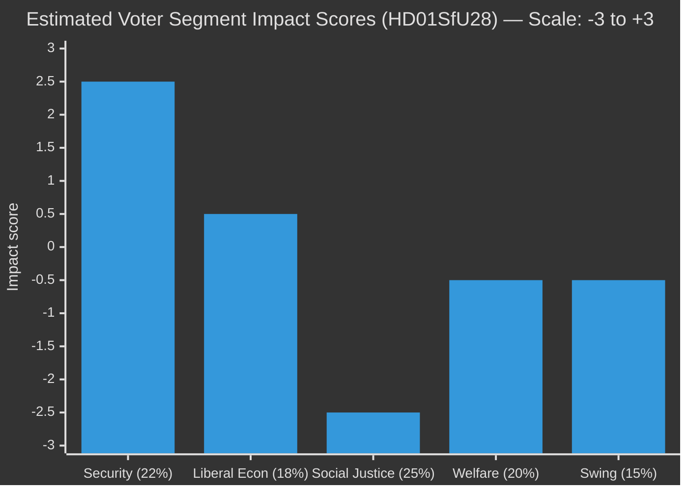

# Voter Segmentation Analysis — Committee Reports 2026-04-28

**Author**: James Pether Sörling | **Date**: 2026-04-29 | **Confidence**: MEDIUM [B3]

## Segmentation Framework

This analysis applies a five-segment voter model to assess the differential impact of the 2026-04-28 betänkanden on Swedish voter groups.

## Segment 1 — Security-Focused Voters (estimated 22% of electorate)

**Profile**: Primarily SD + KD core voters; secondary M voters; rural, older male; elevated concern about Russia/NATO; migration seen through security lens.

**Impact of 2026-04-28 batch**:
- HD01SfU28: Strongly positive — perceived as necessary security measure (citizenship = loyalty test)
- HD01FöU20 + HD01FöU14: Strongly positive — visible security delivery
- Other documents: Neutral

**Activation probability**: HIGH — HD01SfU28 plenary debate will energise this segment.

## Segment 2 — Liberal Economic Voters (estimated 18% of electorate)

**Profile**: Primarily M + L + C voters; urban/suburban professional; supports EU membership and NATO; views migration pragmatically; prioritises economic stability and rule of law.

**Impact of 2026-04-28 batch**:
- HD01SfU28: MIXED — income requirement seen as pragmatic (positive) but proportionality concerns (negative, esp. for C voters)
- HD01SkU21: Positive — tax representative liability relief benefits SME owners
- HD01FiU44: Positive — EU financial market integration
- HD01FöU20 + HD01FöU14: Positive — rule-based security architecture

**Activation probability**: MEDIUM — SfU28 proportionality debate may suppress C-voter enthusiasm.

## Segment 3 — Social Justice Voters (estimated 25% of electorate)

**Profile**: Primarily S + V + MP voters; urban, younger, higher education; high concern for equality, climate, welfare state; negative view of migration restrictions.

**Impact of 2026-04-28 batch**:
- HD01SfU28: Strongly negative — "two-tier citizenship" frames activate core values
- HD01SoU27: Moderately negative — privacy concerns in data sharing
- HD01SkU22: Mildly positive — tax fairness narrative (reducing carousel fraud)
- Other documents: Neutral

**Activation probability**: HIGH — SfU28 plenary will be high-visibility mobilisation opportunity for this segment.

## Segment 4 — Welfare State Defenders (estimated 20% of electorate)

**Profile**: S + KD voters; older, regional (not rural), concerned about healthcare, elderly care, and social services; less focused on migration as primary issue.

**Impact of 2026-04-28 batch**:
- HD01SoU27: RELEVANT — social data registry affects social services; perceived as administrative efficiency (positive) vs. surveillance risk (negative) depending on framing
- HD01UbU17: Mildly positive — vocational training strengthens labour market
- HD01SkU22: Positive — fiscal compliance strengthens welfare state funding base

**Activation probability**: LOW-MEDIUM — no strongly activating document in this batch for this segment.

## Segment 5 — Disengaged/Swing Voters (estimated 15% of electorate)

**Profile**: Low political engagement; vote based on leadership, economic conditions, scandal; neither ideological bloc has firm grip; disproportionately represented among non-voters.

**Impact of 2026-04-28 batch**:
- HD01SfU28: VISIBLE but polarising — may increase political disengagement if debate becomes too charged
- Economic documents (SkU21, SkU22, FiU44): Invisible to this segment without media amplification

**Activation probability**: LOW — this segment responds to personalities and events, not committee reports.

## Segmentation Impact Summary

*Positive = benefits government; Negative = benefits opposition. Estimates only.*
