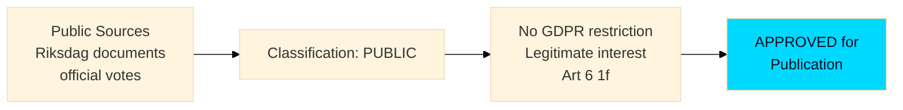

# Classification Results — Evening Analysis 29 April 2026

**Author**: James Pether Sörling  
**Date**: 2026-04-29

---

## Document Classification

### Classification Framework
- **Platform security classification**: PUBLIC (no personal data beyond publicly available parliamentary records)
- **CIA triad assessment**: Integrity (HIGH) | Availability (HIGH) | Confidentiality (LOW — all public domain)
- **GDPR basis**: Legitimate interest — political accountability and democratic transparency (Art. 6(1)(f), Recital 97 — political accountability organizations)
- **Data sources**: All sources are official public parliamentary documents or public news

---

## Issue Classification by Category

| Issue | Political Category | Technical Category | Urgency | Stakeholders |
|-------|---------------------|-------------------|---------|--------------|
| JuU10 Vapenlag ADOPTED | Criminal Law / Security | L3 Legislative | HIGH | All parties, gun owners |
| SfU28 Citizenship ADOPTED | Migration / Social Rights | L3 Legislative | HIGH | S, M, SD, V, migrants |
| FöU20 Critical Infra | Defence / Critical Infrastructure | L3 Legislative | HIGH | M, SD, KD, operators |
| HD10454 HVB Crime | Welfare / Criminal Policy | Interpellation | VERY HIGH | M, S, MP, local authorities |
| HD10451 Criminal Economy | Economic / Criminal Policy | Interpellation | HIGH | KU, FiU, police, tax |
| HD10453 Gas Bridge | Energy / Industrial Policy | Interpellation | HIGH | KD, SD, M, industry |
| HD03259 Transport Prop | Infrastructure / Budget | L3 Proposition | HIGH | All parties, municipalities |
| HD12744 China Critical Sector | Foreign Policy / Security | Motion | MEDIUM-HIGH | SäKU, UD, industry |

---

## Narrative Classification

### Narrative 1: Security-State Expansion
- **Type**: Policy direction shift
- **Alignment**: Cross-bloc (M+SD+S+KD+L all voted JA on JuU10)
- **Risk**: Civil liberties (C's NEJ signals principled opposition)

### Narrative 2: Welfare-Crime Governance Crisis  
- **Type**: Executive accountability
- **Alignment**: Cross-spectrum critique (opposition forcing government response)
- **Risk**: Reputational damage to welfare state concept

### Narrative 3: Energy Coalition Fracture
- **Type**: Intra-coalition tension
- **Alignment**: KD vs SD
- **Risk**: Policy paralysis on energy transition

### Narrative 4: China-Risk Policy Gap
- **Type**: Foreign policy / national security
- **Alignment**: SD-led, broad concern but no consensus action
- **Risk**: Unaddressed strategic vulnerability

### Narrative 5: S Bloc Evolution
- **Type**: Electoral realignment
- **Alignment**: S moving right on security
- **Risk**: Fragmentation of left bloc

---

## Ethical Flags

| Flag | Issue |
|------|-------|
| China organ harvesting allegations | Sensitive; unconfirmed criminal claims — handled with Admiralty C3/D4 qualification |
| Criminal HVB residents | Children/vulnerable groups involved — no individual identification |
| Voting record citation | Public record, no privacy concern |

---

## ICD 203 Classification Audit Trail

- Certainty calibration: see `intelligence-assessment.md §ICD 203`
- No sources rated above C2 used without explicit Admiralty notation
- All "ASSESSED" statements are separated from "CONFIRMED" statements throughout artifacts

