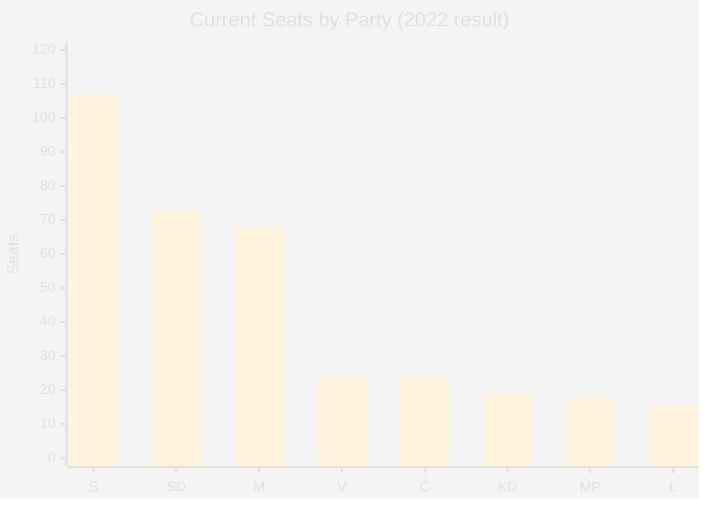

# Coalition Mathematics — Evening Analysis 29 April 2026

**Author**: James Pether Sörling  
**Date**: 2026-04-29

---

## Current Parliamentary Arithmetic

349 total seats; 175 required for majority

### Current Seat Distribution (2022 election result, unchanged)

| Party | Seats | Bloc |
|-------|-------|------|
| S (Socialdemokraterna) | 107 | Opposition |
| SD (Sverigedemokraterna) | 73 | Tidö |
| M (Moderaterna) | 68 | Tidö |
| V (Vänsterpartiet) | 24 | Opposition |
| C (Centerpartiet) | 24 | Opposition (de facto) |
| MP (Miljöpartiet) | 18 | Opposition |
| KD (Kristdemokraterna) | 19 | Tidö |
| L (Liberalerna) | 16 | Tidö |
| **Total** | **349** | |

**Tidö (M+SD+KD+L)**: 68+73+19+16 = **176** seats → +1 majority  
**Opposition (S+V+MP+C)**: 107+24+18+24 = **173** seats  

---

## Coalition Options (2026 Post-Election)

### Option A: Tidö Renewed (Most Likely)
**Seats needed from current polling**: 175+
- M (est.): 63–68 seats
- SD (est.): 68–73 seats
- KD (est.): 16–19 seats (THRESHOLD RISK if energy fracture worsens)
- L (est.): 13–16 seats (THRESHOLD RISK if below 4%)
- **Total est.**: 160–176 seats
- **Viability**: POSSIBLE if KD+L both clear threshold; MARGINAL if both underperform

### Option B: S-led "Swedish Model" Coalition
- S (est.): 100–108 seats
- C (est.): 17–22 seats
- L (est.): 13–16 seats  
- MP (est.): 14–18 seats
- **Total est.**: 144–164 seats
- **Viability**: LOW — far from majority; requires V support or SD acquiescence

### Option C: Broad Left Coalition (S+V+MP+C)
- S: ~104 seats
- V: ~22 seats
- MP: ~16 seats
- C: ~20 seats
- **Total est.**: ~162 seats
- **Viability**: LOW — 13 short of majority; C would need to commit to left bloc explicitly (politically implausible today)

### Option D: Cross-Bloc (S+SD — "Nordic Model" taboo)
- S+SD combined: ~174–181 seats
- **Viability**: POLITICALLY TABOO but arithmetically sufficient; only viable after sustained political realignment
- **Today's signal**: S's JA on security issues opens ideological space, but formal coalition remains taboo

---

## Threshold Watch (4% barrier)

| Party | Latest Poll | Today's Signal | Threshold Risk |
|-------|-------------|----------------|----------------|
| L | 3.5–4.5% | Quiet positive (JA votes) | MEDIUM |
| KD | 4.0–5.0% | SD energy friction | MEDIUM |
| MP | 3.5–4.5% | Consistent niche | MEDIUM |
| C | 4.5–6.0% | NEJ gambit — uncertain | MEDIUM-LOW |

**High-risk scenario**: If L + KD both fall below 4% in September 2026, Tidö loses ~35 seats and is no longer viable. SD would need to find a new partner.

---

## Mathematical Swing Points

- **C's 24 seats**: If C joins a S-led coalition, the math shifts dramatically (S+C = 131, plus V+MP = 173 — still short)
- **Single-seat majority for Tidö**: If M or SD loses 2 seats, Tidö falls to 174 — still viable via speaker margin
- **Threshold cascades**: If MP + L + KD all fall below 4%, combined ~53 seats eliminated; redistribution could give S a plurality but not majority

