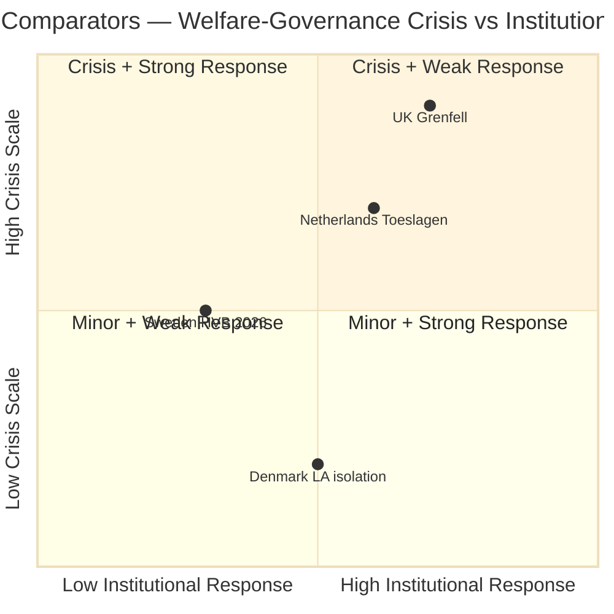

# Comparative International Analysis — Evening Analysis 29 April 2026

**Author**: James Pether Sörling  
**Date**: 2026-04-29

---

## Comparator Framework

Three international comparators for the key Swedish developments of 29 April 2026:
1. JuU10 Weapons law (gun regulation + C bloc-exit)
2. SfU28 Citizenship (cross-bloc security consensus)
3. HVB welfare-crime governance

---

## Comparator 1: Weapons Law — Denmark 2019–2021

| Dimension | Sweden 2026 | Denmark 2019–2021 |
|-----------|------------|-------------------|
| Policy | National weapons register, stricter permit criteria | "Blokbusters" — cross-bloc gang-crime law package |
| Coalition dynamic | C isolated NEJ; rest unanimous JA | Liberal Alliance (LA) isolated on civil liberties |
| Cross-bloc vote | S voted JA with right bloc | S and right united on crime prevention |
| Outcome | ADOPTED; C constructing niche | ADOPTED; LA later returned to coalition |
| Relevance | C's stance mirrors LA's tactical positioning — short-term isolation followed by realignment or electoral niche gain |

**Assessment**: Denmark shows that a principled civil-liberties party can survive short-term isolation but requires a subsequent electoral payoff. For C, the 2026 election is the test.

---

## Comparator 2: Citizenship — Germany 2024 (Einbürgerungsreformgesetz)

| Dimension | Sweden 2026 (SfU28) | Germany 2024 |
|-----------|---------------------|--------------|
| Reform direction | Stricter citizenship requirements; Swedish language + values | Reformed — faster citizenship for high-skilled, dual nationality allowed |
| Cross-party dynamic | S majority JA (rightward) | SPD + Greens vs CDU/CSU on different provisions |
| Lone dissenter | Annika Strandhäll (S) | Multiple SPD members |
| Political signal | S leadership accepts restrictive citizenship as electoral necessity | SPD split reflects identity crisis |
| WB Governance (RL.EST) | SE: +1.82 (2023) | DE: +1.72 (2023) — comparable rule-of-law environment |

**Assessment**: Germany shows that citizenship law is a pressure point for center-left parties; Sweden's S moving right on citizenship mirrors SPD's 2024 tactical shift on asylum, suggesting shared European electoral calculus.

---

## Comparator 3: Welfare-Crime Governance — Netherlands (Toeslagenaffaire) and UK (Grenfell)

| Dimension | Sweden 2026 HVB | Netherlands Toeslagen | UK Grenfell |
|-----------|----------------|----------------------|-------------|
| Nature | Criminal operators in state-funded welfare | State wrongly penalising welfare claimants | Private contractor failure in state housing |
| Systemic failure | IVO + police 2-year information gap | Tax authority algorithm error | Building regulation + procurement |
| Political accountability | Minister facing interpellation | Multiple minister resignations | Ongoing inquiry |
| Scale | 23,000+ companies; hundreds of HVB homes | 26,000+ families | 72 deaths |
| Outcome | OPEN — investigation starting | Cabinet collapsed | Inquiry completed 2024 |

**Assessment**: Sweden's HVB scandal has Toeslagenaffaire structural DNA — systemic state failure to protect vulnerable groups, slow information flow between agencies, political reluctance to acknowledge scope. Risk: prolonged crisis similar to Netherlands if not addressed with structural reform rather than enforcement-only response.

---

## IMF Economic Context (economicProvenance)

**Sweden WEO April 2026**:
- NGDP_RPCH (real GDP growth): +1.8% (2026 est.), +2.3% (2027 est.)
- GGXWDG_NGDP (gross public debt/GDP): 34.3%
- PCPIPCH (CPI inflation): 2.9%

**Nordic comparators (WEO Apr-2026)**:
- Denmark: NGDP_RPCH +2.2% / Norway +1.5% / Finland +1.1%
- Sweden underperforms Denmark but outperforms Finland and Norway

```json
{
  "economicProvenance": {
    "provider": "imf",
    "dataflow": "WEO",
    "indicator": "NGDP_RPCH",
    "vintage": "2026-04",
    "retrieved_at": "2026-04-29",
    "note": "WEO April 2026 Edition — Sweden real GDP growth projections"
  }
}
```


