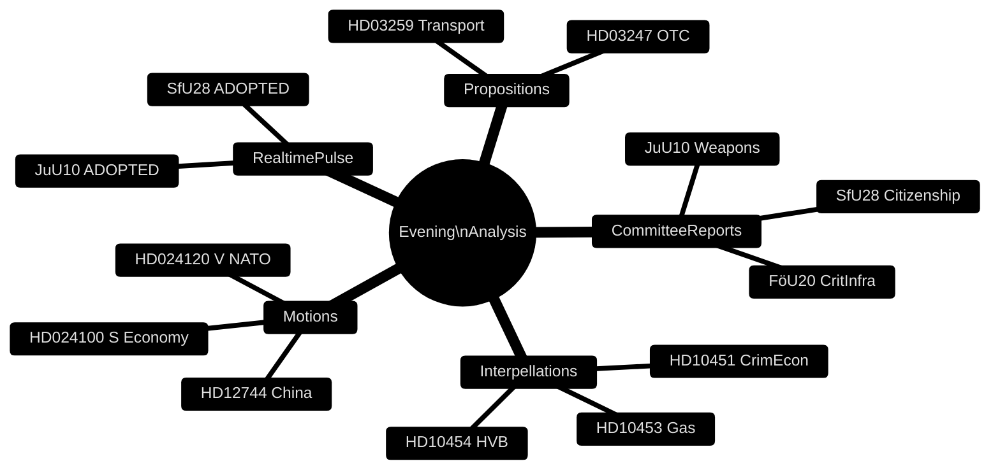

# Cross-Reference Map — Evening Analysis 29 April 2026

**Author**: James Pether Sörling  
**Date**: 2026-04-29

---

## Sibling Folders

All sibling analyses exist under `analysis/daily/2026-04-29/<type>`:

| Sibling Folder | Path | Key Artifacts Used |
|----------------|------|--------------------|
| Propositions | `analysis/daily/2026-04-29/propositions` | synthesis-summary.md, significance-scoring.md |
| Motions | `analysis/daily/2026-04-29/motions` | synthesis-summary.md |
| Committee Reports | `analysis/daily/2026-04-29/committeeReports` | synthesis-summary.md |
| Interpellations | `analysis/daily/2026-04-29/interpellations` | synthesis-summary.md |
| Realtime Pulse | `analysis/daily/2026-04-29/realtime-pulse` | synthesis-summary.md |
| Month Ahead | `analysis/daily/2026-04-29/month-ahead` | synthesis-summary.md |

---

## Cross-Document Links

### JuU10 Weapons Law Thread
- **Source**: `analysis/daily/2026-04-29/realtime-pulse/synthesis-summary.md` — ADOPTED 16:13
- **Reinforced by**: `analysis/daily/2026-04-29/committeeReports/synthesis-summary.md`
- **Party signal**: C unanimous NEJ
- **Evening analysis sections**: executive-brief.md §BLUF, intelligence-assessment.md §KJ-01, stakeholder-perspectives.md §C, scenario-analysis.md §S3

### SfU28 Citizenship Thread
- **Source**: `analysis/daily/2026-04-29/realtime-pulse/synthesis-summary.md` — ADOPTED 16:21
- **Reinforced by**: `analysis/daily/2026-04-29/committeeReports/synthesis-summary.md`
- **Cross-party vote**: S majority JA
- **Evening analysis sections**: executive-brief.md §Decision 1, intelligence-assessment.md §KJ-02

### HD10454/HD10451 Crime-Welfare Thread
- **Source**: `analysis/daily/2026-04-29/interpellations/synthesis-summary.md`
- **Cross-reference**: `analysis/daily/2026-04-29/motions/synthesis-summary.md` (HD024100 series)
- **Evening analysis sections**: threat-analysis.md §T1, significance-scoring.md §rank 2, risk-assessment.md §RISK-02

### HD03259 Transport Plan Thread
- **Source**: `analysis/daily/2026-04-29/propositions/synthesis-summary.md`
- **Budget context**: 875 Mdr kr fiscal commitment
- **Evening analysis sections**: significance-scoring.md §rank 1, implementation-feasibility.md

### China Risk Thread
- **Source**: `analysis/daily/2026-04-29/motions/synthesis-summary.md` — HD12744, HD12746
- **Reinforced by**: `analysis/daily/2026-04-29/realtime-pulse/synthesis-summary.md` — convergence noted
- **Evening analysis sections**: threat-analysis.md §T2, intelligence-assessment.md §KJ-06

### Energy Fracture Thread
- **Source**: `analysis/daily/2026-04-29/interpellations/synthesis-summary.md` — HD10453
- **Party dynamic**: SD vs KD
- **Evening analysis sections**: stakeholder-perspectives.md §SD–KD, coalition-mathematics.md

---

## Doc ID Index

| dok_id | Document Type | Topic | Family |
|--------|--------------|-------|--------|
| HD03259 | Proposition | Transport plan 875 Mdr kr | A |
| HD03247 | Proposition | OTC medicines | A |
| HD03257 | Proposition | IT support | A |
| HD01SfU28 | Committee report (betänkande) | Citizenship law | A |
| HD01FöU20 | Committee report | Critical infrastructure | A |
| HD01FöU14 | Committee report | Military cooperation | A |
| HD01JuU10 | Committee report | Weapons law | A |
| HD10454 | Interpellation | HVB criminal homes | B |
| HD10451 | Interpellation | 352bn SEK criminal economy | B |
| HD10453 | Interpellation | Gas bridge | B |
| HD12744 | Motion | China critical sectors | B |
| HD12746 | Motion | China organ harvesting | B |
| HD024100 | Motion series | S economy package | B |
| HD024109 | Motion | C fiscal responsibility | B |
| HD024117 | Motion | MP artskydd | B |
| HD024120 | Motion | V NATO rejection | B |

