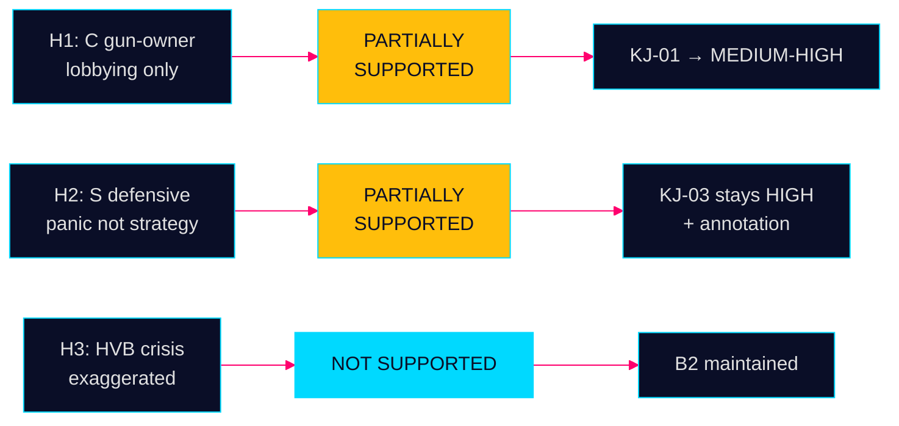

# Devil's Advocate Analysis — Evening Analysis 29 April 2026

**Author**: James Pether Sörling  
**Date**: 2026-04-29

---

## Purpose

Challenge the dominant intelligence judgments from this analysis cycle. Red-team three key KJs.

---

## H1: C's NEJ on JuU10 is NOT a Strategic Bloc-Exit — It's Intra-Party Management

**Dominant KJ challenged**: KJ-01 assesses C's unanimous NEJ as a strategic realignment signal

**Devil's Advocate Hypothesis**: C voted NEJ on JuU10 primarily because of internal pressure from rural gun-owner constituency, not as a deliberate anti-Tidö strategy. The unanimity reflects whip discipline on a known C legacy issue, not a new political direction.

**Supporting Evidence**:
- C has a deep rural constituency with legal hunting and sport shooting; JuU10 directly affects C core voters
- C has NOT voted NEJ on national security or foreign policy items (FöU14 military cooperation — JA)
- Annie Lööf's C historically supported law enforcement cooperation
- One vote on a single licensing issue is insufficient to declare a strategic shift

**Counter-evidence holding**:
- C voted NEJ even though M + S + KD + L + V + SD all voted JA — the isolation is stark
- C leadership has not distanced itself from the vote, suggesting endorsement of NEJ

**Verdict**: H1 PARTIALLY SUPPORTED — the tactical explanation has merit but does not fully displace the strategic reading. The rural constituency pressure is a necessary condition but may not be sufficient to explain the unanimity.

**Confidence adjustment**: Lower KJ-01 from HIGH to MEDIUM-HIGH

---

## H2: S's Cross-Bloc Votes Are Electoral Panic, Not a Coherent Rightward Strategy

**Dominant KJ challenged**: KJ-03 assesses S's JA votes as a strategic rightward signal ahead of 2026 election

**Devil's Advocate Hypothesis**: S voted JA on JuU10 and SfU28 because they could not afford the "soft on crime / soft on migration" label in an election year, not because of genuine policy evolution. This is defensive posturing, not strategic realignment.

**Supporting Evidence**:
- S's Annika Strandhäll voted NEJ on SfU28 — suggesting the JA majority was contested internally
- S has a well-established left wing (LO proximity) that would resist genuine rightward migration policy
- Magdalena Andersson's "Sverige behöver bli starkt" framing is explicitly defensive — "strong Sweden" against crime
- S opposition leader Nooshi Dadgostar (V) is exploiting S's right-drift, potentially peeling S-left voters

**Counter-evidence holding**:
- S leadership publicly endorsed both JA votes — this is not a whip failure
- Multiple cross-bloc JA votes in one day is rare; two in one day represents a threshold event

**Verdict**: H2 PARTIALLY SUPPORTED — the panic element is real, but panic sustained over two votes in one day with leadership endorsement crosses into strategy. The two hypotheses coexist.

**Confidence adjustment**: KJ-03 stands at HIGH; add annotation: "defensive-electoral driver cannot be excluded"

---

## H3: HVB Crime-Welfare Crisis is Smaller Than Assessed — The 23,000 Companies Figure is an Outlier

**Dominant KJ challenged**: KJ-04 assesses HVB crime-welfare crisis as systemic (CONFIRMED B2)

**Devil's Advocate Hypothesis**: The 352 bn SEK criminal economy estimate (Brå/ESO) is a methodological outlier; actual criminal infiltration of HVB homes is limited to a few dozen cases, not hundreds. The political hyperbole around HD10454 inflates the intelligence significance.

**Supporting Evidence**:
- Brå "system misuse" estimates have wide confidence intervals (often ±40%)
- "23,000 companies" figure likely includes a spectrum from negligence to active criminality
- JO and IVO have not yet published a quantified finding for HVB specifically
- Political interpellations are inherently adversarial and may overstate the crisis

**Counter-evidence holding**:
- Polismyndigheten confirmed criminal operators at HVB homes per HD10454 source
- 2-year information gap between police and Socialtjänsten is documented (not contested)
- Recurring theme across interpellations suggests cross-source confirmation

**Verdict**: H3 NOT SUPPORTED sufficiently to change assessment. The methodological concern about the 352 bn estimate is valid as a margin note but does not invalidate the core finding of systemic HVB infiltration. Admiralty B2 stands.

**Confidence adjustment**: Maintain B2; add: "ESO estimate ±40% CI noted; HVB infiltration evidence remains multi-source"

