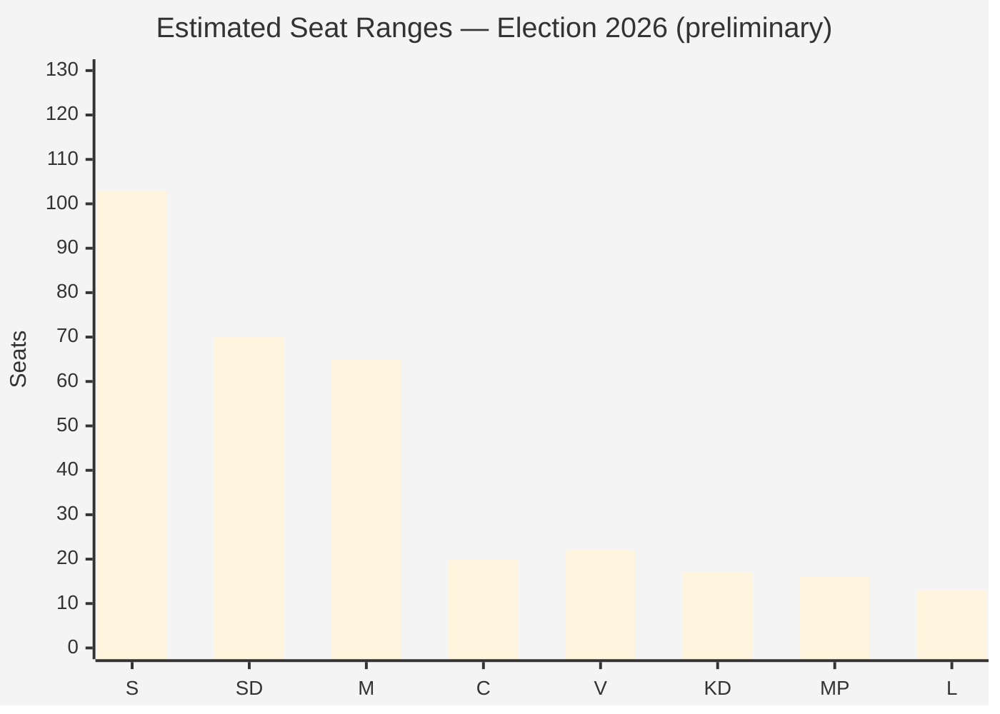

# Election 2026 Analysis — Evening Analysis 29 April 2026

**Author**: James Pether Sörling  
**Date**: 2026-04-29

---

## Electoral Context

**Next Swedish general election**: September 2026 (ordinary Riksdag election day: third Sunday in September = 20 September 2026, approx 144 days away)

**Current parliamentary arithmetic** (349 seats, majority = 175):
- Tidö bloc (M+SD+KD+L): 68+73+19+16 = 176 seats
- Opposition (S+V+MP+C): 107+24+18+24 = 173 seats
- Governing majority: 1 seat margin

---

## Today's Electoral Signals

### Signal 1: JuU10 — C's Electoral Gambit
- C voted unanimously NEJ on weapons law that passed 325:20 (approximate)
- **Electoral interpretation**: C is signalling to its rural, liberal base that it is NOT a Tidö satellite
- **Risk**: Perceived as obstructionist by security-focused voters
- **Opportunity**: Gains distinctiveness vs M and SD on civil liberties
- **Poll impact**: Insufficient data for one-day shift; monitor 2-week trend

### Signal 2: SfU28 — S's Election-Year Security Pivot
- S majority JA on citizenship law
- **Electoral interpretation**: S cannot fight 2026 on "soft on migration" ground after 2022 defeat on immigration
- **Risk**: Hemorrhages V-adjacent voters (already V has 5.8% in latest SVT Pejl)
- **Opportunity**: Recaptures security-concerned S-leavers who went M in 2022

### Signal 3: HVB + Criminal Economy — Accountability Liability for Tidö
- Opposition interpellations on HVB (HD10454) and criminal economy (HD10451)
- **Electoral interpretation**: Opposition has found a compelling accountability narrative: "Tidö promised safe Sweden, but criminals run children's homes"
- **Timeline**: If JO report published before summer recess, could dominate July-August campaign prep

---

## Party-by-Party Electoral Forecast Adjustment

| Party | Current poll est. | 2022 result | Today's signal | Adjusted outlook |
|-------|------------------|-------------|----------------|-----------------|
| S | 29–31% | 30.3% | JA on security — stabilising | HOLD |
| SD | 19–21% | 20.5% | Gas bridge friction vs KD | SLIGHT DOWN (KD friction visible) |
| M | 17–19% | 19.1% | Strong day — JuU10+SfU28 passed | HOLD |
| C | 4–6% | 6.7% | NEJ gambit — too early to call | UNCERTAIN |
| V | 5–7% | 6.7% | NATO isolation; gaining S-left | SLIGHT UP |
| KD | 4–5% | 5.3% | Energy under pressure from SD | DOWN RISK |
| MP | 3–5% | 5.1% | Consistent niche; below risk threshold | HOLD |
| L | 3–4% | 4.7% | Quiet day; JA on both | HOLD |

---

## 2026 Coalition Arithmetic Scenarios

| Coalition | Seats (estimate) | Viable? |
|-----------|-----------------|---------|
| Tidö renewed (M+SD+KD+L) | ~172–180 | POSSIBLE (requires L above 4%) |
| "Swedish model" (S+C+L+MP) | ~155–170 | DIFFICULT (C+L alignment required) |
| S+V+MP+C | ~167–175 | NARROW (needs C to join left bloc) |
| S+SD (Nordic model) | ~180+ | TABOO but arithmetically feasible |

**Most likely outcome (S1 base case)**: Tidö renewed with narrow majority. S strengthened in opposition but insufficient for government.

