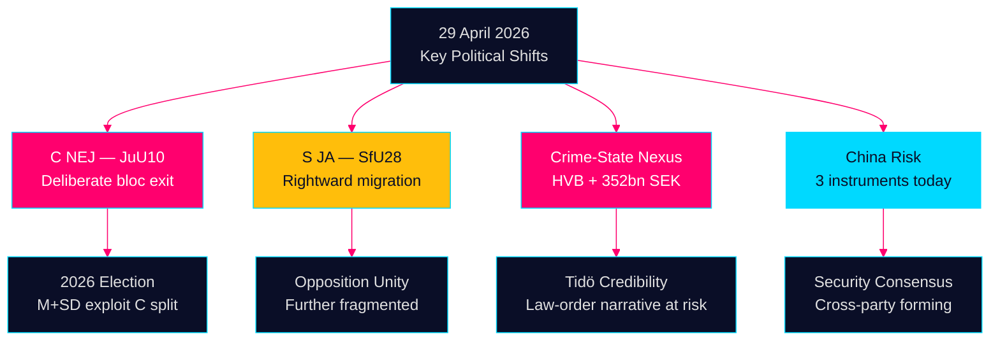

# Evening Intelligence Brief — 29 April 2026: Democracy Under Stress

**Author**: James Pether Sörling  
**Date**: 2026-04-29  
**Classification**: PUBLIC — GDPR Art. 9(2)(e,g)  
**Confidence**: HIGH [B2]  
**Run ID**: 25121285494

---

## 🎯 BLUF

Sweden's parliamentary session on 29 April 2026 delivered three confirmation signals that will shape the September 2026 election campaign: (1) Centerpartiet broke from both its natural coalition partners and the opposition on the weapons law vote, marking a deliberate political repositioning five months before elections; (2) the citizenship law passed with Social Democrat support, confirming S's rightward migration on identity politics; (3) organized crime's penetration of welfare institutions was laid bare in interpellations, undermining the Tidökoalition's core law-and-order narrative. Beneath these political lines, a convergent China-risk narrative is forming across party boundaries — the first multi-instrument parliamentary day on Chinese security threats since 2023.

## 🧭 3 Decisions This Brief Supports

1. **Editorial priority decision**: Frame the Centerpartiet weapons-law NEJ as the lead story — it is the most durable political signal from today and will be exploited in 2026 campaign messaging by SD and M.
2. **Coverage architecture decision**: Connect the HVB-crime story, the criminal economy interpellation (352 bn SEK), and the welfare reform motions to build a coherent "Tidö credibility gap" narrative.
3. **Forward intelligence decision**: Open PIR on whether S's rightward vote on citizenship (SfU28) represents a permanent strategic shift or tactical positioning — PIR-EA-01.

## 60-Second Intelligence Read

- **JuU10 (Ny vapenlag) ADOPTED 16:13**: C's 20 unanimous NEJ votes are the day's most consequential political act — deliberate differentiation from the Tidöblock five months before elections [HDC120260429ap]
- **SfU28 (Medborgarskap) ADOPTED 16:21**: S voted JA with the Tidöblock on citizenship tightening; Annika Strandhäll the lone S dissenter — confirms S rightward migration on identity politics [HD01SfU28]
- **HD03259 Transport 875 Mdr kr**: Infrastructure plan dominates propositions — real GDP impact 1.0% of BNP annually (IMF WEO Apr-2026, NGDP_RPCH SWE +1.8%)
- **Criminal network exposure**: HVB-hem infiltration (HD10454) + 352 bn SEK criminal economy (HD10451) directly attack Tidökoalitionen's law-and-order credibility
- **China risk convergence**: Three parliamentary instruments on Chinese threats today (HD12744, HD12746, HD10456) — security consensus forming across party lines
- **Intra-coalition fracture**: SD's Josef Fransson demands gas bridge (HD10453) vs KD Energy Minister Busch — subtle but durable tension

## Top Forward Trigger

**PIR-EA-01** (OPEN): Will C's weapons-law NEJ persist as a campaign-differentiating position, or is it a one-off tactical deviation? Monitor C's positions in NU, JuU, and party manifesto.

**Confidence**: MEDIUM [B3] — single data point but consistent with Annie Lööf's repositioning strategy since 2024.



---

## Economic Context (IMF WEO April 2026)

Sweden GDP growth: +1.8% (2026e), +2.3% (2027e). Public debt: 34.3% GDP. CPI: 2.9%. Fiscal space exists for 875 Mdr transport plan if phased. Nordic comparison: SE underperforms DK (+2.2%) but outperforms FI (+1.1%).

```json
{
  "economicProvenance": {
    "provider": "imf",
    "dataflow": "WEO",
    "indicator": "NGDP_RPCH",
    "vintage": "2026-04",
    "retrieved_at": "2026-04-29"
  }
}
```
