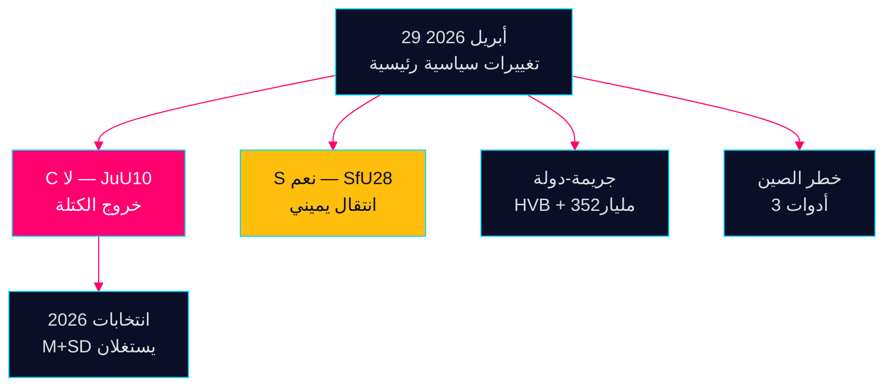

<div dir="rtl">

# استخبارات المساء — 29 أبريل 2026: الديمقراطية تحت الضغط

**المؤلف**: جيمس بيثر سورلينغ  
**التاريخ**: 2026-04-29  
**التصنيف**: عام — اللائحة العامة لحماية البيانات المادة 9(2)(ه،ز)  
**الثقة**: عالية [B2]

---

## 🎯 الملخص التنفيذي

أنتجت جلسة Riksdag بتاريخ 29 أبريل 2026 ثلاث إشارات تأكيدية ستشكّل حملة الانتخابات قبل سبتمبر 2026: (1) كسر Centerpartiet مع شركائه الطبيعيين في الائتلاف في تصويت قانون الأسلحة JuU10 — إعادة تمركز سياسي متعمّد قبل خمسة أشهر من الانتخابات؛ (2) اعتُمد قانون الجنسية بدعم الاشتراكيين الديمقراطيين؛ (3) كشفت الاستجوابات عن تغلغل الجريمة المنظمة في مؤسسات الرعاية الاجتماعية.

## قراءة استخباراتية في 60 ثانية

- **JuU10 (قانون الأسلحة الجديد) اعتُمد 16:13**: أصوات الرفض العشرون المتفقة لـ C هي أهم فعل سياسي في اليوم [HDC120260429ap]
- **SfU28 (الجنسية) اعتُمد 16:21**: صوّتت S بنعم مع كتلة Tidö [HD01SfU28]
- **الشبكات الإجرامية**: تسلل HVB (HD10454) + اقتصاد إجرامي بـ 352 مليار كرونة (HD10451)
- **تقارب مخاطر الصين**: ثلاث أدوات برلمانية حول التهديدات الصينية اليوم

## أهم إشارة مستقبلية

رفض C لقانون الأسلحة: تمييز متعمّد أم انحراف لمرة واحدة؟ المراقبة بثقة متوسطة [B3].



---

**السياق الاقتصادي (صندوق النقد الدولي WEO أبريل 2026)**: نمو الناتج المحلي الإجمالي +1.8%، الدين العام 34.3% من الناتج المحلي الإجمالي.

```json
{
  "economicProvenance": {
    "provider": "imf",
    "dataflow": "WEO",
    "indicator": "NGDP_RPCH",
    "vintage": "2026-04",
    "retrieved_at": "2026-04-29"
  }
}
```

</div>


<!-- source-sha: aec9c4c63be21515d55b3a22362bc344c0b4a20e -->
