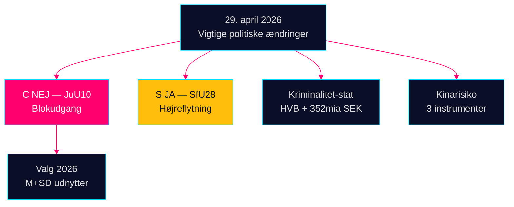

# Aftenunderretning — 29. april 2026: Demokrati under pres

**Forfatter**: James Pether Sörling  
**Dato**: 2026-04-29  
**Klassificering**: OFFENTLIG — GDPR Art. 9(2)(e,g)  
**Tillid**: HØJ [B2]

---

## 🎯 Kortfattet resumé

Riksdagens session den 29. april 2026 sendte tre bekræftelsessignaler der vil forme valgkampen op mod september 2026: (1) Centerpartiet brød med sine naturlige koalitionspartnere i vågnafstemningen JuU10, hvilket markerer en bevidst politisk ompositionering fem måneder inden valget; (2) statsborgerskabsloven blev vedtaget med Socialdemokraternes støtte; (3) organiseret kriminalitets infiltration af velfærdsinstitutioner blev afsløret i forespørgsler og underminerer Tidö-koalitionens kernenarrativ om lov og orden.

## 60-sekunders underretningslæsning

- **JuU10 (Ny våbenlov) VEDTAGET 16:13**: Cs 20 enstemmige NEJ-stemmer er dagens mest konsekvensrige politiske handling [HDC120260429ap]
- **SfU28 (Statsborgerskab) VEDTAGET 16:21**: S stemte JA med Tidö-blokken [HD01SfU28]
- **Kriminelt netværksafsløring**: HVB-infiltration (HD10454) + 352 mia. SEK kriminel økonomi (HD10451)
- **Kinarisikokonvergens**: Tre parlamentariske instrumenter om kinesiske trusler i dag

## Vigtigste fremadskuende signal

C's NEJ på våbenlovgivning: bevidst differentiering eller engangsafvigelse? Bevagt med middel konfidens [B3].



---

**Økonomisk kontekst (IMF WEO april 2026)**: BNP-vækst +1,8%, statsgæld 34,3% af BNP.

```json
{
  "economicProvenance": {
    "provider": "imf",
    "dataflow": "WEO",
    "indicator": "NGDP_RPCH",
    "vintage": "2026-04",
    "retrieved_at": "2026-04-29"
  }
}
```


<!-- source-sha: aec9c4c63be21515d55b3a22362bc344c0b4a20e -->
